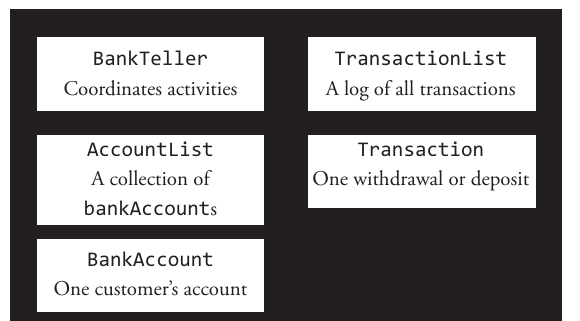
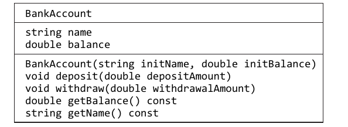
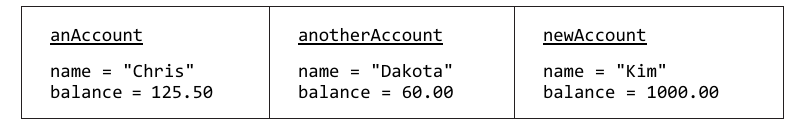
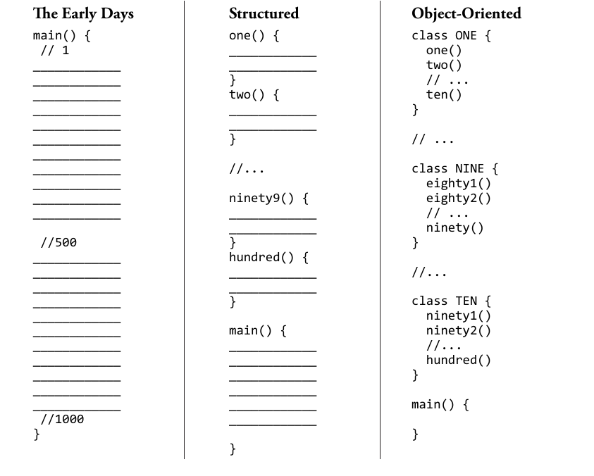
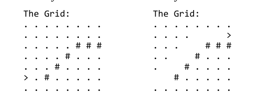

# 第5章 发送消息

**前章回顾**

到目前为止，我们已经学会了如何使用和实现自由函数（即非成员函数）。当然，我们所介绍的这些函数只是可用的非成员函数中的一小部分这些自由函数不属于任何一个特定的类，它们是C++语言的一个重要部分。我们可用通过这些函数的头信息和相关文档来了解新函数的用法。

**本章提要**

本章将重点介绍如何发消息给一个已经存在的对象，这是一种不同于只有函数调用的语法。本章还会介绍`string`、`ostream`、`istream`这几个来自标准库中的类以及两个第三方类`BankAccount`和`Grid`，和它们的成员函数。这些内容能让我们在解决问题时具有更好的开发技能，我们将会学习如何将数据成员封装到类中，并编写操作这些成员状态的成员函数。在这过程中，我们将充分认知到这样做的重要性。

我们希望在完成本章的学习之后，你将掌握：

* 如何发送消息给对象。
* 如何使用`string`和`ostream`类型的消息，并了解它们所能产生的效果。
* 如何使用`string`、`Grid`和`BankAccount`这三种类型的对象来解决相关问题。
* 了解程序员们为什么需要将软件划分成一系列类，这些类都是一组成员函数与相关成员数据的集合。

## 5.1 为真实世界建模

C++编程语言中主要有的是存储布尔类型、字符类型以及数字类型这三种原生类型，但C++中也有多种类型组成的C++类结构。例如`string`（这是个C++中已被实现的类），这个类中存储了一个字符集以及与该字符集相关的其他信息（譬如该`string`对象中的字符数，`string`对象的名称、地址等数据）。还有些类可以让程序员们存储一个大型的数据集合。但即便如此，这数百个C++类型也无法满足每个程序员的所有需求。因此在很多时候，程序员们会发现他们需要根据自己程序的需要来建模，创建属于自己的类。下面，我们以银行系统为例来讨论一下这个问题：

**银行柜台程序的书面说明**

> 请实现一个银行柜台程序，该程序要能允许银行客户通过唯一的识别方式访问银行帐号。然后，客户要能在柜台服务的帮助下完成一下多项交易活动，包括提款、存款、查询账户余额以及查看最近十笔交易记录。我们要求该系统必须要为其所有客户确保其余额的正确性。并且该系统还必须要要能应付任意数量的客户一笔以上的交易动作。

当然，我们并没有要求你立即将这个系统实现出来。但是，可以先来考虑一下该系统中会用到哪一些相关的类型。在这里我们要介绍一种简单的解决方案建模工具，用它来找出我们需要的对象类型，这个工具就是将问题的书面说明中出现的名词都写下来。然后，我们再逐个来思考最终可以用来表示系统中相关部分的候选类型。这些将被用来构建系统的类型主要来自以下三个地方：

* 问题的书面说明。
* 我们对目标问题理解。
* 编程语言所自带的类型。

这些类型应该尽可能地依据对对真实世界的建模，从中我们可以得到如下这些候选类型：

**对应解决方案模型的候选对象**

| | |
|--------------|-----------------------------|
| 银行柜台      | 交易活动                      |
| 银行客户      | 最近10笔交易记录               |
| 银行账户      | 账户余额                      |

下面我们用一张图来说明一下这个银行柜台系统还会涉及到的主要类型。你可以看到`BankTeller`是在许多其他类型对象的辅助下完成相关实现的。



这份问题的书面说明告诉我们一个程序通常要由许多不同的类型组成，而不是囫囵吞枣似地实现一个系统，再为其加个用户界面那么简单。下面，我们就单以其中的`BankAccount`这个对象的类型为例来说明一下这个问题。

### 5.1.1 `BankAccount`对象

在本章接下来的篇幅中，我们会逐步将`BankAccount`这个类型实现成一个C++类，该类将会提供多个`BankAccount`对象。每个`BankAccount`对象实体都代表着一个银行账户。依据我们对银行账户的了解，首先会想到每个`BankAccount`对象应该要有个账户号码和账户余额。除此之外，`BankAccount`对象中还应该包含譬如交易记录清单、个人识别码（PIN）、母亲婚前姓氏等其它部分的值。另外还必须考虑它所要执行的银行业务，譬如创建新账户、存款、取款、查看当前账户余额等。最后还可能会有很多代表银行业务的消息（message）——例如，`generateMonthlyStatementAsPDF`。

下面，我们来对该类中集合的操作和类做个预览，先创建一个名为`BankAccount.h`的文件（`.h`这个扩展名代表了这是个头文件），然后将`BankAccount`类型定义如下，关于该类的具体实现细节，我们将会在下一章中为你呈现。

```C++
#include <string>

class BankAccount {
  public:
    BankAccount(std::string initName, double initBalance);
    // post: Construct call with two arguments:
    //       BankAccount anAcct("Hall", 100.00);

    void deposit(double depositAmount);
    // post: Credit depositAmount to the balance

    void withdraw(double withdrawalAmount);
    // post: Debit withdrawalAmount from the balance

    double getBalance() const;
    // post: Return this account's current balance

    std::string getName() const;
    // post: Return this account's name

  private:
    std::string name;
    double balance;
};
```

我们可以将这份`BankAccount`类的定义视作将来在C++中构建多个`BankAccount`对象的蓝图。如你所见，每个`BankAccount`对象都会有属于自己的数据成员：`name`和`balance`，以及五个意义相同的成员函数：`BankAccount`、`deposit`、`withdraw`、`getName`和`getBalance`。通常情况下，当我们在名为`BankAccount.h`的文件中做了这样的定义之后，就需要在另一个名为`BankAccount.cpp`的文件中对这个C++类做出具体的实现。

需要注意的是，C++社区中指称类属函数时使用的是*成员函数（member function）*这个术语`【译者注：此处原文为data member，译者认为是作者笔误，故修正于此，特做说明。】`，而在指称存储对象状态的变量时则使用的术语是*数据成员（data member）*。在其他编程语言中，人们通常使用*方法（method）*这个术语来指称前者，而不是*成员函数*。后者也一样，人们通常使用的术语是*实例变量（instance variable）*而不是*数据成员*。本教材将采用C++的术语风格。

另外我们也可以看到。`BankAccount`对象在构造时需要我们提供以下两个实参来初始化该对象的状态：

* 一个可以代表这个账户的标识符，譬如某个名称。
* 一个表示账户初始余额的浮点数。

**通用格式 5.1**： *构造对象（也可以同时设置初始值）*

> *class-name object-name*(*initial-value(s)*);

下面来看几个对象构造的示例：

```C++
BankAccount anAccount("Chris", 125.50);
string str("A string")
string str2() // default value is an empty string ""
```

如你所见，每个对象都具有：

* 名称：这是用来引用整个对象的变量。
* 状态：该对象当前所拥有的值。
* 消息：该对象可执行的操作。

每个对象都会提供一个用来访问该对象状态的变量，虽然它们拥有各自独特的状态，但能理解同一组消息。例如，在下面这个对象构造动作中，

```C++
BankAccount anotherAccount("Dakota", 60.00);
```

我们收到了以下信息：

* 用以范围该对象的名称：`anotherAccount`。
* 状态：”Dakota“这个账户名下的账户余额为60.00。
* 消息：该对象可以理解的消息包括`withdraw`、`deposit`、`getBalance`等。

也就是说，`BankAccount`类的其他实例理解的消息是相同的，但它们会有各自独立的状态。例如在下面这个`BankAccount`对象构造玩之后，

```C++
BankAccount newAccount("Kim", 1000.00);
```

`newAccount`对象的名称是“Kim”，账户余额为1000.00。

### 5.1.2 类与对象的图解

对于上述三个对象特征，我们可以用下面这张类图来汇总一下：



在这张类图的最顶层部分，我们看到的是类名。接下来的部分中列出的是实例变量。最底层部分则是方法。同样的，对象也可以用下面这样一张实例图来说明，带下划线的是对象的名称，其余是它们各自的值：



这三张对象的图解描述了三个不同的`BankAccount`对象当前的状态。同一个类可以构造出多个对象，这些对象拥有各自独立的状态（即各自拥有一组值）。

## 5.2 发送消息

`cin`、`cout`这样的对象也好，任何的`string`对象也罢，它们都属于有类成员函数的对象。因此它们在使用上与`cmath`中声明的自由函数是有些不同的，需要使用不同的语法。在使用成员函数时，我们甚至可以用不同的名称（即消息）调用不同类型的函数调用。有些消息会返回对象的状态，也有些消息的任务是告诉对象去做某事。

* 让对象返回其状态的消息：`anAccount.getBalance();`
* 让对象做事的消息：`anAccount.withdraw(25.00);`

我们可以通过`getName`、`getBalance`这样的操作来范围对象的状态。由于其他类成员函数的存在，程序员们也可以通过`withdraw`和`deposit`这样的函数来修改对象的状态。下面我们来看一下发送消息给对象的通用格式：

**通用格式 5.2**： *发送消息给某个对象*

> *object-name.function-name*(*argument-list*)

现在，我们来示范一下`BankAccount`对象的消息发送：

```C++
anAccount.deposit(237.42);
anAccount.withdraw(5);
anAccount.getBalance();
```

下面这些则是不正确的示范：

```C++
anAccount.deposit();        // Missing the amount to deposit
eposit();                   // missing the object-name and .
nAccount.getBalance;        // missing ()
anAccount.withdraw("10");   // wrong class of argument
anAccount;                  // missing member function name
anAccount.withdrawal(10);   // BankAccount has no function withdrawal
```

幸运的是，如果我们在编写对象名称，点号以及操作名称时出了错，编译时是会产生报错信息的。而且`与所有的函数一样，如果客户端代码没有提供正确的实参，编译器也会报错。

总之，我们现在知道了`BankAccount`类（及其产生的所有`BankAccount`对象）中有两个可用于访问其对象状态的成员函数：`getName`和`getBalance`，两个可修改状态的成员函数：`withdraw`和`deposit`。接下来，我们要来具体示范一下这些操作，下面这个程序中构造了两个`BankAccount`对象，并同步将一些消息发给了它们，这些消息将会产生一下这些活动：

* 让名为`ba1`的对象存款133.33元。
* 让名为`ba2`的对象取款250.00元。
* 显示这两个对象的名称和账户余额。

```C++
// Initialize two BankAccount objects and send some messages
#include <iostream> // for cout
using namespace std;
#include "BankAccount.h" // for class BankAccount

int main() {
    BankAccount ba1("Miller", 100.00);
    BankAccount ba2("Barber", 987.65);

    ba1.deposit(133.33);
    ba2.withdraw(250.00);

    cout << ba1.getName() << ": " << ba1.getBalance() << endl;
    cout << ba2.getName() << ": " << ba2.getBalance() << endl;

    return 0;
}
```

**程序输出**

```shell
Miller: 233.33
Barber: 737.65
```

对象中所存储的数据量是取决于其所属类的，一个对象的状态可以有许多值——这些值可能也属于不同的类。例如，`BankAccount`对象中存储了一个用来表示账户名的`string`对象和一个用来表示账户余额的数字。而`weeklyEmployee`对象则可能需要存储多个用来存储姓名、地址、社会安全号码的`string`对象，，以及用来表示工资率和工作时数的数字。`robot`对象则可能需要存储当前位置，一份地图以及其机械臂的当前状态。

**自检题**

5-1 下面每个被字母注释的行都存在着一个错误，请说明这些错误的缘由。

```C++
#include <iostream>      // For cout
#include "BankAccount.h" // For class BankAccount
using namespace std;

int main() {
    BankAccount b1("Sam");          // -a
    BankAccount b2(500.00);         // -b
    BankAccount b3("Jo", 200.00);   // -c
    b1.deposit();                   // -d
    b1.deposit;                     // -e
    b1.deposit("100.00");           // -f
    B1.deposit(100.00);             // -g
    b1.Deposit(100.00);             // -h
    withdraw(100);                  // -i
    cout << b4.getName() << endl;   // -j
    cout << b1.getName << endl;     // -k
    cout << b1.getName(100.00) << endl; // -l
    return 0;
}
```

5-2 请写出下面程序会产生的输出：

```C++
#include <iostream> // For cout
using namespace std;
#include "BankAccount.h" // For the BankAccount class

int main() {
    BankAccount b1("Chris", 0.00);
    BankAccount b2("Kim", 500.00);
    b1.deposit(222.22);
    b1.withdraw(20.00);
    b2.deposit(55.55);
    b2.withdraw(10.00);

    cout << b1.getName() << ": " << b1.getBalance() << endl;
    cout << b2.getName() << ": " << b2.getBalance() << endl;
    return 0;
}
```

## 5.3 `string`对象

和`bankAcount`类一样，`string`类型也是C++中被实现的一个类。虽然每个`string`对象中存储的都是一个字符集合，但程序员有时也会对其中的一个字符产生兴趣。除此之外，程序员有时也会需要其中的几个字符或获得当前字符串的长度（即其所存储的字符数）。甚至有时候，我们还会需要检查字符串中是否存在着某个指定的子串。例如，我们可能需要判断", "是不是字符串"Last, First"的子串，如果是的话，该子串在字符串中的首位索引是什么？C++的`string`类型提供了大量的成员函数，以帮助我们解决大部分与字符串值有关的问题，我们将来会在许多程序中用到`string`对象。

每个`string`对象都存储了一个包含0个或多个字符的集合。构造`string`对象的方法主要有以下两种。

**通用格式 5.3**： *`string`对象的两种不同构造方式*

> string *identier*(*string-literal*);<br>
> string *identier* = *string-literal*;

**实例示范**

```C++
string stringReference("A String Object");
string anotherStringReference = "Another";
```

和大多数类一样，`string`类的成员函数中也有负责修改`string`对象状态的（譬如`insert`、`replace`、`erase`）和只返回对象状态的（譬如`length`、`find`、`substr`）。另外，`string`类中还有一些允许访问其元素或个别字符的操作：`[]`、`front`和`back`。最后，还有一组作用于`string`对象本身的操作，譬如`+`、`[]`、`<<`和`>>`。

### 5.3.1 访问性方法

#### string::length()

在将`length`消息发送给`string`对象之后，它会返回该`string`对象中的当前字符数。

```C++
string stringReference("A String Object");
string anotherStringReference = "Another";
stringReference.length(); // returns 15
anotherStringReference.length(); // returns 7
```

#### string::at

`at`消息的作用是返回其`int`实参所代表的索引位置上的字符。请注意，`string`对象的索引是从0开始的，也就是说，第一个字符的索引是0，第二个字符的索引是1，要获取它就要向对象发送`at(1)`这个消息。

```C++
string str("A string object");
str.at(0); // returns 'A'
str.at(1); // returns ' '
str.at(2); // returns 's'
str.at(str.length()-1); // returns 't', the last character
```

#### string::find和string::rfind

`find`消息的作用是返回其实参字符串在目标字符串中第一次出现时的首字母索引。如果该实参字符串不存在于目标对象中，`find`就会返回一个名为`string::npos`的值（代表的是一个不存在的位置），这往往会是一个值很大的整数，用于区别其他可能返回的整数。而`rfind`则是返回其实参字符串在目标对象中最后一次出现时的首字母索引。

```C++
string str("there is the other the");
str.find("the"); // returns 0, the first "the"
cout << str.rfind("the"); // returns 19, the last "the"
cout << str.find(" is "); // returns 5
cout << str.find("not here"); // returns string::npos which
                              // may be 18446744073709551615
```

#### string::substr

`substr`消息的作用是以第一个实参指定的，在目标字符串中的索引为起点，返回第二个实参所指字符数的子字符串。

```C++
string str("Smiles a Lot");
str.substr(1, 4); // returns "mile"
str.substr(9, 1); // returns "L"
str.substr(9, 2); // returns "Lo"
str.substr(9, 55); // returns "Lot"
```

#### str::front和str::back**

`front`和`back`这两个成员函数的作用就是访问`string`对象中的首字符和尾字符。

```C++
string str("abc");
// front and back are part of C++11. With some C++ compilers,
// this code may generate compile time errors because their
// string class may does not yet have these member functions.
str.front(); // returns 'a'
str.back();  // returns 'c'
```

### 5.3.2 修改性方法

#### str::insert

`insert`消息的作用是往目标`string`对象中添加字符，它的第一个实参指定的是插入位前面的索引（即被插入字符会位于该索引位置的右边）。第二个实参则通常是一个字符串常量或其他字符串对象（即待插入的字符串）。

```C++
string quick("quick");
string all("the brown jumped dog");

all.insert(4, quick); // all.length() increased
all.insert(23, "over the lazy");
cout << all; // prints: the quick brown jumped over thelazy dog
```

#### str::replace

`replace`成员函数的作用是修改目标字符串中指定部分的内容，它的第一个实参指定的是待修改部分的起点处索引，而第二个实参则带修改部分所要跨越的字符数。

```C++
string quick("quick");
string all("the brown jumped dog");
all.replace(4, 14, quick);
cout << all; // prints: the quick dog
```

#### str::erase

`erase`消息的作用是擦除目标字符串中由其实参索引值指定部分的内容。

```C++
string all("the quick brown fox");
all.erase(4, 12);

cout << all << endl; // prints: the fox
cout << all.length(); // prints 7
```

### 5.3.3 为`string`对象本身定义的操作符

#### `+`操作符

程序员们通常需要将两个独立的字符串合并成一个字符串，这时候就可以使用`+`操作符，它可以将两个以上的字符串拼接（或者说连接）成一个字符串。

```C++
string firstName("Kim");
string lastName("Potter");

string fullName = lastName + ", " + firstName;
cout << fullName; //prints Potter, Kim
```

当然，该操作符也能将字符拼接成字符串。

```C++
fullName = '>' + fullName + '<';
cout << fullName; // prints >Potter, Kim<
```

#### `<<`和`>>`操作符

`<<`和``>>`这两个操作符对`string`类的重载使我们可以像数字一样对字符串进行输入/输出操作。

```C++
string firstName;
cout << "Enter first name: ";
cin >> firstName; // If the user enters Kim
cout << "Hello " + firstName; // output would be: Hello Kim
```

#### `[]`操作符

`[]`操作符的作用和`at`成员函数是一样的，通过这对方括号，我们也可以对目标字符串中的个别字符进行访问或修改。

```C++
string str("abcde");

str[0]; // returns 'a'
str[1]; // returns 'b'
str[4]; // returns 'e'

str[2] = 'X';
str[3] = 'O';
cout << str; // prints abXOe
```

除此之外，`string`类型还有一些用于比较的操作符，譬如`<=`和`==`等，这部分内容我们将会在之后的章节中介绍。

**自检题**

5-3 请写出下面程序会输出的结果。

```C++
#include <iostream>
#include <string>
using namespace std; // Allows string instead of std::string

int main() {
    string str("Social Network");
    cout << str.length() << endl;
    cout << str.at(0) << endl;
    cout << str.at(str.length() - 1) << endl;
    cout << str.find("Net") << endl;
    cout << str.find("net") << endl;
    cout << str.substr(7, 3) << endl;
    cout << str.substr(7, 1) << endl;
    cout << str.substr(7, 99) << endl;
    cout << str[1] << endl
    return 0;
}
```

5-4 请写出下面各`string`对象被修改之后的内容。

* a.
    ```C++
    string str1("Social");
    str1.replace(0, 1, "UnS");
    ```
* b.
    ```C++
    string str3("Social");
    str3.insert(3, "iet");
    str3.erase(6, 1);
    ```
* c.
    ```C++
    string str2("Social");
    str2.erase(3, 2);
    ```
* d.
    ```C++
    string str4("Social");
    str4[0] = 'N';
    str4[5] = 'X';
    str4\[2\] = 'T';
    ```

5-5 请编写一段代码，将某字符串中间位置的字符存储到一个名为`mid`的`char`类型的变量中，如果字符总数为偶数，则选择中间右边的字符，譬如“abcd”的中间字符为“c”。

5-6 对于下面各条消息的发送，如果你认为发送错误，就将爱标识为“error”，否则就请写出该调用表达式返回的值。

```C++
string str("Any String");
```

* a. length(str)  
* b. str.length
* c. str(length)
* d. str.find(" ")
* e. str.substr(2, 5)
* f. str.substr("tri")

## 5.4 `ostream`和`istream`的成员函数

`istream`和`ostream`是分别为我们提供输入和输出功能的两个类。

#### ostream::width

`width`成员函数的作用是修改名为`cout`的`ostream`对象的状态。

```C++
#include <iostream>
using namespace std;
int main() {
    cout << 1;
    cout.width(5);
    cout << 2;
    cout << 3;
    return 0;
}
```

**程序输出**

```shell
1     23
```

默认情况下，`cout`的状态是被设置为以最小列数继续下一项输出——也就是说，这些输出项之间是没有空格的。我们可以用`cout.width(5)`这个消息来临时改变`cout`的这种默认状态，将其到下一项输出之间的距离设置成了五列宽度。但在下一项输出之后，默认状态会重新生效，所以你会看到3紧接着出现在2的后一列中。

#### ostream::precision

如果我们想控制浮点数输出的外观，就需要用到`ostream`的成员函数`precision`。`precision`消息的作用是告诉`ostream`对象`cout`以指定的小数位来显示浮点数。和`width`不一样的是，`precision`的作用是会被保持下去的，一直`cout`收到另一个`precision`消息为止。

```C++
// Send two precision messages to the ostream object named cout
#include <iostream>
using namespace std;

int main() {
    double x = 1.23456;

    cout << x << endl;   // Default (1.23456)
    cout.precision(1);   // Modify the state of cout
    cout << x << endl;   // Show only one signi cant digit (1)
    cout.precision(4);   // Modify the state of cout
    cout << x << endl;   // Show four digits rounded (1.235)
    cout << x << endl;   // Precision of 4 still in effect

    return 0;
}
```

**程序输出**

```shell
1.23456
1
1.235
1.235
```

#### istream::good

`istream`类的成员函数`good`的作用是返回某个输入对象（通常是`cin`）的状态。一般情况下`cin.good()`返回的是1，就表示“true”，代表`cin`还能继续读取数据。反之，如果某人输入了错误的值，譬如在该输入数字的情况下输入了一个“BAD”，那么`good`消息就会返回0，代表其状态变成了“false”。

```C++
cout << cin.good(); // Returns 1 for good, 0 for bad
```

每当`cin.good()`返回的状态为false时。除非我们采取其他步骤修复该状态，否则就无法进行更多的输入了。所以，如果您输入了一个无效的数字（这种输入错误并不少见），就会出现一些意想不到的情况。

```C++
// Demonstrate what happens with bad input
#include <iostream> // For the cout and cin objects
using namespace std;

int main() {
    int x = 0.0;

    cout << "Is cin good? " << cin.good() << endl;
    cout << "Enter an int: ";
    cin >> x;
    cout << "Is cin still good? " << cin.good() << endl;

    return 0;
}
```

| 程序会话1：1代表true | 程序会话2：0代表false    |
|-------------------|-------------------------|
| Is cin good? 1   | Is cin good? 1           |
| Enter an int: 123 | Enter an int: NotAnInt  |
| Is cin still good? 1 | Is cin still good? 0 |

### 5.4.1 类成员函数的头信息

当某个函数成为某个类的成员时，其函数头信息就要用类名加`::`操作符来加以限定。在下一章中，我们将会看到`::`是成功构建C++类过程中必须要到的操作符。它还有助于读者分辨何时该用点号来发送消息。下面，我们来看一下如何将函数头信息标识为类成员函数：

**通用格式 5.4**： *类成员函数的头信息*

> *class-name* :: *function-name*(*parameters*)

所以，例如`int string::length()`就代表`length`是`string`类的一个成员，它与`sqrt`和`pow`这样的非成员函数的是不同的。下面，我们来看一些目前已经发布的类成员函数的头信息（事实上远不止这些）：

**一些类成员函数头信息的实例**

| 类型          | 成员函数                 |
|--------------|-------------------------|
| string       | int string::length() const; <br>// Return the number of characters in this string <br>int string:: nd(string subString); <br>// Return position of first substring <br>string string::substr(int pos, int n) const; <br>// Return the n characters to the right of <br>// string[pos] or up to this string's length<br>string insert (int pos, const string& str); <br>// Inserts additional characters into the string right <br>// before the character indicated by pos. |
| ostream      | int ostream::width(int nCols); <br>// Next output to this ostream object will be <br>// displayed in nCols. Returns the current value <br>// of the date member width. <br>int ostream::precision(int nDigits); <br>// Show oating-point output with nDigits of digits. <br>// Also returns the current precision. |
| istream      | int istream::good(); <br>// post: Return 1 if istream can read or 0 if corrupt |
| BankAccount  | BankAccount::BankAccount(string aName, double initBalance); <br>// post: Construct a BankAccount with two arguments <br>void BankAccount::deposit(double amount); <br>// pre: amount >= 0 <br>// post: amount is credited to this object's balance <br>void BankAccount::withdraw(double amount); <br>// pre: amount >= 0 and <= this object's balance <br>// post: amount is debited from this object's balance <br>double BankAccount::getBalance() const; <br>// post: Return this object's current balance <br>string BankAccount::getName() const; <br>// post: Return this object's name |

这种类名加`::`的形式可以帮助我们识别自己是否在调用非成员函数（即自由函数），也就是我们应该使用函数名来调用，还是用类名后面跟着点号的形式来发送消息。

| 自由函数的头信息 | 函数调用                   |
|---------------|---------------------------|
| double pow(double base, double power) <br>// post: Return base to the power power | double answer = 0.0; <br>double x = 1.023102; <br>answer = pow(x, 360.0); |
| string string::substr(int pos, int n) <br>// post: Return n characters of this <br>// string beginning at index pos | string name("Doe, Jo"); <br>int n = name.find(","); <br>string last = name.substr(0, n); |

另外，我们还需要在文档中说明这是一个需要用类名加点号来调用的类成员函数。我们将会经常看到一些没有写明形参表和返回值类型的成员函数文档（譬如`string::length`）。本教材以及其他很多在线资料和书籍都是这样处理文档的的。

**自检题**

5-7 请写出下面程序将会输出的内容，在此过程中，请确保所有的输出都位于它正确的列数上。

```C++
#include <iostream>
using namespace std;
int main() {
    cout << "123456789012345" << endl;
    cout.width(3);
    cout << 1;
    cout.width(5);
    cout << 2.3;
    cout.width(6);
    cout << "who" << endl;
    return 0;
}
```

5-8 请写出下面程序确切会输出的内容：

```C++
#include <iostream>
using namespace std;
int main() {
    cout.precision(3);
    cout << 9.876543 << endl;
    cout.precision(1);
    cout << 1.2 << endl;
    cout.precision(8);
    cout << 1.2 << endl;
    return 0;
}
```

5-9 请根据下面的输入，写出以下程序会参数的完整会话内容：

* a.  the user enters ***123***
* b.  the user enters ***XYZ***

```C++
#include <iostream>
using namespace std;
int main() {
    int anInt(0);
    cout << "Enter an integer: ";
    cin >> anInt;
    cout << "Good? " << cin.good() << endl;
    return 0;
}
```

5-10 请说出以下成员函数所需的类：

* a. istream::clear
* b. Grid::move
* c. ostream::width
* d. string::replace
* e. BankAccount::withdraw
* f. istream::good

## 5.5 另一个标准类：Grid

This section presents another nonstandard class that will be used occasionally over the next several chapters to help you think in terms of objects while providing opportunities to improve problemsolving skills.

This section presents a Grid type implemented as a C++ class. Before you study this section, please realize that the Grid class is meant to be used for teaching and learning purposes only. It will be used occasionally in later chapters to demonstrate new concepts in a visual manner. However, Grid objects are not meant to predominate any of those new concepts. The graphical state of Grid is meant to help you more readily grasp the access and modifi cation of object state through messages. You will be able to complete a few programming projects comprised only of messages to this object.

The Grid class presented here is based on the work of Rich Pattis’ *Karel the Robot: A Gentle Introduction to the Art of Programming* and a game seen at Disney World’s Epcot Center. Th e game asked the question, “Could you be a programmer?” Th e player was invited to guide a pirate ship to a treasure while avoiding obstacles.

A Grid object stores a little rectangular map of rows and columns with an object to move. A Grid object is initialized with fi ve arguments:

```C++
Grid Grid-name (rows, cols, mover-row, mover-col, direction);
```

where the first two arguments represent the size of the Grid in rows and columns, the next two arguments are the mover’s starting row and column, and the last argument is the mover’s starting direction. The direction must be listed either as north, south, east, or west.

The following program provides an example initialization with an output message(Grid::display) that allows the programmer to inspect the state of the Grid. To maintain consistency with C++, which begins counting at 0, the first row is referenced as the 0 row. The first column is also referenced as the 0 column and the intersection of the first row, first column location is referenced as 0, 0.

```C++
// Initialize and display a Grid object
#include "Grid.h" // For the Grid class

int main() {
    // Arguments used to initialize a Grid object go like this:
    // #rows, #columns, StartRow, StartColumn, StartDirection
    Grid aGrid(8, 16, 4, 8, east); // 4 is the fth and
                                   // 8 is the ninth
    column aGrid.display();
    return 0;
}
```

**Output**

```shell
The Grid:
. . . . . . . . . . . . . . . .
. . . . . . . . . . . . . . . .
. . . . . . . . . . . . . . . .
. . . . . . . . . . . . . . . .
. . . . . . . . > . . . . . . .
. . . . . . . . . . . . . . . .
. . . . . . . . . . . . . . . .
. . . . . . . . . . . . . . . .
```

A Grid object’s state is accessed with class member functions such as these:

* int Grid::row() const
* int Grid::nRows() const
* int Grid::nColumns() const
* void Grid::display() const
* bool Grid::frontIsClear() const

Although you may not see the need for these operations at this point, they will come in handy if you do any problem solving associated with Grid objects.

```C++
// Access the state of a Grid object with messages
#include <iostream> // For the cout object
using namespace std;
#include "Grid.h" // For class Grid

int main() {
    Grid aGrid(7, 14, 5, 8, east); // Column 8 is the ninth column
    cout << "Current row : " << aGrid.row() << endl;
    cout << "Current column : " << aGrid.column() << endl;
    cout << "Number of rows : " << aGrid.nRows() << endl;
    cout << "Number of columns: " << aGrid.nColumns() << endl;
    cout << "Front is clear? : " << aGrid.frontIsClear() << endl;
    return 0;
}
```

**程序输出**

```shell
Current row : 5
Current column : 8
Number of rows : 7
Number of columns: 14
Front is clear? : 1
```

The state of any Grid object is modifi ed with the messages Grid::move(), Grid::turnLeft(), and Grid::turnRight().

```C++
#include "Grid.h" // For the Grid class
int main() {
    Grid aGrid(7, 9, 1, 3, east);

    aGrid.move(); aGrid.move(); aGrid.turnRight(); aGrid.move();
    aGrid.move(); aGrid.turnRight(); aGrid.move(); aGrid.move();
    aGrid.turnLeft(); aGrid.move(); aGrid.move(); aGrid.display();
    return 0;
}
```

**Output**

```shell
The Grid:
. . . . . . . . .
. . .       . . .
. . . . .   . . .
. . .       . . .
. . .   . . . . .
. . . v . . . . .
. . . . . . . . .
```

**SELF-CHECK**

5-11 Write the output of the following program:

```C++
#include <iostream> // For cout
using namespace std;
#include "Grid.h" // For the Grid class

int main() {
    Grid aGrid(6, 6, 4, 2, east);
    aGrid.move(2);
    aGrid.turnLeft();
    aGrid.move(3);
    aGrid.turnLeft();
    aGrid.move(2);
    aGrid.display();
    cout << "row: " << aGrid.row() << endl;
    cout << "col: " << aGrid.column() << endl;
    return 0;
}
```

### 5.5.1 OTHER Grid OPERATIONS

There are several other Grid operations, some of which will be needed in this chapter’s programming projects. Completing those projects provides practice at sending messages to objects—calling member functions—and developing algorithms resulting in a more graphical result. Th e following class diagram lists all Grid member functions. It is not necessary to know the data members to use objects, so the state is omitted here.

**Grid MEMBER FUNCTIONS**

```C++
// -- Modiers
void move();
void move(int spaces);
void turnLeft();
void turnRight();
void putDown();

void putDown(int putDownRow, int putDownCol); void toggleShowPath();
void pickUp();
void block(int blockRow, int blockCol);

// -- Accessors
bool frontIsClear() const;
bool rightIsClear() const;
int row() const;
int column() const;
int nRows() const;
int nColumns() const;
void display() const;
```

Although this class diagram provides a summary of legal messages, it does not explain the number and class of arguments to use when sending messages to a Grid object. For that, the following subset of the member function headings is provided (all the ones you need to do the programming projects in this chapter) with pre- and postconditions.

**SUBSET OF Grid MEMBER FUNCTIONS**

These help us understand what each function does. A precondition tells us what must be true before a message is sent. A postcondition tells us what will happen if the precondition is met.

```C++
Grid::Grid(int Rows, int Cols,
           int startRow, int startCol,
           int direction)
// post: Construct a 10-by-10 Grid object with 5 arguments
//       Grid aGrid(10, 10, 0, 0, east);

void Grid::move()
// pre: The mover has no obstructions in the next space
// post: The mover is 1 space forward

void Grid::move(int spaces)
// pre: The mover has no obstructions in the next spaces
// post: The mover is spaces forward

void Grid::putDown(int putDownRow, int putDownCol)
// pre: The intersection (putDownRow, putDownCol) has nothing at
//      it except, perhaps, the mover
// post: There is one thing at the intersection

void Grid::pickUp()
// pre: There is something to pick up at the mover's location
// post: There is nothing to pick up from the current intersection

void Grid::turnLeft() // post: The mover is facing 90 degrees counterclockwise

void Grid::block(int blockRow, int blockCol)
// pre: There is nothing at the intersection (blockRow, blockCol)
// post: The intersection can no longer be visited

void Grid::display() const
// post: The current state of the Grid is displayed on the screen
```

For example, think about a program that blocks three intersections (represented by \#), instructs a kid to eat two cookies, and moves the kid back to the starting point. A few messages to Grid::putDown will place a few “cookies” (or whatever you would like the capital letter “O” to represent) on the Grid. Then the challenge is sending the proper messages to move the kid to eat the cookies using the Grid member functions such as Grid::move. If the kid is facing south you will see a v, if the kid is facing north you will see \^, if the kid is facing east you will see > and facing west <. To "eat" the cookies send messages to Grid::pickUp. Here is the program:

```C++
// This program sets two cookies on the table and instructs a kid
// on how to locate them, "eat" them, and return home
#include "Grid.h" // For the Grid class

int main() {
    Grid kid(8, 12, 0, 0, south);
    kid.putDown(4, 0);
    kid.putDown(4, 3);
    kid.block(3, 2); // Can't move through a block #
    kid.block(4, 2);
    kid.block(5, 2);
    // Show the state of kid
    kid.display();

    // "Eat" two cookies
    kid.move(4);
    kid.pickUp();
    kid.move(2);
    kid.turnLeft();
    kid.move(3);
    kid.turnLeft();
    kid.move(2);
    kid.pickUp();

    // Get the kid back home
    kid.move(4);
    kid.turnLeft();
    kid.move(3);

    // Show the ending state
    kid.display();
    return 0;
}
```

**Output**

```shell
> The Grid
v . . . . . . . . . . .
. . . . . . . . . . . .
. . . . . . . . . . . .
. . # . . . . . . . . .
O . # O . . . . . . . .
. . # . . . . . . . . .
. . . . . . . . . . . .
. . . . . . . . . . . .

The Grid
<       . . . . . . . .
  . .   . . . . . . . .
  . .   . . . . . . . .
  . #   . . . . . . . .
  . #   . . . . . . . .
  . #   . . . . . . . .
        . . . . . . . .
. . . . . . . . . . . .
```

### 5.5.2 FAILURE TO MEET THE PRECONDITIONS

There are many “illegal” messages you can send to a Grid object. For example, you could try sending a move message that asks the mover to move through a block (\#) or off the edge of the Grid. All it takes is one incorrect message—moving four rows instead of three, for example.

**SELF-CHECK**

5-12 If you were designing the operations for a Grid object, what would you want to prevent from occurring?

So what should a Grid object do when sent a message that makes no sense? Quite frankly, it’s a bit awkward. Th e object could respond by doing nothing. In this case, the state of the object would remain unaltered. Or the object could travel off the end of the Grid or move through blocks—but this sounds more like a Superman object. Here’s yet another snippy answer: the behavior is *undefined*.

This awkwardness is circumvented by the notion of preconditions. A function’s *precondition* is what the function presumes to be true when a function is called or the message is sent. For example, the void move(int spaces) operation has the precondition that there is no block or Grid edge in the path of the mover. Also, the Grid::pickUp() message presumes there is something to pick up.

```C++
void Grid::move(int spaces)
// pre: The mover has no obstructions in the next spaces
// post: The mover is spaces forward

void Grid::pickUp()
// pre: There is something to pick up at the mover's location
// post: There is nothing to pick up from the current intersection
```

So what does happen when you violate one of these preconditions? You’ll likely fi nd out if you work on certain Grid-related programming projects.

### 5.5.3 FUNCTIONS WITH NO ARGUMENTS STILL NEED ( )

You have now seen several messages that require no arguments. If a function has no parameters, it requires no arguments. Here are two examples:

```C++
cout << aString.length() << endl;
cout << aGrid.row() << endl;
```

It should be noted, before you do any of this chapter’s programming projects, that even though no values need to be passed as arguments to either string::length or Grid::row, the parentheses must still be included in the message. The following code will not do what you might expect:

```C++
cout << aString.length << endl; // ERROR: Missing () after length
cout << aGrid.row << endl;      // ERROR: Missing () after row
```

The parentheses represent the function call operator. Without ( and ), there is no function call— even when zero arguments are needed by the function.

## 5.6 WHY FUNCTIONS AND CLASSES?

*Abstraction* is the process of pulling out and highlighting the relevant features of a complex system. One aspect of abstraction is understanding the computer from the programming-language level without full knowledge of the details at the lower levels. Abstraction is our weapon against complexity.

You can use operations such as sqrt, pow, Grid::move, and any other new function without knowing the implementation details coded by other programmers. Abstraction allows programmers to quickly and easily use int, double, string, BankAccount, and Grid objects. The characteristics of int data (a specifi c range of integer values) and int operations (such as addition, multiplication, assignment, input, and output) can be understood without knowing the details of those operations, or even how those values are stored, or how these operations are implemented in the hardware and software. Abstraction is friendly. Abstraction makes life easier. Abstraction helps keep us sane. Abstraction is that little “black box” programmers are always talking about. When you can’t see how a function is implemented, a programmer calls that a “black box.” Th at is abstraction.

Even though C++ is delivered with a large set of abstractions known as functions and classes, additional functions and classes will still be required. New abstractions are built from existing objects, operations, and algorithms. As you begin to create function and class abstractions, set a goal to build these abstractions so they are easy to use and perform a well-defi ned operation. When the details of implementation are long forgotten, you will still be able to use the abstraction because you know *what* it does. You won’t have to remember *how* it does it.

Instead of encapsulating a group of related code statements in a function, you could write all code statements directly in the main function. Th ose statements would then replace the function call. However, as the table below shows, that detailed way is quite extensive in the number of lines required.

**The Actions Represented by One Message**

| Operation                     | The Object-Oriented Way        | The Detailed Way     |
|-------------------------------|--------------------------------|----------------------|
| Construct one Grid object     | Grid g(15,15,9,4,east);        |  35 lines            |
| Move in current direction     | g.move(2);                     | 112 lines            |
| Output the Grid               | g.display();                   |   6 lines            |
| Change direction              | g.turnLeft();                  |  10 lines            |

The four messages in the middle column represent the abstract equivalent of coding the 163 lines the non-function way, as listed in the right column. Now imagine a six-message program that moves and turns three times. Th e equivalent non-function way would require approximately 366 detailed lines of code rather than the six messages!

By placing the many lines of detailed code into functions, the programmer may execute that operation with just one message or function call. Th e same message may be sent over and over again. So whenever you have code that can be used more than once in a program, it is preferable to implement that behavior within the confi nes of a free (nonmember) function or as one of many member functions available to the objects. Function calls and messages represent many hidden instructions and details. Th e programmer need not see, nor understand, all implementation details. Encapsulating code in functions also helps avoid code duplication, a sign of poorlywritten programs. *Abstraction*, *encapsulation*, and *black box* are all terms used for hiding information.

**自检题**

5-13 Using the previous table, how many lines of code are required to initialize the state of one Grid object using the object-oriented way?

5-14 Using the previous table, how many lines of code are required to initialize the state of one Grid object when the detailed way is used (right column)?

5-15 Write a paper and pencil program that constructs a Grid object and moves it one space in all four directions: north east south west.

By partitioning low-level details into one function, the implementation need only be written once. Another advantage of functions is that the same operation can be used over and over again with a one-line message. Rather than one huge int main() { }, programs are composed of more manageable calls to nonmember (free) functions (sqrt and pow) and messages to class member functions (string::substr and Grid::move). Here are some reasons why C++ programmers use existing functions and objects to better manage the complexity of software development:

* to reuse existing code rather than write it from scratch
* to concentrate on the bigger issues at hand
* to reduce errors by writing the function only once and testing it thoroughly

In the early days of programming, programs were written as one big main program. As programs became bigger, *structured programming* techniques became popular. One major feature of structured programming was to partition programs into functions for more manageable code. Programmers found this helped people understand the program better. It is easier to maintain programs that place related processing details in an independent function. It is easier to fix a 20-line function in a program with 100 functions than it is to fi x a 2,000-line program. Other reasons for dividing a program into smaller functions include:

* placing details into a function or class makes the code easier to comprehend
* the same actions need to be achieved more than once in a program
* the function or class can be reused in other applications

With free functions, the data are passed around from one nonmember function to another. When the data are available everywhere throughout a large program, they become susceptible to accidental changes.

Now as software has become even more complex, object technology encapsulates collections of functions with the data manipulated by those functions. Developers don’t throw the data around between disparate groups of nonmember functions which would leave them open for accidental attack. As you will see in the next chapter, with object-oriented programming, data are encapsulated with the functions—nice and safe.

**Historical Progression of How Programs Are Organized into Modules**



**自检题**

5-16 What reason for using functions makes the most sense to you?

5-17 Describe one example of how abstraction helps you get through the day.

## 本章小结

* The string class has a large number of operations for manipulating all or part of a string. These include substr, nd, at, replace, and length.
* Some messages require the object name and a dot ( . ) before the member function name and arguments. Use aString.substr(2, 5) rather than substr(aString, 2, 5).
* Consider using cout.width(10) to right-justify numeric output in 10 columns (or cout.width(9) for 9 columns, and so on). The new column width starts after the output of the previous value. It does not start at the left margin.
* Class member functions are often written with the class name and the scope resolution op-erator :: to indicate the class of objects that would understand the message, so you’ll see ostream::width rather than simply width.
* Class member function headings supply the same usage information as their nonmember cousins (sqrt, pow, fmod). Th e return type is given, as is the function name and the number and class of arguments that must be used.
* Class member functions additionally are qualified with their class names, for example, void Grid::move().
* Most classes in this textbook are part of the C++ standard. The BankAccount and Grid classes are available at this textbook’s website.
* A class diagram summarizes the names of the messages understood by any instance of a class (object). The programmer needs more information to correctly send a message such as number and class of arguments. That is why some of the class member functions were shown with pre- and postconditions.
* In the 1960s, programs were written as collections of statements. By the 1970s, programs were usually collections of free functions. Starting in the 1990s, more and more programs have been collections of interacting objects, where each object is an instance of a class containing a collection of member functions. Each improvement allows more complex software to be built.
* Abstraction means the programmer can call a function or send a message without knowing the implementation details. The programmer does need to know the function name, the return type, or the number and class of arguments.

## 练习题

1. Write the output generated by the following program:
    ```C++
    #include <iostream>
    using namespace std;
    #include "BankAccount.h" // For class Grid

    int main() {
        BankAccount b1("One", 100.00);
        BankAccount b2("Two", 200.00);
        b1.deposit(50.00);
        b2.deposit(30.00);
        b1.withdraw(20.00);
        cout << b1.getBalance() << endl;
        cout << b2.getBalance() << endl;
        return 0;
    }
    ```

2. Write the complete dialogue of this program when the user enters this input in the order requested: MyName 100 22.22 44.44
    ```C++
    #include <iostream> // For cout and endl
    using namespace std;
    #include "BankAccount.h" // For the BankAccount class
    int main() {
        string name;
        double start, amount;
                                      // Input:
        cout << "name: ";             // MyName
        cin >> name;
        cout << "initial balance: ";  // 100
        cin >> start;

        // Construct a BankAccount
        BankAccount one(name, start);

        cout << "deposit? ";          // 22.22
        cin >> amount;
        one.deposit(amount);

        cout << "withdraw? ";         // 44.44
        cin >> amount;
        one.withdraw(amount);

        cout << "balance for " << one.getName() << " is "
                               << one.getBalance() << endl;
        return 0;
    }
    ```

3. Write the output generated by the following program:
    ```C++
    #include <iostream> // For the object cout
    using namespace std;
    #include "Grid.h" // For the Grid class
    int main() {
        Grid aGrid(6, 6, 1, 1, south);
        aGrid.putDown(2, 3); // Place thing at a specific intersection
        aGrid.block(0, 0);
        aGrid.block(5, 5);
        aGrid.move(2);
        aGrid.turnLeft();
        aGrid.putDown(); // Place thing where the mover is
        aGrid.move(3);   // located, which appears as &
        aGrid.turnLeft();
        aGrid.putDown(); // Place object where the mover is located
        aGrid.move(1);
        aGrid.turnLeft();
        aGrid.move(1);
        aGrid.display();
        cout << "Mover: row#" << aGrid.row() << " col#" << aGrid.column()
             << endl;
        return 0;
    }
    ```

4. What is the value of position?
    ```C++
    string s("012345678");
    // Initialize position to the rst occurrence of "3" in s
    int position = s.find("3");
    ```

5. What is the value of s2?
    ```C++
    string s1("012345678");
    string s2(s1.substr(3, 2));
    // assert: s2 is a substring of s1
    ```

6. What is the value of lengthOfString?
    ```C++
    string s3("012345678");
    int lengthOfString = s3.length();
    // assert: lengthOfString stores the number of characters in s3
    ```

7. Choose the most appropriate classes for each of the following from this set of classes: double, int, ostream, istream, string, BankAccount, or Grid. 
    * a. Represent the number of students in a section.
    * b.  Represent a student’s grade point average.
    * c.  Represent a student’s name.
    * d.  Represent the number of questions on a test.
    * e.  Represent a person’s savings account.
    * f.  Simulate a very limited version of the arcade game Pac-Man.
    * g.  Read input from a user.
    * h.  Display output.

8. Name two reasons why programmers use or implement functions.

9. Must a programmer understand the implementation of Grid::move to use it?

10. Answer the following questions given the member function heading:

    ```C++
    void Grid::block(int blockRow, int blockCol)
    // pre: The intersection at (blockRow, blockCol) has nothing
    //      at all on it, not even the mover
    // post: The intersection at (blockRow, blockCol) is blocked. The
    //       mover cannot move into this intersection.
    ```

    * a.  What is the member function name?
    * b.  What type does it return?
    * c.  What class does it belong to?
    * d.  Write a valid message assuming a Grid object named aGrid exists.

11. Write a complete C++ program that will initialize a BankAccount object with an initial balance of \$500.00 and your own name. Make a deposit of \$125 and a withdrawal of \$20.00. Then show the name and balance. The output should look like this:

```shell
name: Your Name
balance: 605
```

## 编程小技巧

1. You will need author-supplied fi les to complete some programming projects. Th ese are the files included with " and " rather than < and > ("Grid.h" and "BankAccount.h", for example). Both files need to be located in the same directory (folder) as the .cpp fi le with the main function that you are writing. You can download the proper fi les from this textbook’s website.

2. Distinguish standard \#include fi les from nonstandard (user defined) files. #include standard libraries (classes and objects) with < > and nonstandard classes with " ". Here are some examples:
    ```C++
    #include <string> // For the standard string class
    #include <iostream> // For cout and cin
    using namespace std; // Required to avoid writing std::cout
    #include "BankAccount.h" // For class BankAccount
    #include "Grid.h" // For class Grid
    ```
3. Even if no arguments are required, end messages with (). Do not forget parentheses in messages that do not require arguments.
    ```C++
    cout << myAcct.balance;    // Error: This references a memory location
    cout << myAcct.balance();  // Good

4. C++ begins counting at 0, not 1. The first character in a string is referenced with subscript 0, not 1.
    ```C++
    cout << aString[0]; // Return the first character
    cout << aString\[1\]; // Return the second character
    ```

5. Don’t reference aString\[aString.length()\]. This is an attempt to reference a single value that is not in the range of 0 to aString.length()-1. In general, do not reference characters in a string that do not exist.
    ```C++
    string aString;
    aString = "This string has 29 characters";

    cout << aString[-1]; // ERROR: -1 is out of range, only use 0..28
    cout << aString[aString.length()]; // ERROR: 29 is also out of range
    ```
6. Two diff erent kinds of constructions are allowed when only one argument is required (C++11 defines another, but it is not used until later). One with parenthesis and one with the assignment operator:
    ```C++
    string state1 = "Arizona";
    string state2("Minnesota");

    int n2 = 0;
    int n1(0);

    double x2 = 0.0;
    double x1(0.0);
    ```
However, when two or more values are needed to initialize an object, use parentheses like this:
    ```C++
    BankAccount anAcct("Skyler", 23.41);
    Grid aGrid(12, 12, 0, 0, east);
    ```

7. The :: operator indicates the class to which a function belongs. The :: operator is called the “scope resolution operator.” The class name followed by :: documents a function as a member function. Any instance of that class will understand the message. Therefore, string::length documents that any string object will understand the length message. However, the class name and :: are not to be used in the message.
    ```C++
    BankAccount anAcct("Milan", 345.67);

    // Need 'object-name.functionName' not 'class-name::functionName'
    cout << BankAccount::balance(); // Invalid
    cout << anAcct.balance(); // A valid message
    ```

## 编程项目

### 5A A LITTLE CRYPTOGRAPHY

Write a C++ program that hides a message in five words. Use one of the characters in the fi ve input strings to spell out one new word. Make up at least one other message besides these two that requires running the same program twice:

```shell
Enter ve words: ***cheap energy can cause problems***
Enter ve integers: ***4 2 1 0 5***
Secret message: peace

Enter ve words: ***programming is very complex work***
Enter ve integers: ***3 0 0 5 2***
Secret message: giver
```

### 5B LETTER I

Write the code that would go in a main function that constructs a 13-by-7 Grid object and then instructs the mover to “draw” the letter I exactly as shown (the mover could be left anywhere next to the I).

```shell
. . . . . . .
. . . . . . .
. .       . .
. . .   . . .
. . .   . . .
. . .   . . .
. . .   . . .
. . .   . . .
. . .   . . .
. . .   . . .
. .       > .
. . . . . . .
. . . . . . .
```

### 5C HURDLES

Write a function void jumpOneHurdle(Grid & g) that instructs the mover to jump one “hurdle” (the block \#). Th e main function must make five calls to this function and display the current state after each function call to jumpOneHurdle.

```C++
g.display(); // Show initial state, just after construction
jumpOneHurdle(g); g.display();
jumpOneHurdle(g); g.display();
jumpOneHurdle(g); g.display();
jumpOneHurdle(g); g.display();
jumpOneHurdle(g); g.display();
```

The first display message should show this state of the Grid object:

```shell
The Grid:
. . . . . . . . . . . . . . . . . . . . . . .
. . . . . . . . . . . . . . . . . . . . . . .
> . . # . . . # . . . # . . . # . . . # . . .
. . . . . . . . . . . . . . . . . . . . . . .
```

The sixth display message should show the mover has jumped five hurdles:

```shell
The Grid:
. . . . . . . . . . . . . . . . . . . . . . .
. .       .       .       .       .       . .
      #       #       #       #       # > . .
. . . . . . . . . . . . . . . . . . . . . . .
```

### 5D STAIR CLIMB

Write a function void climbStair(Grid & g) that instructs the mover to climb one step and call it enough times to climb to the top of the stairs. You will need six block messages to simulate the stairs below.

*Before*        *After*



### 5E TEN String PROCESSING FUNCTIONS

Write one C++ program that uses this test driver as a main function to generate the output shown by calling ten new free functions, which are specifi ed below.

```C++
// Test drive 10 String processing functions
int main() {
    cout << "      matterAntiMatter(\"LOL\"): " << matterAntiMatter("LOL")     << endl;
    cout << "         removeEnds(\"MarkeR\"): " << removeEnds("Marker")        << endl;
    cout << "               tripleUp(\"on\"): " << tripleUp("on")              << endl;
    cout << "   splitString(\"IU\", \"owe\"): " << splitString("IU", "owe")    << endl;
    cout << "     reverse7Chars(\"1234567\"): " << reverse7Chars("1234567")    << endl;
    cout << "         halfAndHalf(\"ABcde\"): " << halfAndHalf("ABcde")        << endl;
    cout << "   nameRearranged(\"Li,Kim R\"): " << nameRearranged("Li, Kim R") << endl;
    cout << "        middleThree(\"123456\"): " << middleThree("123456")       << endl;

    // Use reference parameters instead of returning a string
    string str1("abacada");
    remove3(str1, "a");
    cout << " remove3(\"abacada\", \"a\"): " << str1 << endl;

    string str2("ornoon");
    replace(str2, 'o', 'X');
    cout << "replace(\\"ornoon\\", 'o', 'X'): " << str2 << endl;

    return 0;
}
```

**Expected Output**

```shell
    matterAntiMatter("LOL"): Anti-LOL
       removeEnds("MarkeR"): arke
             tripleUp("on"): 1)on 2)on 3)on
   splitString("IU", "owe"): IoweU
   reverse7Chars("1234567"): 7654321
       halfAndHalf("ABcde"): cdeAB
nameRearranged("Li, Kim R"): Kim R. Li
      middleThree("123456"): 345
    remove3("abacada", "a"): bcda
replace("ornoon", 'o', 'X'): XrnXXn
```

1. string antiMatter(string matter)

Everyone knows that interplanetary space travel is fueled by letting matter and antimatter mix. With this in mind, write a function antiMatter that takes a string with the name of some thing or idea. Return a string with “Anti-” prepended to it. Don’t forget the hyphen.

```shell
matterAntiMatter("Shoes") returns "Anti-shoes"
matterAntiMatter("noisy trucks") returns ""Anti-noisy trucks"
matterAntiMatter("LOL") returns "Anti-LOL"
```

2. string removeEnds(string str)

Complete method removeEnds to return a substring of the supplied string that does not have the characters at either end. Precondition: str always has at least two characters.

```shell
removeEnds ("MarkeR") returns "arke"
removeEnds ("mom") returns "o"
removeEnds ("to") returns ""
```

3. string tripleUp(string str)

Complete method tripleUp to return a string that has the argument repeated three times with 1), 2), and 3) as shown. Precondition: str.length() 1 tripleUp("top") returns "1)top 2)top 3)top"

4. string splitString(string str, string mid)

This function takes in a string of length 2 or greater, and returns a string with a space added into the middle of the string. If the string’s length is an odd number, the second half of the string will be the longer half.

```shell
splitString("IU", "owe") returns "IoweU"
splitString("ab", "_ _") returns "a_ _b"
```

5.  string halfAndHalf(string str)

Complete method halfAndHalf to return a new string that has the first half of the argument at the end and the last half of the argument at the beginning. If there are an odd number of letters, consider thelast half to have one more character than the first half before the split. Precondition: str.length() 2.

```shell
halfAndHalf("1234abcd") returns "abcd1234"
halfAndHalf("ABcde") returns "cdeAB"
halfAndHalf("Hello") returns "lloHe"
```

6. string nameRearranged(string name)

Implement nameRearranged that takes a name in the form lastName, ", " firstName, and an initial and returns a string in the form of firstName, initial, ". " and lastName.

```shell
nameRearranged("Jones, Kim R") returns "Kim R. Jones"
```

7. string middleThree(string str)

Implement middleThree so it returns the middle three characters of any string that has three or more characters. If the length of name is even, favor the right. Precondition: str.length() 3.

```shell
middleThree("Rob") returns "Rob"
middleThree("Roby") returns "oby"
middleThree("Robie") returns "obi"
middleThree("123456") returns "345"
```

8. string reverse7Chars(string str)

Implement reverse7Chars so it returns a string that is the reverse of the argument. Precondition: Th e argument str is seven characters long.

```shell
reverse7Chars("1234567") returns "7654321"
reverse7Chars("morning") returns "gninrom"
```

9. void remove3(string & str, string sub)

Implement remove3 so it modifies the string argument str such that the first three occurrences of sub are removed. Precondition: The argument sub exists at least three times in str.

```C++
string str("there is the other the");
removeThree(str, "he"); // str changes to " tre is t otr the"

string str2("to be or to be or to be");
removeThree(str2, "to "); // str2 changes to " be or be or be"
```

10. void replace(string & str, char oldC, char newC)

Implement replace to modify the string argument str so that the first three occurrences of oldC are changed to newC. Precondition: The argument oldC exists at least three times in str.

```C++
string str3("ornoono");
replace(str3, 'o', 'X'); // str3 changes to Xr nXXno
```