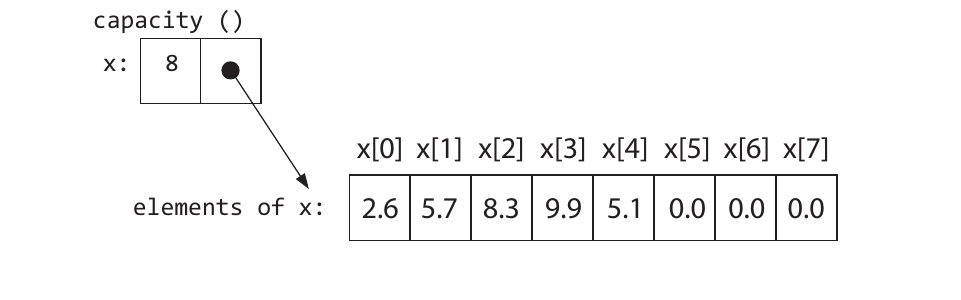
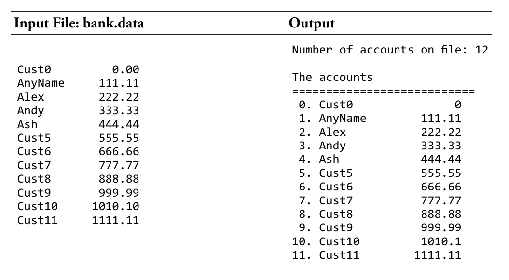
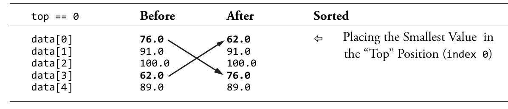
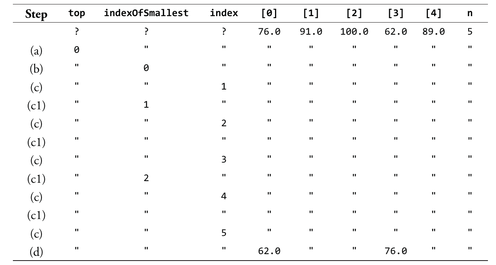
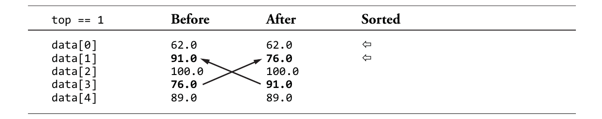
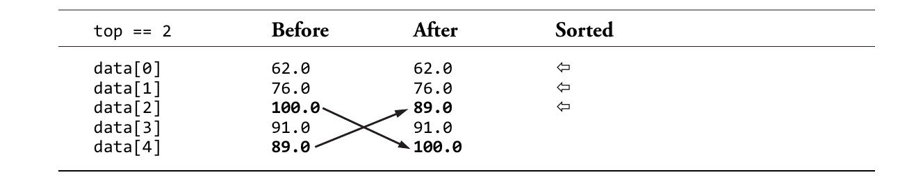
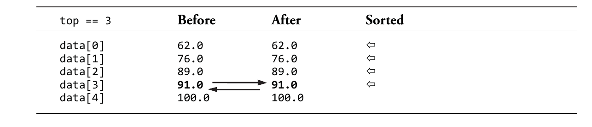
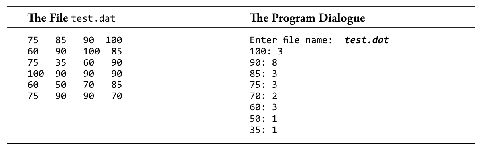

# 第10章 向量

## 前章回顾

到目前为止，我们所探讨的所有对象几乎都是一些特定的单一元素值（譬如`double`或`int`），或者是有两个以上不同类型元素组成的对象（譬如`Employee` 和`BankAccount`）。

## 本章提要

为了完成一些更有趣的事情，我们通常会需要用到一整组数据。例如，我们可能需要一个学生列表、一个电话联系人列表、一个文本线程列表、一个不同在线商店的价格列表等等。这些都需要我们将多个元素存储在同一个对象中 ，以便在后续编程中解决各种问题。因此在这一章中，我们将开始为你介绍其中最简单、最有用的一种：C++的`vector`类型。我们希望在完成本章的学习之后，你将掌握：

* 如何构造并使用`vector`存储一组任意类型的数据。
* 如何通过实现算法来处理一整组对象。
* 如何利用顺序搜索算法来找出指定元素在`vector`中的位置。
* 如何将`vector`对象传递给函数。
* 如何将`vector`中的元素按升序或降序排列，以及理解二分搜索算法的工作过程。

## 10.1 C++标准库中的vector类

`vector`类构造的对象是一个存储对象的*集合（collections）*。所有的`vector`对象中容纳的都是*相同性质（homogeneous）*的元素，因为这些对象都是同一种类型元素的集合（数字集合或字符串集合），例如，该对象可能是`int`、`double`或者`string`等任何一种标准类型的集合。除此之外，任何由程序员定义的类，只要它拥有默认构造函数，也都可以收纳在`vector`对象中。总而言之，我们可以拥有一个任何你能想象到的对象集合。下面我们来看初始化`vector`对象的两种通用格式：

**通用格式 10.1**: *`vector`对象的初始化*

```text
 vector <type> vector-name(capacity);
 —— 或 ——
 vector <type> vector-name(capacity, initial-value);
```

在这里：

* *type*用于指定要存储到`vector`中的对象的类型。
* *vector-name*可以是任何一个有效的C++标识符。
* *capacity*应该是个整数表达式，表示该`vector`中所能存储的最大元素数量。
* *initial-value*是可选项，可以用来指定每个元素的初始值。如果我们只提供一个实参（*capacity*），该类的默认构造函数就会自行负责设置初始值（想必你还记得，我们之前在使用`double`和`int`时，它们的默认值都是些垃圾值）。

下面我们来看几个`vector`对象初始化的具体示例：

```C++
 vector <int> garbage(1000000); // A million integers of unknown value
 vector <double> x(100, 99.9); // Store 100 numbers, all equal to 99.9
 vector <string> names(20, "TBA"); // Store 20 strings, all equal to "TBA"
```

当然，想要使用`vector`，我们还必须先加入`include <vector>`这个指令。另外，如果我们同时加上了`using namespace std;`这个声明，就直接引用`vector`，而无需每次都`std::vector`了。

```C++
#include <vector> // For the vector<type> class
using namespace std;
```

应该要提醒一下的是，接下来，我们所介绍的`vector`的语法和算法也同样适用于C++原生数组，譬如`int garbage[100]`和`string names[20]`。但使用`vector`主要会让我们有具有以下优势：

* `vector`对象可以自行检测出无效索引，譬如-1这个索引值谁要访问的元素。
* `vector`类有几个相当有用的成员函数，例如`resize(200)`。
* `vector`对象可以在构造阶段初始化其所有元素，而原生的C++数组则通常需要我们写个额外的`for`循环来完成相同的事。

### 10.1.1 访问集合中的个别元素

所有的`vector`对象都支持用索引值来访问其中的任意元素。`vector`中的个别元素可以通过其对应的下标加一对方括号`[ ]`来直接访问。

**通用格式 10.2**： *访问某个`vector`元素*

```text
 vector-name[integer-expression]
```

在C++中，`vector`的下标区间是一个0到`capacity - 1`的一个整数区间。也就是说，当某个`vector`对象x中的各对象被定义成这样时：

```C++
 vector <double> x(8, 0.0);
```

我们就可以用0、1、2、3一直到7的这些整数下标来引用它们，但8就不行了。譬如，下面这两个赋值语句修改了该`vector`中前两个元素所存储的值：

```C++
 // Assign new values to the first two elements of vector named x
 x[0] = 2.6;
 x[1] = 5.7;
```

由于C++采用的是从0开始计数的索引方式，所以该`vector`中的第一个元素要用下标0，或者说`x[0]`来引用；第五个元素要用下标4，或者说`x[4]`来引用。这些下标可以用于显示`vector`中的各个元素、将它们运用在表达式中、以及用赋值或输入操作修改它们。事实上，我们可以对该`vector`中的这些元素做任何其相同类所支持的操作。

当然，我们所熟悉的赋值规则也同样适用于`vector`元素。例如，`string`常量不能被赋值给`double`对象，同样的，`string`常量也不能被存储到其元素值被声明为`int`类型的`vector`中。

```C++
 x[2] = "Wrong type of constant"; // ERROR: x stores numbers
```

由于两个`double`类型的值是可以用`+`符号执行加法运算的，所以`vector`中的元素也一样可以下标的形式应用于算术运算表达式，譬如：

```C++
 x[2] = x[0] + x[1]; // Store 8.3
```

键盘输入也一样是可以用来修改`vector`元素的状态，具体如下：

```C++
cout << "Enter two numbers: ";
cin >> x[3] >> x[4];
```

#### 程序会话

```text
Enter two numbers: ***9.9 5.1***
```

在这里，用户分别输入了 ***9.9*** 和 ***5.1***，它们被分别存储在了该`vector`对象`x`的第四、第五个元素中。加上之前我们对`x`前三个元素的赋值，目前`x`这个`vector`的状态应如下图所示：



### 10.1.2 用确定的for循环来处理vector

程序员们势必经常会需要引用多个连续的`vevtor`元素。这其中最简单的用例就是一次性显示`vector`中所有有意义的元素了。C++的`for`循环为此提供了一种便利的方式。在下面的程序中，我们对`vector`执行了与上面相同的赋值操作。然后我们在最后加上了一段`for`循环，用来显示`vector`中前`n = 5`个元素。请注意，这时候`x[5]`、`x[6]`和`x[7]`还都是其原有的初始值0.0。

```C++
#include <iostream>
#include <vector> // For the vector<type> class
using namespace std;

int main() {
    vector<double> x(8, 0.0);

    // Assign new values to the first two elements of vector named x
    x[0] = 2.6;
    x[1] = 5.7;
    x[2] = x[0] + x[1]; // Store 8.3

    cout << "Enter two numbers: ";
    cin >> x[3] >> x[4];

    int n = 5;
    // assert: n represents the number of meaningful elements

    // Display the meaningful elements of x--the rst n elements
    cout << "\nThe first " << n << " elements of x: " << endl;
    for (int index = 0; index < n; index++) {
        cout << "x[" << index << "\]: ";
        cout << x[index] << endl;
    }

    return 0;
}
```

#### 程序会话

```text
 Enter two numbers: ***9.9 5.1***

 The first 5 elements of x:
 x[0]: 2.6
 x[1]: 5.7
 x[2]: 8.3
 x[3]: 9.9
 x[4]: 5.1
```

如你所见，`x`的前`n`个元素用名为`index`的`int`变量来引用是很方便的。该变量既是`for`循环的计数器，也是我们在该`for`循环中所使用的下标（即`x[index]`）。也就是说，`index`变量（在上面这段代码中）充当了两个服务角色，毕竟`x[index]`所引用的`vector`元素也要取决于`index`的值。例如，当`index = 0`时，`x[index]`所引用的就是`x`的第一个元素，当`index = 4`时，`x[index]`所引用的就是`x`的第五个元素了。

### 10.1.3 处理vector中的前n个元素

下面，我们再来看一个`for`循环示例，我们在该循环中比较了`vector`中前`n`个元素，并找出之前程序中那个`x`中的最大浮点数。

```C++
// First set the largest as the first element . . . 
double largest = x[0];

// . . . then compare all other vector elements x[1] through x[n-1]
for(int i = 1; i < n; i++) {
    if (x[i] > largest)
        largest = x[i];
}

// Display the largest
cout << "The largest element in vector x = " << largest;
```

#### 程序输出

```text
The largest element in vector x = 9.9
```

通常情况下，`vector`中所存储的有意义的元素往是要少于其整体容量的。因此，我们往往需要用一个对象来存储当前所关注的元素数量。在前面的代码中，`n`的作用是限制被引用的元素，让程序只在前五个元素中寻找最大值。请想象一下，如果我们是要从整个`x`中寻找最大的数字，不再将搜索范围限制在前`n`个元素了，那么最大的可能就是我们得到的结果是`index`为6、7、8的某个垃圾值。

使用`for`循环这样的确定循环模式可以很方便地对`vector`进行处理，它可以对我们选定数量的`vector`元素进行检查、引用或者修改。其选定的元素数量（在这里就是`n`）就是我们必须要处理的元素数。在这一章中，我们将介绍以下`vector`处理算法：

* 显示`vector`中的部分或所有元素。
* 找出`vector`中所有元素的总和值、平均值和最大值。
* 在`vector`中搜索特定的对象。
* 按特定的顺序排列元素（譬如让`vector`中的元素按数字或`string`对象首字母的从最小到最大的顺序排列）。

### 10.1.4 检查下标出界

标准`vector`类本身并不会检下标是否在0到`capacity-1`的这个适当区间内。因此程序员们必须得自己留意，不要使用超出初始化时指定区间之外的下标。如果我们在使用没有检查下标能力的标准`vector`类，下面这样的赋值很有可能会毁坏其它部分的某些内存数据，譬如另一个对象的状态：

```C++
x[-2] = 4.5; // Careful! These out-of-range subscripts are not
x[8] = 7.8;  // guarded against and could crash your computer.
```

这样做既有可能会带来一些无伤大雅的错误，也可能会形成bug，甚至导致系统崩溃。我们应该设法确保`vector`的所有下标都落在0到`capacity-1`的这个指定区间内。

如果不做这样的区间检查，一次下标出界的操作就会对其他区域的内存造成毁坏，这会产生出非常难以检测的bug。更糟糕的是，如果这样的代码在工作站上一直运行下去，我们可能会遇到某些因计算机内存受到影响的延时错误，但系统本身却可能在几周之内都不会崩溃。

下面，我们就来示范一个下标出界可能会产生的问题，请思考一下，在执行下面这个赋值操作之后，可能会发生哪些情况：

```C++
result = x[n];
```

这时候，存储在`x[n]`处的的值在`vector`容量之外的，它是一些随机的垃圾值。在一个系统上，这条语句会产生的如下输出：

```C++
// There is no warning or error with the statement
cout << "x[n]: " << x[n] << endl;
```

#### 程序输出

```text
x[n]: -33686019
```

当然，标准`vector`类也为我们提供了一个可以避免下标出界的成员函数`at`。虽然这会让`result`看起来会有些不一样，但该消息可以优雅地终止程序，不会不再会将一些随机值存储到`result`中了。

```C++
result = x.at(n); // Gracefully terminates the program. Good.
```

如果我们想确保自己的程序中不出现越界的索引，就应该使用`at(int)`消息。这样一来，当程序遇到这种情况时就会提前终止执行，并显示一条错误信息告知原因。这至少比我们去修复那些难以定位的错误要好多了。下面，我们就具体来看一下使用`vector`类的`at`成员函数会发生什么情况：

```C++
#include <vector> // For the vector<type> class
#include <iostream>
using namespace std;

int main() {
    vector<double> x(8);

    // Attempt to assign 100 to all elements of vector named x
    for (int i = 1; i <= x.capacity(); i++) {
        x.at(i) = 100;
    }

    cout << "Program would terminated above with x[8]" << endl;

    return 0;
}
```

#### 程序提前终止时的输出（具体输出内容会因系统的不同而不同）

```text
 libc++abi.dylib: terminating with uncaught exception of type std::out_of_range: vector
```

我们当然可以在以后的示例中都使用`vector::at`，但是，程序员们使用下标的习惯已经由来已久了，我们会看到许多地方使用的依然是方括号（`[]`)，所以本教材也将继续使用下标这种形式。但在你们自己开发程序时，可以随意采用消息的方式。

### 10.1.5 vector::capacity、 vector::resize与操作符=

C++标准库中的`vector`对象可以接收许多消息。每个`vector`对象都可以知道自己可以存储多少对象，也就是它的容量。另外，`vector`还可以增加或减少自己的容量，也就是调整自身容量的大小。

在一个`vector`完成初始化之后，`vector::capacity`消息可以返回该`vector`可以容纳的最大元素数。`vector::resize`消息可以让`vector`根据它的单一实参值更改成新的容量值。当然，该函数有个奇怪的设定，即当其实参值小于原有容量时，`capacity`消息返回的是那个更大的容量值。例如在下面的代码中你会看到，当程序因`at(55)`这个调用终止执行并显示错误信息时，`v2`的容量仍然是100：

```C++
// Demonstrate capacity and resize
#include <vector> // For the standard vector<type> class
#include <iostream>
using namespace std;

int main() {
    vector <int> v1; // v1 cannot store any elements with 0 capacity
    vector <int> v2(100, -1);

    cout << "v1 can store " << v1.capacity() << endl;
    cout << "v2 can store " << v2.capacity() << endl;

    v1.resize(22);
    cout << "v1 can now store " << v1.capacity() << endl;

    // Odd behavior when the argument is less than the current capacity.
    // at(55) shows you can not access past the smaller capacity.
    v2.at(55) = 123;
    cout << "v2.at(55): " << v2.at(55) << endl;
    v2.resize(55);
    cout << "v2 can now store " << v2.capacity() << endl;
    cout << "v2 has this -1s: " << v2.size() << endl;
    cout << "v2.at(55): " << v2.at(55) << endl;

    return 0;
}
```

#### 程序输出

```text
 v1 can store 0
 v2 can store 100
 v1 can now store 22
 v2.at(55): 123
 v2 can now store 100
 v2 this many meaningless -1s: 55
 v2.at(55): libc++abi.dylib: terminating with uncaught exception of type std::out_of_range: vector
```

如果我们将`vector`调整到了一个更大的容量，下标数较低的原有元素是不变的。但如果是将`vector`的容量调小了，下标数较高的元素就会被丢失，就发生了截断现象。

`vector`对象之间也是可以相互赋值的。操作符`=`左侧的`vector`将会成为其右侧的一个完整副本，并且左侧原有的`vector`对象将和其他位于操作符`=`左侧的对象一样，被销毁。

```C++
// Demonstrate capacity and resize
#include <iostream>
#include <vector> // For the vector<type> class
using namespace std;

int main() {
    vector <int> v1(3, -999);
    vector <int> v2;

    v2 = v1;
    // assert: v2 now stores 3 elements == -999
    for(int index = 0; index < v2.capacity(); index++) {
        cout.width(5);
        cout << v2[index];
    }

    return 0;
}
```

#### 程序输出

```text
 -999 -999 -999
```

### 自选题

请根据下面的初始化操作回答下列问题：

```C++
 vector <int> x(100, 0);
```

* 10-1. `x`中可以存储多少个整数？

* 10-2. 引用`x`中的第一个元素的下标是哪一个整数？

* 10-3. 用`x`中的最后一个元素的下标是哪一个整数？

* 10-4. `x[23]`的值是多少？

* 10-5. 请编写代码，将78这个数存入`x`的第一个元素。

* 10-6. 请编写代码，将1数存入`x[99]`、将2存入`x[98]`、3存入`x[97]`，以此类推下去，一直到将99存入`x[1]`以及100存入`x[0]`。要求使用`for`循环。

* 10-7. 请编写代码，用单独的一行显示`x`中的所有元素。要求使用`for`循环。

* 10-8. 请问执行了`x[-1] = 100;`这条语句之后会发生什么情况？

* 10-9. 请列举`vector`的两个成员函数。

* 10-10. 请写出下面程序预计会产生的输出：
    ```C++
    #include <vector> // For the standard vector<type> class
    #include <iostream>
    using namespace std;

    int main() {
        int n = 5;
        vector <int> x(n, 0);
        for(int i = 0; i < n; i++) {
            x[i] = i;
        }

        x.resize(2 * n);

        // Show the rst ve elements are still in x
        for(int i = 0; i < n; i++) {
            cout.width(5);
            cout << x[i];
        }
        cout << endl;

        for(int i = 0; i < x.capacity(); i++) {
            cout.width(5);
            cout << x[i];
        }
        cout << endl;

        return 0;
    }
    ```

***

## 10.2 顺序搜索

我们会使用`vector`对象的主要原因之一就是为了将各个元素存储到计算机的快速存储器（fast memory），在那里这些元素将会被频繁地访问。而这就通常意味着我们要对存在于集合中的元素进行搜索，因此搜索也应该属于常见的`vector`处理操作。搜索操作的示例包括但并不仅仅是在注册方数据库中搜索学生的名字、查找库存货物的价格或者获取银行某账户的信息。对于这类在`vector`中查找某元素的算法，我们通常称之为*顺序搜索（sequential search）*.

顺序搜索算法会试图通过比较`vector`中的每个对象来定位被知道的搜索项。该算法会一个接着一个的形式（按照顺序）来进行搜索，只要搜索目标尚未找到或`vector`中还有剩下的元素没有被比较，顺序搜索就会继续下去。

下面，我们来看一下顺序搜索算法在`string`对象`vector`环境下的应用。虽然我们这次要搜索的元素是一个人名，但被搜索的`vector`中也可以是其他各种类型的对象，譬如数字、学生或员工等，只要这些类型的对象可以用操作符`==`来进行比较即可。

```C++
// Initialize and show the first n elements of vector named name
#include <iostream>
#include <string>
#include <vector> // For the standard vector<type> class
using namespace std;

// This free function uses the sequential search algorithm to return
// the index of searchName in the vector or -1 if searchName is not found.
int indexOf(string searchName, const vector<string> & names, int n) {
    // Just show the vector elements for now
    for (int i = 0; i < n; i++) {
        if (searchName == names[i])
            return i;
    }
    // searchName not found
    return -1;
}

int main() {
    vector<string> myFriends(10);
    int n = 5; // Set the number of meaningful elements to be searched

    myFriends[0] = "Sage";
    myFriends[1] = "Harley";
    myFriends[2] = "Peyton";
    myFriends[3] = "Quinn";
    myFriends[4] = "Taylor";

    cout << "Sage is at index " << indexOf("Sage", myFriends, n) << endl;
    cout << "Peyton is at index " <<  indexOf("Peyton", myFriends, n) << endl;
    cout << "Taylor is at index " << indexOf("Taylor", myFriends, n) << endl;

    if(indexOf("Not Here", myFriends, n) == -1) {
        cout << "Not Here was not found" << endl;
    }

    return 0;
}
```

#### 程序输出

```text
Sage is at index 0
Peyton is at index 2
Taylor is at index 4
Not Here was not found
```

### 自选题

* 10-11. 如果`searchName`不存在于`names`所引用的`vector`中，该函数返回的是什么值？

* 10-12. 当`searchName`与`myFriends[0]`匹配时，该函数共执行了几次比较操作（即搜索循环的迭代次数）？

* 10-13. 当`searchName`与`myFriends[n-1]`匹配时，该函数共执行了几次比较操作（即搜索循环的迭代次数）

* 10-14. 当`searchName`与`myFriends[3]`匹配时，该函数共执行了几次比较操作？

* 10-15. 当`searchName`不存在于`myFriends`匹配时，该函数共执行了几次比较操作？

* 10-16. 但`vector`中没有有用数据，即`n == 0`时，顺序搜索需要执行几次比较操作？

***

## 10.3 发送消息给vector中的各对象

我们也可以利用下标来向各个元素发送消息。具体做法就是用`vector`的名称加上我们要发送消息的那个`vector`元素的*下标*。下标的作用就是区别我们要执行相关操作的对象。例如，如果我们想获取`myFriends[0]`这个字符串“Sage”的长度，就得使用以下表达式：

```C++
myFriends[0].length(); // The length of the first name in the vector
```

请注意，这里的表达式不能错写成`myFriends.length()`，因为这样的话，我们所要计算的就是整个`vector`的长度了。而`length`是`string`定义的函数，它不属于`vector`类（尽管后者定义了`vector::resize`和`vector::capacity`这两个函数）。

接下来，我们再来看看应该如何确定某个`BankAccounts`类的`vector`中所有`BankAccounts`对象的总资产。在下面的程序中，我们会先建立一个包含四个`BankAccounts`对象的小型数据库。在此过程中，我们需要用`account[0] = BankAccount ("Baker", 0.00);`这样的语句先构建一个账户名为“Baker”、账户余额为0.00的`BankAccounts`对象，并将其赋值给`vector`的第一个元素`account[0]`。

```C++
// Illustrates a vector of programmer-defined objects
#include <iostream>
#include <vector> // For the vector<type> class
using namespace std;
#include "BankAccount.h" // For the BankAccount class

int main() {
    vector<BankAccount> account(100);

    // Initialize the first n elements of account
    int n = 4;
    account[0] = BankAccount("Baker", 0.00);
    account[1] = BankAccount("Cook", 100.00);
    account[2] = BankAccount("Cartright", 200.00);
    account[3] = BankAccount("FensterMacher", 300.00);
    // assert: The first n elements of account are initialized

    double assets = 0.0;
    // Accumulate balance of n BankAccount objects stored in account
    for (int i = 0; i < n; i++) {
        assets += account[i].getBalance();
    }

    cout << "Assets: " << assets << endl;

    return 0;
}
```

#### 程序输出

```text
Assets: 600
```

### 自检题

* 10-17. 请写出下面程序预计会产生的输出：
    ```C++
    #include <iostream>
    #include <vector> // For the vector<type> class
    #include <string> // For the string class
    using namespace std;

    int main() {
        vector<string> s(10);
        // Initialize the first 4 elements of account
        s[0] = "First";
        s[1] = "Second";
        s[2] = "Third";
        s[3] = "Fourth";
        int n = 4;

        for (int i = 0; i < n; i++) {
            cout << s[i].substr(1, s[i].length() - 2) << " ";
        }

        return 0;
    }
    ```

***

### 10.3.1 用文件输入的方式初始化vector

In some of the preceding programs, the vectors of objects were initialized in several assignment statements. vector objects can also be initialized through disk fi le input. To demonstrate, imagine the following is part of the input data file named bank.data with a total of 12 accounts on 12 lines:

```text
Cust0         0.00
AnyName     111.11
Alex        222.22
Andy        333.33
Ash         444.44
Cust5       555.55
```

. . . five lines are omitted . . .

```text
Cust11     1111.11
```

If the vector is declared with a maximum capacity of 20 like this, then the first BankAccount object can be stored in account[0]:

```C++
vector <BankAccount> account(20);
// assert: account could store 20 default BankAccount objects
```

So an object named numberOfAccounts starts at 0:

```C++
int numberOfAccounts = 0;
```

Then the vector of BankAccount objects can be initialized one account at a time with these steps:

1. Input two items per line—a name and a balance.
2. Construct a BankAccount and store it into the next available vector location.
3. Increase the number of accounts by 1.

The vector::capacity function will also be used to safeguard against using subscripts beyond the account’s boundaries of 0 through 19.

The following while loop test expression should be true before a BankAccount object can be added at the next available location in the vector. If there are no more data in the fi le, (inFile >> name >> balance) is false and the loop will terminate. Also, if there are more data in the fi le but no more room in the vector, (numberOfAccounts < account.capacity()) is false and the loop terminates for a diff erent reason—there is no room.

```C++
while ((inFile >> name >> balance) &&
        (numberOfAccounts < account.capacity())) {
    account[numberOfAccounts] = BankAccount(name, balance);
    numberOfAccounts++;
}
```

While there is room for another element and there are more data in the file, the repeated part executes. Inside the loop, the two objects (name and balance) are passed on to the BankAccount constructor to construct a BankAccount, which is then stored in the next consecutive
> vector element. This initialization and assignment must occur before numberOfAccounts is incremented from 0 to 1 during the first iteration of the loop.

Now numberOfAccounts accurately indicates the number of accounts processed so far, and the first BankAccount object is stored into account[0]. During each loop iteration, numberOfAccounts represents not only the total number of meaningful accounts stored in the vector, but also the next available vector subscript into which the next BankAccount object can be stored. When the end of the file is encountered, numberOfAccounts will have the correct value—one greater than the subscript storing the last account.

This processing is shown in the context of a complete program which sets up a small database of bank customers:

```C++
// Initialize a vector of BankAccount objects through le input
#include <vector> // For the vector<type> class
#include <fstream> // For the ifstream class
#include <iostream> // For cout and endl
#include <string> // For the string class
using namespace std;
#include "BankAccount.h" // For the BankAccount class

int main() {
    string leName = "bank.data";
    ifstream inFile(leName.c\_str());

    if (!inFile) {
        cout << "**Error** " << leName << " was not found" << endl;
    } else {
        vector<BankAccount> account(20);
        string name;
        double balance = 0.0;
        int numberOfAccounts = 0;

        while ((inFile >> name >> balance)
                && (numberOfAccounts < account.capacity())) {
            account\[numberOfAccounts\] = BankAccount(name, balance);
            numberOfAccounts++;
        }

        cout << "Number of accounts on le: " << numberOfAccounts << endl;
        cout << endl;
        cout << "The accounts" << endl;
        cout << "===========================" << endl;
        for (int index = 0; index < numberOfAccounts; index++) {
            cout.width(2);
            cout << index << ". ";
            cout << account[index].getName();
            cout.width(20 - account[index].getName().length());
            cout << account[index].getBalance() << endl;
        }
    } // end else

    return 0;
}
```



### SELF-CHECK

* 10-18. Write two assignment statements that initialize two additional BankAccount objects with assignment statements in the next two vector locations. Use any data you desire.

* 10-19. What would happen if the input fi le bank.data contained 21 lines, each line representing one account? Remember, account.capacity() is 20.

* 10-20. Write code to initialize a vector of integers from a file named int.dat. Assume the fi le never has more than 1,000 integer values.

* 10-21. Which object in your code represents the number of initialized elements?

* 10-22 Write code that verifi es proper initialization of the vector of the previous two self-check questions.

***

## 10.4 vector ARGUMENT/PARAMETER ASSOCIATIONS

Sometimes it may be necessary to pass a vector to either a member function or a nonmember function through argument/parameter association. This requires a diff erent syntax in the parameter list. There are three ways to declare a vector parameter, but only these two should ever be used:

#### Pass by Reference (when the function must modify the associated vector argument)

> *return-type* *function-name* (vector <*class*> & *vector-name)*
>
#### Pass by const Reference (runtime effi cient with & and safe with const)

> *return-type* *function-name* (const vector <*class*> & *vector-name*)

A vector object should not be passed by value. Th is parameter-passing mode is usually inefficient since vector objects can consume a large amount of memory.

```C++
void inef cient(vector <BankAccount> accounts, int n) {
    // VALUE parameter (should not be used with vectors). All elements
    // of acct are copied after allocating additional memory.
}
```

Recall that passing by value causes the function to allocate memory for a copy of the object passed by value. Th is could be thousands or even millions of bytes. Th e program could terminate because of lack of memory. Additionally, every byte of the vector needs to be copied, which could noticeably slow down the program. Passing by const reference has the same meaning, but is more efficient.

Use pass by reference (with &) when a function is supposed to modify the associated argument:

```C++
void initialize(vector <BankAccount> & accounts, int & n){
    // REFERENCE parameter (allows changes to argument)
    // Only a pointer to acct is copied
    // A change to acct here changes the argument in the caller
}
```

When a function requires a vector but should not modify the associated argument, pass the vector by const reference:

```C++
void display(const vector <BankAccount> & accounts, int & numberOfAccounts)
{
    // CONST REFERENCE parameter (for ef ciency and safety)
    // Only a reference to the acct is copied (4 bytes)
    // A change to acct does NOT change the argument
}
```

The next program passes a vector by reference to the function initialize in order to communicate the initialized array back to main. The main function passes by reference a vector of doubles to a void function named initialize. Because the vector and int parameters x and numberOfAccounts are declared as a reference parameter with &, any change to x or numberOfAccounts inside of initialize also changes the arguments in the main function test and n.

```C++
#include <vector> // For the vector<type> class
#include <iostream> using namespace std;

void initialize(vector<int> & x, int & numberOfAccounts) {
    // Two reference parameters
    // post: Initialize the first n elements of the argument
    numberOfAccounts = 5;
    x.resize(numberOfAccounts);
    x[0] = 75;
    x[1] = 88;
    x[2] = 67;
    x[3] = 92;
    x[4] = 51;
    // The arguments associated with x and n, test and n in main,
    // will also be modified.
}

void display(const vector<int> & x, int numberOfAccounts) 
{
    // Const reference
    // Display the vector with n meaningful values
    cout << "The vector: ";
    for (int i = 0; i < numberOfAccounts; i++) {
        cout.width(5);
        cout << x\[i\] << " ";
    }

    cout << endl;
}

int main() {
    vector<int> vec(10, 0)
    int n;

    // Initialize test and n
    initialize(vec, n);
    display(vec, n);

    return 0;
}
```

#### Output

```text
The vector: 75 88 67 92 51
```

### 10.4.1 const REFERENCE & PARAMETERS

The preceding program showed that the arguments—test and n—were passed to function initialize by reference. Th is was done to allow the function to modify both arguments and communicate the changes back to main. However, sometimes a vector is passed as input to a function, where no changes should be made. In this case, the const reference form should be used like in the initialize function above. Part of the reason is efficiency—the program executes more quickly. The other consideration is better memory utilization—less memory is required to
> store the vector in the called function. A vector object passed by value requires as much memory as the argument.

```C++
// A vector should not be passed by value like this
void display(vector <double> x, int n) {
    // Value parameter
    // This function must obtain the memory necessary to store x when x
    // could have a large capacity of large objects
}
```

So if the vector argument had a capacity of 100,000 elements, void display would need to consume an additional 100,000 elements. Additionally, every single element would need to be copied from the client code (the caller) to the called function. Th is can be time consuming, especially when the vector’s capacity is large and/or the size of each element is large. Th e computer has to do a lot of unnecessary work. Th e program would run noticeably slower and might exhaust available memory.

Here are two alternatives to make any program more effi cient in terms of space (saves memory) and time (runs faster):

1. Pass the vector by reference—effi cient but dangerous.
2. Pass the vector by const reference—effi cient and safe.

The second option is highly recommended—the computer program has much less work to do.

Using const is also an antibugging technique that will let the compiler catch attempts to modify the constant objects. Any const member function may still be called— vector::capacity, for example. However, the compiler will flag any attempt to send a nonconst message:

```C++
// precondition: x.capacity() > 0
void display(const vector <int> & x, const int n) {
    cout << "\nThe vector's capacity is " << x.capacity() // <- Okay
    cout << x[0]; // <- OKAY to reference vector element
    x[0] = 123; // <- ERROR caught during compilation
}

error: cannot assign to return value because function 'operator[]' returns a const value
```

Pass vector objects or any large object by const reference.

### SELF-CHECK

* 10-23. Why should vector and Grid objects be passed by const reference when you have always seen int and double variables passed by value?

* 10-24. If the average size of the BankAccount objects in a vector of capacity 100,000 is 57 bytes, how many bytes of additional memory would have to be reserved and then copied into each of the following functions? Remember, pass by reference typically requires four bytes of memory:
  * a.  void one(vector<BankAccount> v1)
  * b.  void two(vector<BankAccount> & v1)
  * c.  void one(const vector<BankAccount> & v1)

***

## 10.5 SORTING

The elements of a vector are often arranged into either ascending or descending order through a process known as *sorting*. For example, a vector of test scores is sorted into ascending order by rearranging the numeric values in lowest-to-highest order. A vector of string objects sorted in ascending order establishes an alphabetized list (A’s before B’s, B’s before C’s). To sort a vector, the elements must be compared with the < operator. If one object can be less than another object of the same type, then the vector is *sortable*. For example, 85 < 79 and "A" < "B" are valid expressions.

The following code declares and gives meaningful values to a part of the vector named data to demonstrate sorting a vector of integers:

```C++
vector<int> data(10, 0); // Store up to 10 integers
int n = 5;
data[0] = 76;
data[1] = 74;
data[2] = 100;
data[3] = 62;
data[4] = 89;
```

There are many sorting algorithms. Even though others are more efficient (run faster), the relatively simple selection sort algorithm is presented here. The goal here is to arrange a vector of integers into ascending order, the natural ordering of integers.

| Object Name | Unsorted vector | Sorted vector |
|-------------|-----------------|---------------|
| data[0]     |       76.0      |  62.0         |
| data[1]     |       91.0      |  76.0         |
| data[2]     |       100.0     |  89.0         |
| data[3]     |       62.0      |  91.0         |
| data[4]     |       89.0      |  100.0        |

With the selection sort algorithm, the largest integer must end up in data[n - 1] (where n is the number of meaningful vector elements). The smallest number should end up in data\[0\]. In general, a vector x of size n is sorted in ascending order if x\[i\] <= x[i + 1] for i = 0 to n-2.

The selection sort begins by locating the smallest element in the vector by searching from the first element (data[0]) through the last (data[4]). The smallest element, data[3] in this vector, is then swapped with the top element, data[0]. Once this is done, the vector is sorted at least through the first element.



The task of fi nding the smallest element is accomplished by examining all vector elements and keeping track of the index with the smallest integer. After this, the smallest vector element is swapped with data[top] where top will range from 0 to n-1. Here is an algorithm that accomplishes these two tasks:

**Algorithm:** *Finding the smallest element in the vector and switching it with the topmost element*

```text
(a) top = 0
// At first, assume that the first element is the smallest
(b) indexOfSmallest = top
// Check the rest of the vector (data[top + 1] through data[n - 1])
(c) for index ranging from top + 1 through n - 1
    (c1) if data[index] < data[indexOfSmallest]
            indexOfSmallest = index
// Place the smallest element into the first position and place the first vector
// element into the location where the smallest vector element was located.
(d) swap data[indexOfSmallest] with data[top]
```

The following algorithm walkthrough shows how the vector is sorted through the first element. Th e smallest integer in the vector will be stored at the "top" of the vectordata[0]. Notice that indexOfSmallest changes only when a vector element is found to be less than the one stored in data[indexOfSmallest]. Th is happens the first and third times step (c1) executes.



This algorithm walkthrough shows indexOfSmallest changing twice to represent the index of the smallest integer in the vector. After traversing the entire vector, the smallest element is swapped with the top vector element. Specifi cally, the preceding algorithm swaps the values of the first and fourth vector elements, so 62.0 is stored in data[0] and 76.0 is stored in data[3]. The vector is now sorted through the first element!

The same algorithm can be used to place the second-smallest element into data[1]. The second traversal must begin at the new "top" of the vector—index 1 rather than 0. This is accomplished by incrementing top from 0 to 1. Now a second traversal of the vector begins at the second element rather than the first. The smallest element in the unsorted portion of the vector is swapped with the  second element. A second traversal of the vector ensures that the first two elements are in order. In this example vector, data[3] is swapped with data[1] and the vector is sorted through the first two elements:



This process repeats a total of n-1 times:



An element may even be swapped with itself:



When top goes to data[4], the outer loop stops. The last element need not be compared to anything. It is unnecessary to find the smallest element in a vector of size 1. This element in data[n - 1] must be the largest (or equal to the largest), since all of the elements preceding the last element are already sorted in ascending order:


Therefore, the outer loop changes the index top from 0 through n - 2. The loop to find the smallest index in a portion of the vector is nested inside a loop that changes top from 0 through n - 2 inclusive.

**Algorithm:** *Selection Sort *

```text
    for top ranging from 0 through n - 2 {
        indexOfSmallest = top
        for index ranging from top + 1 through n - 1 {
            if data[indexOfSmallest] < data[index] then
                indexOfSmallest = index
        }

        swap data[indexOfSmallest] with data[top]
    }
```

Here is the C++ code that uses selection sort to sort the vector of numbers shown. Th e vector is printed before and after the numbers are sorted into ascending order.

```C++
#include <vector>
#include <iostream>
using namespace std;

void sort(vector<int> & data, int n) {
    int indexOfSmallest = 0;

    for (int top = 0; top < n - 1; top++) {
        // First assume that the smallest is the first element in the subvector
        indexOfSmallest = top;

        // Then compare all of the other elements, looking for the smallest
        for (int index = top + 1; index < data.capacity(); index++) {
            // Compare elements in the subvector
            if (data[index] < data[indexOfSmallest])
                indexOfSmallest = index; 
        }

        // Then make sure the smallest from data\[top\] through data.size
        // is in data[top]. This message swaps two vector elements.
        double temp = data[top]; // Hold on to this value temporarily
        data[top] = data[indexOfSmallest];
        data[indexOfSmallest] = temp;
    }
}

vector<int> initialize() {
    vector<int> v(5);
    v[0] = 76;
    v[1] = 91;
    v[2] = 100;
    v[3] = 62;
    v[4] = 89;
    return v;
}

void display(vector<int> v) {
    for (int i = 0; i < v.capacity(); i++) {
        cout << v\[i\] << " ";
    }
    cout << endl;
}

int main() {
    vector<int> data = initialize();

    cout << "Before sorting: ";
    display(data);

    sort(data, data.capacity());
    cout << " After sorting: ";
    display(data);

    return 0;
}
```

#### Output

```text
Before sorting: 76 91 100 62 89
After sorting: 62 76 89 91 100
```

Most sort routines arrange the elements from smallest to largest. However, with just a few simple changes, any type of elements that allow the < and > operators may be arranged into descending order using the > operator.

```C++
if (data[index] < data[indexOfSmallest])
    indexOfSmallest = index;
```

becomes

```C++
if (data[index] > data[indexOfLargest])
    indexOfLargest = index;
```

### SELF-CHECK

* 10-25. Alphabetizing a vector of string objects requires a sort in which order—ascending or descending?

* 10-26. If the largest element in a vector already exists as the first, what happens when the swap function is called for the first time (when top = 0)?

* 10-27. Write code that searches for and stores the largest element of vector x into largest. Assume that all elements from x[0] through x[n-1] have been given meaningful values, so all vector elements should be considered.

## 10.6 BINARY SEARCH

This chapter has shown the sequential search algorithm used to locate a string in a vector of string objects. Th is section examines the more efficient binary search algorithm. Binary search accomplishes the same search task more quickly. It is faster than a sequential search, especially when the vector is large. However, one of its preconditions is that the vector must be sorted. By contrast, the slower sequential search does not require the vector to be sorted and the algorithm is simpler.

In general, binary search works like this. If a vector of objects is sorted, half of the vector’s elements are eliminated from the search each time a comparison is made. This is summarized in the following algorithm that searches for any element:

**Algorithm:** *Binary Search*

```text
while the element is not found and it still may be in the vector {
    determine the position of the element in the middle of the vector
    if the element in the middle is not the one being searched for:
        eliminate the half of the vector that cannot contain the element
}
```

Each time the search element is compared to one vector element, the binary search eff ectively eliminates half the vector elements from the search field. In contrast, the sequential search only eliminates one element from the search field for each comparison. Assuming a vector of string objects is sorted in alphabetic order, sequentially searching for "Ableson" does not take long since "Ableson" is likely to be located as one of the first vector elements. However, sequentially searching for "Zevon" would take much more time because the sequential search algorithm first searches through all names beginning with A through Y before arriving at the Z’s. Binary search gets to "Zevon" much more quickly.

The binary search algorithm has these preconditions:

1. The vector must be sorted (in ascending order for now).
2. The subscripts that reference the fi rst and last elements must represent the entire range of meaningful elements.

The element in the middle of the vector is accessed by computing the vector subscript that is halfway between the first and last positions of the meaningful elements. This is the average of the two subscripts that represent the first and last elements in the vector. These become subscripts in the search and will be referred to as rst, mid, and last. Here is the vector to be searched:

```C++
vector <string> str(32);
int n = 7;

str[0] = "ABE"; // first == 0
str[1] = "CLAY";
str[2] = "KIM";
str[3] = "LAU"; // mid == 3
str[4] = "LISA";
str[5] = "PELE";
str[6] = "ROE"; // last == 6
```

The binary search algorithm is preceded with several assignments to get things going:

```text
searchString = the string being searched for
first = subscript of the first meaningful vector element
last = subscript of the last meaningful vector element
mid = ( first + last) / 2
```

At this point, one of three things can happen:

1. The element in the middle of the vector matches the search name—the search is complete.
2. The search element precedes the middle element. The second half of the vector can be eliminated from the search field.
3. The search element follows the middle element. The first half of the vector can be eliminated from the search field.

This is written algorithmically as:

**Algorithm:** *Binary Search (more refi ned while assuming ascending sort)*

```text
if searchString == str[mid] then
    searchString is found
else
    if searchString < str[mid]
        eliminate mid...last elements from the search
    else
        eliminate first...mid elements from the search
```

The binary search algorithm is implemented here as a free function assuming the vector named str has been constructed, initialized, and sorted:

```C++
#include <vector>
#include <iostream>
#include <string>
using namespace std;

vector<string> initialize() {
    vector<string> str(7);
    str[0] = "ABE";
    str[1] = "CLAY";
    str[2] = "KIM";
    str[3] = "LAU";
    str[4] = "LISA";
    str[5] = "PELE";
    str[6] = "ROE";
    return str;
}

// pre: The vector named str is sorted in ascending order.
//     str[0] through str[6] are de ned vector elements.
//     string de nes < and ==.
int indexOf(string searchString, vector<string> str, int n){
    int first = 0;
    int last = n - 1; // last = 6;

    while (( first <= last)) {
        int mid = ( first + last) / 2; // (0 + 6) / 2 = 3 if (searchString == str[mid]) // Check the three possibilities
            return mid; // 1) searchString is found
        else if (searchString < str[mid]) // 2) It's in first half so
            last = mid - 1; // eliminate second half
        else
            // 3) It's in second half so eliminate first half
                first = mid + 1;
    }
    return -1; // searchString not found
}

void display(vector<string> v) {
    for (int i = 0; i < v.capacity(); i++)
        cout << v\[i\] << " ";
    cout << endl;
}

int main() {
    vector<string> data = initialize();
    cout << indexOf("LISA", data, data.capacity());
    return 0; 
}
```

#### Objects Before Comparing searchString ("LISA") to str[mid] ("LAU")

```text
str[0]  "ABE"  ← first == 0
str[1]  "CLAY"
str[2]  "KIM"
str[3]  "LAU"  ← mid == 3
str[4]  "LISA"
str[5]  "PELE"
str[6] "ROE"   ← last == 6
```

After comparing searchString to str\[mid\], first is increased and a new mid is computed:

| | |
|-|-|
| ~~str[0] "ABE"~~ | // Because "LISA" is greater than str[mid], the |
| ~~str[1] "CLAY"~~ | // the objects str[0] through str[3] no longer need |
| ~~str[2] "KIM"~~ | // to be searched and can now be eliminated from |
| ~~str[3] "LAU"~~ | // subsequent search |
| str[4] "LISA" | ← first == 4 |
| str[5] "PELE" | ← mid == 5   |
| str[6] "ROE"  | ← last == 6  |

Since searchString < str[mid] or "LISA" < "PELE" is true, last is decreased and a new mid is computed:

| | |
|-|-|
| ~~str[0] "ABE"~~ | |
| ~~str[1] "CLAY"~~ | |
| ~~str[2] "KIM"~~ | |
| ~~str[3] "LAU"~~ | |
| str[4] "LISA" | ← first == 5  ← last == 5 ← mid == 5 |
| ~~str[5] "PELE"~~ | // Because "LISA" is less than str[mid], eliminate |
| ~~str[6] "ROE"~~ | // str[5] through str[6] from the search field |

Now str\[mid\] does equal searchString, so the algorithm will break out of the loop.

The binary search algorithm can be more effi cient than the sequential search that only eliminates one element per comparison. Binary search eliminates half the elements for each comparison. For example, when n == 1,024, a binary search eliminates 512 elements from further search after the first comparison.

Now consider the possibility that the element being searched for is not in the vector. For example, to search for "CARLA", the values of first, mid, and last progress as follows:

| Comparison | first | mid | last | Comment |
|------------|-------|-----|-----|------------|
| 1  |  0  |  3  |  6  | Compare "CARLA" to "LAU" |
| 2  |  0  |  1  |  2  | Compare "CARLA" to "CLAY" |
| 3  |  0  |  0  |  0  | Compare "CARLA" to "ABE" |
| 4  |  1  |  0  |  0  | first <= last is false and the function returns -1 |

The loop test ( first <= last) evaluates to false when searchString ("CARLA") is not stored in the vector. Notice that last is less than rst—the two subscripts have crossed each other.

| | |
|-|-|
| str[0] "ABE" | ← last == 0  ← mid == 0 |
| str[1] "CLAY" | ← first == 1 |
| str[2] "KIM" | |
| str[3] "LAU" | |
| str[4] "LISA" | |
| str[5] "PELE" | |
| str[6] "ROE"  | |

After searchString ("CARLA") is compared to str[1] ("ABE"), no further comparisons are necessary. This is the second of two conditions that terminate the loop. Since rst is no longer less than or equal to last, searchString cannot be in the vector.

### SELF-CHECK

* 10-28. Write at least one precondition for a successful binary search.

* 10-29. What is the maximum number of comparisons (approximately) performed on a list of 1,024 elements during a binary search? (*Hint:* After one comparison, only 512 vector elements need be searched; after two searches, only 256 elements need be searched and so on.)

* 10-30. During a binary search, what condition signals that the search element does not exist in a vector?

* 10-31. What changes must be made to the binary search when the elements are sorted in descending order?

***

## CHAPTER SUMMARY

* Whereas objects may store data of many different types at the same time (a string, an int, and even a vector, for example), a vector object stores collections of the same class (a vector of char, int, string, or BankAccount objects, for example).

* Individual vector elements are referenced with subscripts. With a C++ vector, the int expression of a subscript reference should be in the range of 0 through the capacity - 1. For example, the valid subscript range of vector <double> x(100) is 0 through 99 inclusive.

* Out-of-range subscripts may not be detected at compile time and may cause system crash-es, destruction of other objects, or some other system-specific problems. It depends on the vector class you are using. Programmers must guard against these potential hazards.One of the easiest ways to do this is to use vector::at.

* An integer named n or size is usually an important piece of data that must be maintained in addition to the vector elements themselves. Th e number of meaningful elements is important in any vector-processing algorithm.

* Any vector object can be resized to have a different maximum capacity. If it is resized to be bigger, the meaningful elements remain. However, if a vector is resized to be smaller, truncation of meaningful elements may occur.

* The selection sort algorithm was used to arrange vector elements into ascending order. Any object that can be compared with < may be sorted.

* vector objects may also be sorted in ascending order, which is more appropriate sometimes, especially with string elements where ascending order means alphabetical order.

* The binary search algorithm is more efficient than sequential search. However, the vector must first be sorted for binary search to work properly.

## EXERCISES

1. Show the output generated by the following program:
    ```C++
    #include <iostream>
    #include <vector>
    using namespace std;

    int main() {
        const int MAX = 10;
        vector<int> x(MAX);

        for (int i = 0; i < 3; i++)
            x[i] = i * 2;
        for (int i = 3; i < MAX; i++)
            x[i] = x[i - 1] + x[i - 2];
        for (int i = 0; i < MAX; i++)
            cout << i << ". " << x[i] << endl;
    `   return 0;
    }
    ```

2. How many elements must be given meaningful values for a vector with 100 elements?

3. Declare a C++ vector called vectorOfInts that stores 10 integers with subscripts 0 through 9.

4. Write code that determines the largest value of a vector named list. Assume all elements from index 0 through list.size()-1 have been assigned meaningful values.

5. Write code to determine the average of integers in a vector named list. Assume all elements from index 0 through list.size()-1 have been assigned meaningful values.

6. Write the output generated by the following program:
    ```C++
    #include <iostream>
    #include <vector>
    #include <string>
    using namespace std;

    void init(vector<char> & data, int & n) {
        // postcondition: Initialize data as a vector of chars.
        // Initialize n as the number of meaningful elements.
        n = 5;
        data[0] = 'c';
        data[1] = 'b';
        data[2] = 'e';
        data[3] = 'd';
        data[4] = 'a';
    }

    void display(const vector<char> & data, int n) {
        // post: Show all meaningful elements of data
        cout << endl;
        cout << "Vector of chars: ";
        for(int i = 0; i < n; i++)
            cout << data[i] << " ";
        cout << endl;
    }

    void mystery(vector<char> & data, int n) {
        // post: Reverse the order of data
        int last;
        char temp;

        last = n - 1;
        for(int i = 0; i < n / 2 + 1; i++) {
            temp = data[i];
            data[i] = data[last];
            data[last] = temp;
            last--;
        }
    }

    int main() {
        vector<char> characters(10, ' ');
        int n;

        init(characters, n);
        display(characters, n);
        mystery(characters, n);
        display(characters, n);

        return 0;
    }
    ```

7. Write code to declare and initialize a vector of 10 string objects with keyboard input. Your dialogue should look like this:
    ```text
    Enter 10 strings
    #0 First
    #1 Second
    . . .
    #9 Tenth
    ```

8. Write code that sets found to true if a given string is found in the following vector. If a string is not in the vector, let found be false. Assume only the first n vector elements are initialized and are to be considered.
    ```C++
    vector<string> s(200);
    int n = 127;
    bool found = false;
    ```

9. How many comparisons does a sequential search make when the search element is stored in the fi rst vector element and there are 1,000 meaningful elements in the vector?

10. How many comparisons does a sequential search make when the search element does not match any vector element and there are 1,000 elements in the vector?

11. Assuming a large number of searches are made on a vector, and it is just as likely that an element will be found in the first position as the last position, approximate the average number of comparisons after 1,000 searches when there are 1,000 elements in the vector.

12. Write the output generated by the following program (trick question):
    ```C++
    #include <vector> // For the vector<type> class
    #include <iostream>
    using namespace std;

    void init(vector<int> x, int n) {
        // post: Supposedly modify n and the first n elements of test in main
        x[0] = 0;
        x[1] = 11;
        x[2] = 22;
        x[3] = 33;
        x[4] = 44;
        n = 5;
    }

    int main() {
        vector <int> test(100, 0);
        int n;

        // Initialize test and n
        init(test, n);
        // Display the vector with n meaningful values
        cout << "The vector: ";
        for(int i = 0; i < n; i++)
            cout << test[i] << " ";

        return 0;
    }
    ```

13. How would you change the code in exercise 12 so that the output is:
    ```text
    The vector: 0 11 22 33 44
    ```

14. Write the output generated by the following program:
    ```C++
    #include <vector> // For the vector<type> class
    #include <iostream>
    using namespace std;

    void f(const vector<int> & x) {
        cout << x[0] << endl;
        cout << x.capacity() << endl;
    }

    int main() {
        vector <int> test(10000, -1);
        f(test);
        return 0;
    }
    ```

15. Which lines contain compile time errors?
    ```C++
    void f1(vector<int> x) {
        cout << x[0] << endl;         // Line 1
        cout << x.capacity() << endl; // Line 2
        x[0] = 999;                   // Line 3
    }
    ```

16. Which lines contain compile time errors?
    ```C++
    void f2(const vector<int> & x) {
        cout << x[0] << endl;         // Line 1
        cout << x.capacity() << endl; // Line 2
        x[0] = 999;                   // Line 3
    }
    ```

17. Which of the previous two functions (exercises 15 and 16) is more efficient in terms of space and time—f1 or f2?

18. Write the output generated by the program segment below using the initialized vector of string objects.
    ```C++
    #include <iostream>
    #include <string>
    #include <vector> // For the vector<type> class
    using namespace std;

    int main() {
        vector<string> x(10);
        int j;
        int top = 0;
        int n = 5;

        x[0] = "Alex";
        x[1] = "Andy";
        x[2] = "Ari";
        x[3] = "Ash";
        x[4] = "Aspen";
        for (top = 0; top < n - 1; top++) {
            int subscript = top;
            for (j = top + 1; j <= n - 1; j++) {
                if (x[j] < x[subscript])
                    subscript = j;
            }
            string temp = x[subscript];
            x[subscript] = x[top];
            x[top] = temp;
        }
        for (int index = n - 1; index >= 0; index--) {
            cout << x[index] << endl;
        }
        return 0;
    }
    ```

19. Write the output of the program segment below using this initialized vector of string objects.
    ```C++
    vector <string> str(20);
    str[0] = "ABE";
    str[1] = "CLAY";
    str[2] = "KIM";
    str[3] = "LAU";
    str[4] = "LISA";
    str[5] = "PELE";
    str[6] = "ROE";
    str[7] = "SAM";
    str[8] = "TRUDY";

    int first = 0;
    int last = 8;
    int mid;
    string searchString("CLAY");

    cout << "First Mid Last" << endl;
    while ( first <= last) {
        mid = ( first + last) / 2;
        cout << first << " " << mid << " " << last << endl;
        if (searchString == str[mid])
            break;
        else if (searchString < str[mid])
            last = mid - 1;
        else
            first = mid + 1;
    }

    if ( first <= last)
        cout << searchString << " found" << endl;
    else
        cout << searchString << " was not" << endl;
    ```

20. Write the output generated by the program segment in exercise 19 when searchString is assigned each of the following values:
    * a.  searchString = "LISA"
    * b.  searchString = "TRUDY"
    * c.  searchString = "ROE"
    * d. searchString = "ABLE"
    * e. searchString = "KIM"
    * f. searchString = "ZEVON"

21. List at least one condition that must be true before a successful binary search can be implemented.

22. Using a binary search, what is the maximum number of comparisons (approximately) that will be performed on a list of 256 sorted elements? (*Hint*: After one comparison, only 128 vector elements need be searched; after two searches, only 64 elements need be searched; and so on.)

## PROGRAMMING TIPS

1. C++ begins to count at 0. Th e fi rst vector element is referenced with subscript 0, not 1 as is done in some other programming languages.

2. A vector often has a capacity greater than its number of meaningful elements. Sometimes vector objects are initialized to store more elements than are actually needed. In this case, only the first n elements are meaningful.

3. Use a second variable named n, perhaps to maintain the number of meaningful vector elements. When vector objects are used as a data member, consider using another data member to store the number of meaningful elements. You may need to resize to allow additional capacity. However, when using vector objects outside of a class, make sure you have an integer that maintains the number of meaningful elements. Consider the following code that counts the number of elements from a fi le as individual vector elements are initialized. Th e number of meaningful elements is maintained in n, so it was necessary to initialize n to 0 and then increment n by 1 for each number on file.
    ```C++
    vector <double> x(100, 0.0);
    double aNumber;
    int n = 0;
    while ((inFile >> aNumber) && (n < x.capacity())) {
        x[n] = aNumber;
        n++;
    }
    ```

4. Consider using at(index) instead of \[index\]. Th e at message is safer. You get a runtime error that is easier to track down than a change to some memory in an unknown place.

5. The last meaningful vector element is in x[n-1], not x[n]. Don’t reference x[n]. This can be done in the code of the third programming tip by accidentally writing the for loop like this:
    ```C++
    int n = 10;
    vector<int> x(n, 123);
    for (int j = 0; j <= n; j++) { // Used <= instead of <
        cout.width(5);
        cout << x[j]; // Will eventually reference garbage
    }
    ```

6. Prevent assignments to a vector with out-of-range subscripts. The code of the third programming tip has a loop test that terminates before assignment to x[x.capacity()]. When n equals the capacity, the loop terminates.
    ```C++
    while ((inFile >> aNumber) && (n < x.capacity()) ) {
        // The loop test prevents assignment to x[x.capacity()]
        x\[n\] = aNumber;
        n++;
    }
    ```
    It would also be useful to notify the user that something went wrong in this case. Terminating the program prematurely is an easy (but awkward) way of doing this:

    ```C++
    if (n == x.capacity() && inFile) {
        cout << "**Error** Vector was too small. Terminating program" << endl;
        return 0;
    }
    ```

7. Make your programs robust with vector::resize and vector::capacity. The code in programming tip 6 can be most irritating to users once they have purchased your software. A sounder way to handle the awkward situation of having too small a vector is to resize it when necessary. With the following code, the vector’s capacity will increase by 10 elements every time the vector fi lls up. This code also demonstrates the advantage of keeping track of the number of meaningful values in a separate integer variable because size() and capacity() are 20 when there were only 17 numbers in the input file.
    ```C++
    int aNumber;
    ifstream inFile("numbers");
    vector<int> x(10);
    int n = 0;
    while (inFile >> aNumber) {
        if (n == x.capacity()) {
            x.resize(n + 10);
        }
        x\[n\] = aNumber; n++;
    }

    cout << " n: " << n << endl;
    cout << " Size: " << x.size() << endl;
    cout << "Capacity: " << x.capacity() << endl;
    ```
    Output when the input fi le numbers has 17 integers:
    ```text
           n: 17
        Size: 20
    Capacity: 20
    ```

8. Do not pass vector objects by value. Passing any big object by value slows down program execution and requires unnecessary memory runtime allocation. If a function needs the values of a vector but is not supposed to modify the vector, pass the vector by const reference like this:
    ```C++
    void constReferenceIsGood(const vector<double> & x, int n) {
        // This function can reference any element in x, but cannot change x
    }
    ```
    As usual, if a function is meant to modify the argument (a vector in this case), pass it by reference like this:
    ```C++
    void init(vector<double> & x, int & n) { // Reference parameter
        // This function can change any element in x
    }
    ```

    Even string objects should be passed by const reference rather than by value because they are sometimes big.

9. The standard vector class does not check subscripts with [], but it does with vector::at(int). Consider using x.at(subscript) instead of x[subscript]. They are equivalent expressions with one notable exception—when the subscript is out of range, vector::at reports it as an error. You’ll find out about the error right away during testing. This is preferable to using some random value accessed with an out-of-range subscript. Your code would look diff erent than other C++ programs due to the historical use of \[\] and the newness of at.
    ```C++
    #include <vector> // For the vector<type> class
    #include <iostream>
    using namespace std;

    int main() {
        int n;
        cout << "Enter vector capacity: ";
        cin >> n;
        vector <int> x(n);

        for(int index = 0; index < n; index++) {
            x.at(index) = index;
        }

        cout << "First: " << x.at(0) << endl;
        cout << "Last: " << x.at(x.capacity() - 1) << endl;

        return 0;
    }
    ```

    Dialogue
    ```text
    Enter vector capacity: ***100***
    First: 0
    Last: 99
    ```
    The previous code once again demonstrates that the fi rst element in the vector is referenced with a subscript of 0, and the last element with index capacity()-1. So the following statement code would generate a runtime error and terminate the program: 
    ```C++
    cout << "Last: " << x.at(x.capacity()) << endl; // Always an error
    ```

10. There are many sorting algorithms other than selection sort. Selection sort is only one of the many known sorting algorithms. Several others have approximately the same runtime efficiencies. Some are even better. For example, quicksort is usually much more efficient. Th is chapter was not written to cover sorting completely. It is only a very brief introduction to another category of vector-processing algorithms.

11. There are many searching algorithms. Sequential and binary search are only two of the known searching algorithms. For small amounts of data, sequential search works very nicely. For larger amounts of data stored in sorted vectors, binary search works well. Other ways to store very large amounts of data that can be searched rapidly include hash tables and binary trees, for example. These are topics usually covered in a second course.

## PROGRAMMING PROJECTS

### 10A. REVERSE

Write a complete C++ program that reads an undetermined number of integers (maximum of 100) and displays them in reverse order. The user may not supply the number of elements, so a sentinel loop must be used. Here is one sample dialogue:

```text
Enter up to 100 ints using -1 to quit:
***70***
***75***
***90***
***80***
***-1***
Reversed: 80 60 90 75 70
```

### 10B. SHOW THE ABOVE-AVERAGE ONES

Write a complete program that inputs an undetermined number of positive numeric values, determines the average, and displays every value that is greater than or equal to the average. The user may not supply the number of elements, so use a sentinel loop. Here is one sample dialogue:

```text
Enter numbers or -1 to quit
***70***
***75***
***90***
***60***
***80***
***-1***
Average: 75
Inputs >= average: 75 90 80
```

### 10C. SEQUENTIAL SEARCH FUNCTION

Write a function named search that returns the subscript of the first found search element in a vector of string objects. If the search element is not found, search should return -1.

### 10D. A COLLECTION OF BANKACCOUNT OBJECTS

Write a complete C++ program that creates an undetermined number of BankAccount objects and stores them in a vector. Th e input should come from an external fi le that looks like the following, but may contain 1, 2, 3, or up to exactly 20 lines (each line represents all data necessary to create one BankAccount object):

```text
Hall         100.00
Solly         53.45
Kirstein     999.99
 . . .
Pantone     8790.56
Brendle        0.00
Kentish     1234.45
```

After initializing the vector and determining the number of BankAccount objects, display every BankAccount that has balance greater than or equal to $1,000.00. Th en display every BankAccount that has a balance less than or equal to $100.00. Your output should look like this:

```text
Balance >= 1000.00
Pantone:   8790.56
Kentish:   1234.56

Balance <   100.00:
Solly:       53.45
Brendle:      0.00
```

### 10E. PALINDROME 1

A *palindrome* is a collection of characters that read the same backward as forward. Write a program that extracts a string from the keyboard and determines whether or not the resulting string is a palindrome (recall that string objects reference individual characters with the subscript operator [ ]). Some examples of palindromes are YASISAY, racecar, 1234321, ABBA, level, and MADAMIMADAM. Here are two sample dialogues. (*Note:* Do not use any blank characters! If you prefer, complete programming project 10F instead.)

```text
Enter string: ***MADAMIMADAM***
    Reversed: MADAMIMADAM
  Palindrome: Yes

Enter string: ***RACINGCAR***
Reversed: RACGNICAR
Palindrome: No
```

### 10F. PALINDROME 2

A *palindrome* is a collection of characters that read the same backward as forward. Write a program that extracts a line of characters from the keyboard using

```C++
getline(istream& is, string& aString)
```

and then determines whether or not the resulting string is a palindrome. The blank characters should be ignored and it must be case-insensitive. (*Hint:* First convert the individual characters to uppercase with the toupper function from <cctype>, and then create a new string with no space characters.)

```text
Enter a line: A man a plan a canal Panama
AMANAPLANACANALPANAMA is a palindrome
```

### 10G. FIBONACCI NUMBERS

The Fibonacci numbers start as 1, 1, 2, 3, 5, 8, 13, 21. Notice that the first two are 1, and any successive Fibonacci number is the sum of the preceding two. Write an entire program that properly initializes a vector named b to represent the fi rst 20 Fibonacci numbers ( b\[1\] is the second Fibonacci number). Do not use 20 assignment statements to do this. Th ree should suffice.

### 10H. SALARIES

Write a program that inputs an undetermined number of annual salaries from an input file. After this, display all salaries that are above average. Also show the percentage of salaries that are above average. If the input file contains this data:

```text
 30000.00
 24000.00
 35000.00
 32000.00
 25000.00
```

then your output should look like this:

```text
 Average salary = 29200.00
 Above average salaries:
 30000.00
 35000.00
 32000.00
 60% of reported salaries were above average
```

### 10I. BINARY SEARCH FUNCTION

Write a free function named search that returns the subscript location of the first found search element in a vector. Use the binary search algorithm. If the search element is not found, search should return -1. Test your function, of course.

### 10J. FREQUENCY

Write a C++ program that reads integers from a fi le and reports the frequency of each integer. For example, if the input fi le contains the numbers as shown to the left below, your program should generate the output shown to the right below, with the highest numbers first. Create the input fi le so that all numbers are in the range of 0
> through 100 inclusive. (*Hint*: Start with a vector of capacity 101 with all elements set to 0.)



### 10K. EIGHT VECTOR PROCESSING FUNCTIONS

#### 1. int numberOfPairs(const vector<string> & strs)

Complete numberOfPairs to return the number of times a pair occurs in strs. A pair is any two string elements that are equal (case sensitive) at consecutive vector indexes. Th e vector may be empty or have only one element. In both of these cases, return 0. Here is some
> testing code that uses push_back messages to add elements at the end of the vector (you need #include <cassert> for the assert function).

```C++
vector<string> strs;
strs.push_back("a");
assert(0 == numberOfPairs(strs));
strs.push_back("a");
assert(1 == numberOfPairs(strs));
strs.push_back("a");
assert(2 == numberOfPairs(strs));
strs.push\back("b");
strs.push_back("b");
// a a a b b
assert(3 == numberOfPairs(strs));
```

#### 2.  int numberOfVowels(const vector<char> & chars)

Given a fi lled vector of char elements, complete numberOfVowels to return the number of vowels which could be the letters A, E, I, O, or U in either uppercase or lowercase. If the vector is empty, return 0. Here is some testing code to help explain the expected behavior:

```C++
vector<char> chars;
chars.push_back('x');
assert(0 == numberOfVowels(chars));
chars.push_back('A');
chars.push_back('a');
assert(2 == numberOfVowels(chars));
chars.push_back('I');
chars.push_back('o');
chars.push_back('U');
chars.push_back('e');
assert(6 == numberOfVowels(chars));
```

#### 3.  bool sumGreaterThan(const vector<double> & doubles, double sum)

Given a filled vector of double elements, write function sumGreaterThan to return true if the sum of all vector elements is greater than sum. Return false if sum is less than or equal to the elements in doubles. Also return false if the vector is empty. Here is some testing code to help explain the expected behavior:

```C++
vector<double> doubles;
doubles.push_back(4.0);
assert(sumGreaterThan(doubles, 4.0)== false);
doubles.push_back(0.1);
assert(sumGreaterThan(doubles, 4.0)== true);
```

#### 4.  int howMany(const vector<string> & vec, string valueToFind)

Complete function howMany to return the number of elements in a vector of strings that equals valueToFind. Th e vector may be empty.

```C++
vector<string> strings;
strings.push_back("A");
strings.push_back("a");
strings.push_back("A");
assert(0 == howMany(strings, "x"));
assert(1 == howMany(strings, "a"));
assert(2 == howMany(strings, "A"));
```

#### 5.  void sortOfSort(vector <int> & nums)

Complete function sortOfSort that modifi es the parameter nums to place the largest integer at index n-1 and the smallest integer at nums[0]. The other elements must still be in the vector, but not in any particular order. You must modify the given vector argument by changing nums in method sortOfSort.

| Original vector | Modifi ed vector (some elements may differ in order) |
|----------------|-------------------------------------|
| {4, 3, 2, 0, 1, 2}  |  {0, 3, 2, 1, 2, 4}            |
| {4, 3, 2, 1}        |  {1, 3, 2, 4}                  |
| {4, 3, 1, 2}        |   {1, 3, 2, 4}                 |

```C++
vector<int> nums;
nums.push_back(4);
nums.push_back(3);
nums.push_back(1);
nums.push_back(2);
sortOfSort(nums);
assert(1 == nums[0]);
assert(4 == nums[3]);
assert(nums\[1\] == 2 || nums\[1\] == 3); // depends on your algorithm
assert(nums\[2\] == 2 || nums\[2\] == 3);
```

(*Hint:* Get the smallest value at index 0 before you look for and swap the largest and the last index.)

#### 6.  void evensLeft(vector<int> & nums)

Modify the parameter nums so it still contains the exact same numbers as the given vector, but rearranged so that all the even numbers come before all the odd numbers. Other than that, the numbers can be in any order. You must modify the vector argument by changing nums in method evensLeft. The vector may be empty or have only one element. In both cases, no change should be made.

| Original vector | Modified vector |
|-----------------|-----------------|
| {1, 0, 1, 0, 0, 1, 1} | {0, 0, 0, 1, 1, 1, 1} |
| {3, 3, 2}             | {2, 3, 3} |

```C++
vector<int> ints;
ints.push_back(3);
ints.push_back(3);
ints.push_back(2);
evensLeft(ints);
assert(2 == ints[0]);
assert(3 == ints[1]);
assert(3 == ints[2]);
```

#### 7.  void shiftNTimes(vector<int> & nums, int numShifts)

Complete shiftNTimes to modify nums so it is “left shifted” n times. So shiftNTimes({6, 2, 5, 3}, 1) changes the vector argument to {2, 5, 3, 6} and shiftNTimes({6, 2, 5, 3}, 2) changes the vector argument to {5, 3, 6, 2}. You must modify the vector argument by changing the parameter nums inside method shiftNTimes. Remember, a change to the parameter inside the method shiftNTimes changes the argument.

```text
shiftNTimes( {1, 2, 3, 4, 5, 6, 7}, 3 ) modifi es the vector to { 4, 5, 6, 7, 1, 2, 3 }
shiftNTimes( {1, 2, 3, 4, 5, 6, 7}, 0 ) does not modify the vector
shiftNTimes( {1, 2, 3}, 5) modifi es the vector to { 3, 1, 2 }
shiftNTimes( {3}, 5) modifi es the vector to { 3 }

vector<int> nums2;
nums2.push_back(1);
nums2.push_back(2);
nums2.push_back(3);
nums2.push_back(4);
nums2.push\_back(5);

shiftNTimes(nums2, 2);
assert(3 == nums2[0]);
assert(4 == nums2[1]);
assert(5 == nums2[2]);
assert(1 == nums2[3]);
assert(2 == nums2[4]);
```

#### 8. void replaced(char\[\] & vector, char oldChar, char newChar)

Modify the vector arguments so all occurrences of oldChar are replaced by newChar. replaced ({'A', 'B', 'C', 'D', 'B'}, 'B', '+') must modify the vector argument to be {'A', '+', 'C', 'D', '+'}.

| Original vector | Modified vector |
|-----------------|-----------------|
| replaced({'A', 'B', 'C', 'D', 'B'}, 'C', 'L') | { 'A', 'B', 'L', 'D', 'B' } |
| replaced({'n', 'n', 'D', 'N'}, 'n', 'T') | { 'T', 'T', 'D', 'N' } |

```C++
vector<char> chars2;
chars2.push_back('n');
chars2.push_back('n');
chars2.push_back('D');
chars2.push_back('N');
replaced(chars2, 'n', 'T');
assert('T' == chars2[0]);
assert('T' == chars2[1]);
assert('D' == chars2[2]);
assert('N' == chars2[3]);
```

#### 10L. CLASS STATS

First create the header fi le Stats.h to store all member function declarations and any instance variables you would need. You will certainly need a vector. Th en create a new file named Stats.cpp and implement all of the member functions of the class defi nition. The following test method must generate the output shown below when the input fi le numbers has these 10 integers: 5 1 6 2 3 8 9 4 7 10

```C++
/*
 * Stats.cpp
 *
 * A test driver for class Stats
 */

#include <fstream>
#include <iostream>
#include "Stats.h"
using namespace std;

int main() {
    ifstream inFile("numbers");
    int x = 0;
    Stats tests;

    while (inFile >> x) {
        tests.add(x);
    }

    cout << "Elements before sort: ";
    tests.display();
    tests.sort();
    cout << endl << " Elements after sort: ";
    tests.display();

    cout << endl;
    cout << endl << "Statistics for the first 10 integers" << endl;
    cout << " Size: " << tests.size() << endl;
    cout << " Mean: " << tests.mean() << endl;
    cout << " High: " << tests.max() << endl;
    cout << " Low: " << tests.min() << endl;
    cout << " Median: " << tests.median() << endl;

    return 0;
}
```

#### 程序输出

```text
 Elements before sort: 5 1 6 2 3 8 9 4 7 10
 Elements after sort: 1 2 3 4 5 6 7 8 9 10

Statistics for the first 10 integers
  Size: 10
  Mean: 5.5
  High: 10
   Low: 1
Median: 6
```
