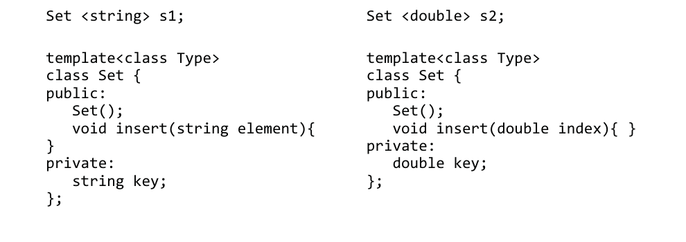
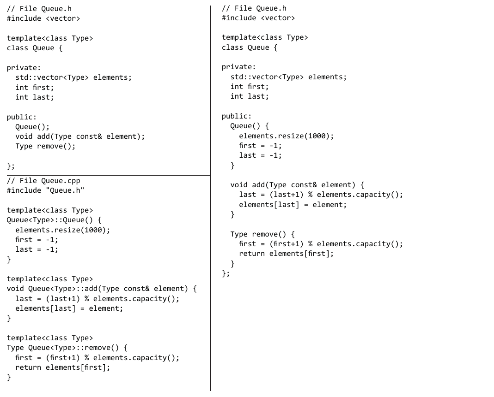

# 第11章 泛型容器

## 前章回顾

在上一章中，我们已经学习了如何使用泛型的`vector`对象来存储一组特定类型的元素。

## 本章提要

在本章，我们将为你介绍另一个名叫`Set`的容器类，顺便回顾一下我们在`vector`处理、类定义以及成员函数实现这些议题中学到的知识。除此之外，本章还将介绍可以用于构建存储特定类型容器的C++模板机制。我希望在完成本章学习之后，你将能够：

* 构建属于自己的存储任意类型容器的元素。
* 更好地理解拥有数据成员、构造函数以及成员函数的类概念。
* 更好地了解如何开发与`vector`处理相关的函数。

## 11.1 容器类

随着我们在计算机领域研究的深入，用在探究如何管理数据集合的方法上的时间会越来越多。上一章中介绍的`vector`类只是众多为此目的设计的类中一种。这些容器类通常都具有以下特征：

* 它们的主要作用说我作为一组对象的容器。
* 它们通常会支持往容器中添加或移除对象。
* 它们通常会允许用户以各种形式访问容器中的各个元素。

接下来，本章将提供介绍`Set`容器来带大家回顾一下与类定义、成员函数实现相关的知识。但这一次，我们将借用`vector`处理算法来实现其成员函数。除此之外，我们还将学习如何让容器类只存储指定类型的对象。也就是说，该类在构造时将会有一个类型实参传递进来。

`Set`类的主要作用是存储在容器中具有唯一性的对象。通常情况下，`Set`类对象应该具备以下特征：

* 和`vector`类一样，`Set`类对象也可以存储任意类型的对象。
* `Set`类对象中的元素是不允许重复的。
* `Set`类对象中的元素不需要我们以特定顺序来维护。

`Set`对象将能理解`isEmpty`、`insert`、`remove`、`size`以及`contains`这些消息。其数据成员包含一个名为`elements`的`vector`对象，这是容器的本身。以及一个名为`n`的、用于表示该`Set`对象中当前元素数量的整数。但在具体讨论这个容器类之前，我们要先带你了解一下C++模板机制是如何让这些类中可以存储任意类型的对象的。

### 11.1.1 传递类型实参

和`x`或1.5能以实参的形式传递给函数一样，类名（也就是类型，譬如`int`、`double`、`string`、`BankAccount`等）也可以以实参的形式被传递给C++的模板机制，譬如`<int>`或`<string>`。以实参形式传递类型名可以让程序员们使用相同的容器类来存储任何一种类型的对象。这意味着我们只需要一个`Set`类，不必为每一种类型的存储设计不同的`Set`类。

C++标准模板库（STL）用模板机制实现了一些标准容器类，其中包括`vector`、`list`、`stack`‘以及`queue`。这样就不用让程序员各自针对自己面对的新类型来实现`vector`、`list`、`stack`和`queue`这些容器了，编译器会用单一的类模板来自动创建它们。

对于每个以实参形式传递的类名来说，一个新的类就会自动创建一个用于管理该类对象的容器。例如下面我们用任意类型来创建一些`Set`对象：

```C++
Set<string> ids; // Store string objects only
Set<double> nums; // Store numbers only
Set<BankAccount> accounts; // Store BankAccount objects only
```

除此之外，模板的另一个优势是我们可以用它只能插入某一种类型的对象，例如下面这些消息操作的编译：

```C++
ids.insert("c1w4");
nums.insert(123);
accounts.insert(BankAccount("c1w4", 100.00));
```

这些消息操作是不能提供编译的，因为其实参不是其自支持的正确类型（这实际上是一件好事）。

```C++
ids.insert(123); // Argument must be a string
nums.insert("c1w4"); // Argument must be a num accounts.insert(100.00); // Argument must be a BankAccount
```

### 11.1.2 模板

类型形参允许程序员将一个数据的类型传递给它所在的类，以便告知该类对象所要存储元素的类型。

**通用格式 11.1**： *类模板*

```text
template<class template-parameter>
class class_name
```

在类定义之前加上模板什么，并给出一个模板形参，该参数的作用域涵盖整个类定义。例如在C++中，`Set`模板类的定义应该是这有开始的：

```C++
template<class Type>
class Set {
    public:
    // Allow insertion of only one specic type
    void insert (Type> element);
```

`Set`类型通常会使用`Type`这个词来命名它的模板形参。例如，当`Set`类对象被构造如下时：

```C++
Set <string> names;
```

其`Type`形参就会被替换成上面尖括号之间被传递进来的类型名，在这里就是`string`。然后C++就会自动参数如下代码：

```C++
void insert(string element);
```

但是，如果我们在调用构造函数初始化`Set`对象时使用的是`int`类型的话：

```C++
Set <int> x;
```

C++自动产生代码就会是下面这样，`Type`所在之处被`int`所替代了：

```C++
void insert(int element);
```

因为`Set`被声明成了一个模板类，编译器可以用它作为一个模型构造任意数量的、可以那不同类型元素的其他`Set`类。

在这里，名为`Type`的类形参的作用域一直会延伸至类定义的结尾。这意味着`Type`可以被用在类定义的任何一处，譬如，我们可以在`public`段使用它，也可以在`private`段的数据成员中使用它。下面来看个示例，在类定义之前加上类型形参（在这里就是`Type`），对于类的模板化是至关重要的一步：

```C++
template<class Type>
class Set {
    public:
       Set();
       Type insert(Type element)
    private:
       Type key;
};
```

如你所见，该类的`public`方法`insert`只有一个`Type`形参，它只能接受 `Type`实参传递进来的值。除此之外，它还有个`Type`类型的`private`数据成员`key`，它也只能接受`Type`实参所传递的值。在声明具体对象时，这里的`Type`标识符会被替换成声明中实参指定的类型。例如，在下面的两个对象初始化动作中，我们将`s1`和`s2`分别模板化成了`double`和`string`这两种类型：



下面，我们来看一个集中使用一个泛型`Set`各项功能的示例程序：

```C++
#include <iostream>
#include <string>
using namespace std;
#include "Set.h" // For> a generic (with templates) Set class

int main() {
    Set<string> names;
    cout << "After contruction, size is " << names.size() << endl; // 0
    cout << "and the Set isEmpty: " << names.isEmpty() << endl; // true

    // Add a few elements, duplicates not allowed names.insert("Chris");
    names.insert("Chris");
    names.insert("Dakota");
    names.insert("River");

    names.remove("River"); // Succeeds
    names.remove("Not here"); // No change to the Set

    cout << endl << "After 4 insert attempts and 2 remove attempts: " << endl;
    cout << "isEmpty: " << names.isEmpty() << endl; // false
    cout << "size: " << names.size() << endl; // 2
    cout << "contains(\"Chris\")? " << names.contains("Chris") << endl;
    cout << "contains(\"Dakota\")? " << names.contains("Dakota") << endl;
    cout << "contains(\"River\")? " << names.contains("River") << endl;
    cout << "contains(\"No\")? " << names.contains("No") << endl;

    return 0;
}
```

#### 程序输出（这里1代表`true`，0代表`false`）

```text
After contruction, size is 0在新元素存储进来之前是不会增加的
and the Set isEmpty: 1

After 4 insert attempts and 2 remove attempts:
isEmpty: 0
size: 2
contains("Chris")? 1
contains("Dakota")? 1
contains("River")? 0
contains("No")? 0
```

该`Set`类的优势之一，也是许多应用中很重要的一个问题，就是元素的数量可以随着`Set`类对象中的存储情况来变化。这样就不必预先判定`Set`的最大元素数量了，一个`Set`中所能存储的元素数量将仅仅取决于其存储对象的大小与内存中可用的容量。这个问题最好的答案是，`Set`中可以在内存允许的情况下存储尽可能多的对象，没有固定的最大值，所有处理这部分的逻辑都会在`insert`方法中实现。

如果要想从`Set`中删除某个对象，就必须要为该类型定义一个具有模板类型形参的相等运算符`==`。因为我们在`contains`和`remove`这两个消息定义中会用到它。下面我们就来看看`BankAccount.cpp`文件中的具体代码，我们在这里对`operator==`进行了重载，它会在`==`左边的`BankAccount`对象的`name`等于与右边实参对象的`name`相等时返回`true`。

```C++
// Overload the == operator to compare two BankAccount objects 
bool BankAccount::operator == (const BankAccount& right) const {
    return name == right.name;
}
```

这个二元运算符`==`也可以运用在`BankAccount`对象之间：

```C++
BankAccount acct1("Ali", 123.44);
BankAccount acct2("Ali", 567.88);
BankAccount acct3("Billie", 567.88);

if(acct1 == acct2 && !(acct1 == acct3)) // true
    cout << "acct1 == acct, but not acct3: " << endl;
```

#### 程序输出

```text
acct1 == acct, but not acct3
```

另外，由于这个`Set`是一个用`vector`来构造的容器，C++通常会要求`Set`的元素都有一个默认的构造函数，这个应该是一个没有形参的构造时，譬如我们在`BankAccount.cpp`中定义的这个：

```C++
// A default constructor is require if you want a collection of these
BankAccount::BankAccount() {
    name = "???";
    balance = -9.99;
}
```

### 自检题

请根据下面的对象声明来回答以下问题：

```C++
Set<int> intSet;
```

* 11-1. `intSet`中可以存储多少个整数？

* 11-2. 请编写代码打印出`intSet`中的元素数量。

* 11-3. 请编写一个消息，尝试将整数89添加到`intSet`这个整数容器中，

* 11-4. 请编写一个消息，尝试将整数89从`intSet`中删除。

***

## 11.2 `Set<Type>`类

在这一节中，我们将具体演示如何用`vector`和模板机制来实现一个`Set`类。这个`Set`对象应该：在新元素存储进来之前是不会增加的

* 是个泛型类，因为它可以以`<Type>`的形式接受任何类型的元素。
* 不预先设置最大容量——只要自由存储空间中还有一些可用内存，它就能分配到内存。

由于种种原因，`Set`类的定义只能在同一个文件中完成，而不是我们平时习惯的两个文件。这样做的主要原因是为了避免编译时错误。有一些编译器只能在所有代码都在同一个文件中时才能处理模板，用我们平时习惯的将头文件（.h）中的类定义与类的实现（.cpp）分离是不被支持的。

这里只用一个.h文件的另一个原因是这样做能让每个方法的头信息在一行内写完，至少可以避免十几行中反复地出现`template <class Type>`。 另外，也可以在每个方法定义之前省去十几个`Set::`前缀。总而言之，这个泛型（模板）的`Set`类将会在同一个`Set.h`文件中被构建，它所有的方法定义都在同一个文件中：

```C++
/**
  * Set.h
  * This is a collection class to represent sets of any type.
  * Duplicate elements are not allowed.
  */

#ifndef SET_H_
#define SET_H_

#include <vector>

template<class Type>
class Set {
```

首先，我们会将`Set<Type>`中的元素存储在一个`vector`中。除此之外，我们还会维护一个`int`变量`n`，用以记录该`Set<Type>`中所存储的元素数，当然，这些元素必须都是不重复的：

```C++
    private:
        std::vector<Type> elements;
        int n;
```

数据成员`n`将会在构造函数内被初始化为0，然后在每一次成功调用`insert`时递增1，每次成功调用`remove`时递减1。

### 11.2.1 构造函数Set()

在`Set`的构造函数中，我们将空的`Set`初始容量设置为20，当然，我们也可以将其设置得更大或更小。

```C++
// The public constructor
public:
    //--constructor
    Set() {
        elements.resize(20);
        n = 0; // This Set object has zero elements when constructed
    }
```

然后，程序员们就可以想下面这样构造`Set`对象了：

```C++
Set <double> tests;
Set <string> names;
Set <BankAccount> names;
```

### 11.2.2 bool contains(Type const& value) const

在我们使用`Set`对象时执行各项操作时，了解其中是否存在某个特定元素是个非常重要的功能。成员函数`contains`的作用就是采用一个循环按顺序对`vector`进行搜索，找到目标就立即返回`true`。

```C++
// Return true if value is in this set
bool contains(Type const& value) const {
    for (int i = 0; i < n; i++) {
        if (value == elements[i])
            return true;
    }
    return false;
}
```

如果在所有`n`个元素中都没有找到`==`指定元素的对象，该函数就会在循环终止时返回`false`，表示没有找到指定元素。

### 11.2.3 void insert(Type const& element)

由于我们要实现的容器是一个`Set`，所以在执行`insert`操作之前，我们必须先确定当前容器中不存在这个指定的元素。如果确认不存在，该`vector`还要去检查一下其容量是否允许其存储更多的元素。如果容量不够的话，我们还需要在存储新元素之前增加一下`vector`的容量。

```C++
// If element is not == to any element, add element to this Set
// The vector will be resized to hold more elements if needed.
void insert(Type const& element) {
    if (contains(element))
        return;

    // Otherwise add the new element at the end of the vector
    // First make sure there is enough capacity
    if (n == elements.size()) {
        // Add memory for 10 more elements whenever needed
        elements.resize(n + 10);
    }
    // Insert after the last meaningful element in this set.
    elements.at(n) = element;
    n++;
}
```

### 11.2.4 bool remove(Type const& removalCandidate)

`remove`方法会负责从容器中找到要删除的元素，然后用容器中的最后一个元素覆盖掉它。当然，如果在容器中没有找到`removalCandidate`这个元素，该方法就直接返回`false`。

```C++
// pre: The removalCandidate type must overload the == operator
// post: If found, removalCandidate is removed from this Set.
//
// Remove removalCandidate if found and return true.
// If removalCandidate is not in this Set, return false.
bool remove(Type const& removalCandidate) {
    // Find the index of the element to remove
    int index = 0;
    while (index < n && !(removalCandidate == elements[index])) {
        index++;
    }

    // When subscript == size() removalCandidate was not found
    if (index == n) {
        return false;
    } else { // Found it when elements[subscript] == removalCandidate.
        // Overwrite removalCandidate with the element at the largest index
        elements[index] = elements[n - 1];
        // decrease size by 1, and
        n--;
        // report success to the client code where the message was sent
        return true;
    }
}
```

### 自检题

* 11-5. 下面的代码在经过编译之后会构建出多少个不同的类？
    ```C++
    Set<string> ids;
    Set<int> studentNumber;
    Set<double> points;
    Set<double> tests;
    ```

* 11-6. 假设我们为下列三种情景各构建了一个`Set`对象，请问在经历了这三组操作之后，它们的`size()`会返回什么值？
  * a)  10次成功的插入操作，然后5次成功的删除操作。
  * b)  40次成功的插入操作。
  * c)  40次成功的插入操作，然后40次成功的删除操作。

***

## 11.3 迭代器模式

由于每个`Set`对象始终能够知道自身存储了多少个元素（`n`），所以我们可以为容器对象设计一组给定的可按顺序迭代容器中各项值的函数。并且可以使它们成为我们容器类的一部分。

本教材的`Set`类就是用迭代器方法来访问其自身所包含的对象的。我们可以用下面这段程序来演示一下客户端代码该如何迭代整个容器，而不必担心越界问题。另外，这个示例也是我们对如何为`Set<Type>`类添加那四个可访问所有元素的方法一次预演。

```C++
#include <iostream>
using namespace std;
#include "Set.h" // For a generic (with templates) Set class
#include "BankAccount.h"

int main() {
    Set<BankAccount> set; // Store set of 3 BankAccount objects
    BankAccount anAcct("Devon", 100.00);
    set.insert(anAcct);
    set.insert(BankAccount("Chris", 300.00));
    set.insert(BankAccount("Kim", 200.00));

    set.first(); // Initialize an iteration over all elements
    double total = 0.00;
    while(set.hasMore()) {
        cout << set.current().getName() << " has ";
        cout << set.current().getBalance() << endl;
        total += set.current().getBalance();
        set.next();
    }
    cout << "Total balance: " << total << endl;

    return 0;
}
```

#### 程序输出

```text
Devon has 100
Chris has 300
Kim has 200
Total balance: 600
```

如你所见，该循环的初始化语句盗用的是`first()`，它将`Set`对象的内部索引指向了容器的第一项。然后，循环测试式`hasMore()`只要为`true`，就意味着至少还有一个元素可访问。在每次迭代结束时，都会重复执行`set.next()`这条语句，让其内部索引指向容器中的下一项，直到`hasMore()`返回`false`。而在该循环内，`current()`返回的是指向容器中某个元素的引用，我们可以通过该引用来访问这个元素。

### 自检题

* 11-7. 请编写一段代码，让其从`Set<BankAccount>`任意多的元素中找出账户余额最高那一个。

***

### 11.3.1 迭代器成员函数

`Set`迭代器成员函数的唯一设计目的就是让客户端代码可以从头到尾以顺序访问的方式访问`Set`中的部分乃至全部元素。迭代器其起先要调用的是`first()`函数，让其私有数据成员`current`[^1]指向`Set`对象中的第一个元素：

[^1]: 译者注：原文如此，但从上下文来看，此处似乎应该是currentIndex。

```C++
void first() {
    currentIndex = 0;
}
```

再来是`hasMore()`成员函数，只要容器内还有一个元素可以访问，该函数就会返回`true`。我们通常会用它来充当循环测试式：

```C++
while(set.hasMore())
```

`hasMore()`成员函数会去比较其私有数据成员`currentIndex`，只要它确认容器内还有应一个容器可访问就会返回`true`：

```C++
bool hasMore() const {
    return currentIndex < n;
}
```

接着是`next()`成员函数，它的作用是递增其内部索引：

```C++
void next() {
    currentIndex++;
}
```

最后是`current()`，它会返回其内部索引当前所指向的元素。请注意，该函数的返回值类型是由客户端代码在构造`Set<Type>`对象时指定的。

```C++
Type current() const {
    return elements[currentIndex];
}
```

## 本章小结

* 具有类型形参的类让用户可以用实参的形式来将类型的名称传递给该类。这是我们可以用`vector`、`list`、`Set`这些容器类来管理任意类型对象的基础。

* 类模板可以让编译器创建许多不同的类，而且这项工作将由编译器自行完成。这样一来，程序员们不必单独去实现像`StringVector`、`IntVector`和`BankAccountVector`这样的类了。

* 这些类的成员函数应该被放在同一个文件中来实现，不要在分离出独立头文件了。这样做既可以满足一些编译器的要求，也可以大量地减少代码中重复的语法单元。本章的`Set`类项目就是用这种方式来构建的。下面我们将看到的就是`Set`类在同一文件中的一份实现概略，我们移除了花括号之间的代码，改用了注释来加以说明。这个实现模型同样可以用实来现`Stack`和`PriorityList`这些编程项目。
    ```C++
    /*
    * File name: Set.h
    */

    #ifndef SET_H_
    #define SET_H_ 

    #include <vector>

    template<class Type>
    class Set {
        private:
            std::vector<Type> elements;
            int n;
            int currentIndex;

        public:
            Set() { }
            void insert(Type const& element) { }
            bool remove(Type const& removalCandidate) { }
            int size() const { }
            bool contains(Type const& value) const { }
            bool isEmpty() const { }
            void rst() { }
            bool hasMore() const { }
            void next() { }
            Type current() const { }
    };

    #endif /* SET_H_ */
    ```

* 本章的`Set`类实现演示如何用`vector`为拥有更高级消息体系的类提供存储机制，譬如不通过下标来执行元素的`insert`和`remove`操作。

* `Set`、`vector`这些容器类除了作为存储对象的容器之外，通常也会提供针对其中元素的适当访问功能。

* `Set`类还引入了迭代器成员函数的概念。迭代器可以不暴露底层结构的情况下允许客户端代码对容器的内容进行遍历。由于`Set`既不是有序的也不提供索引下标，所以我们得通过迭代器来访问其元素节点。这和`vector`之类的其他类型可以通过[]或`at`函数来索引元素是不一样的。

## 练习题

1. 请根据下面的代码回答下列问题：
    ```C++
    #include "Set.h"

    int main() {
        Set<double> db;
        // . . .
    ```
   * a.  请问`db`中可以存储多少个`double`对象？
   * b.  请编写代码，添加一些不重复的元素到`db`中，要求不少于四个。
   * c.  请编写代码，使用迭代器方法逐行输出`db`中的所有元素。
   * d.  请编写代码，求取`db`中元素的取值范围。这里的范围是用容器中最大值与最小值之间的差值来定义的。

2. 请编写一个名为`plus`的模板类，该类的作用是负责两个值之间的`+`操作。要求将该类的定义和方法实现放在同一个名为`Plus.h`文件中。下面的代码是该类的一些使用样例及其会产生的输出（后者用注释来表示）：
    ```C++
    // You only need one template class
    Plus<int> a(2, 3);
    Plus<double> b(2.2, 3.3);
    Plus<string> c("Abe", "Lincoln");
    a.show(); // 5
    b.show(); // 5.5
    c.show(); // AbeLincoln
    ```
3. 请编写代码，找出`Set<int>`对象`intSet`中整数的取值范围。这里的范围是由容器中最大整数与最小整数之间的差值来定义的。

## 编程小技巧

1. C++标准库提供了许多容器类（包括`vector`、`list`、`stack`、`queue`），这些类都比我们所设计的`Set`类要更具通用性也更强大，这个`Set`类在实际工作中其实是排不上用场的。我们在这里只是希望通过这个类复习一下类的定义和向量处理的相关知识，其实C++本身就有一个泛型的`Set`类。本章的`Set`类主要是为了介绍如何在一个文件中用模板技术创建泛型容器而设计的。

2. 在实现泛型容器时，我们应该将所有的代码放在同一个文件中。这样做不但可以减少你在编写每个成员函数时重复的代码李安，而且有些编译器也只能编译在同一个文件中定义的模板类。

3. 迭代器是一种很流行的工具，而`Set`不是。我们希望通过对迭代器函数的演示能让你意识到：在编写访问容器中所有元素的方法时，这是一个被频繁使用的模式。而在C++标准库中，`Set`类就远没有`list`、`stack`、`map`这些其他容器类那么常用了。

4. 模板技术提供的是一种通用性。模板技术的价值在于，它使我们只需要设计一个模板类，就可以用任意的C++内置类型或其他自定义类型创建出新的类。只要我们继续学习C++，将来就一定还会看到其他的模板类。

5. 模板技术带来了大量额外的语法。以下面这个简单且不完整的容器类为例，它存储元素的方式像一个等待行列，遵守先进先出的规则。左边这一列，将该类的实现分成了两个文件，我们估算其中重复的语法单元大约有80个单词。而右边这一列只有一个`.h`文件，代码显得更简短。也就是时候，代码的行数更少，使用的单词更少，类似于`<`、`>`。`::`这样的语法单元更少。

    

## 编程项目

### 11A. `Stack<Type>`类

请（使用模板）实现一个泛型的`Stack`。该`Stack`应该支持以后进先出（LIFO）方式来添加和删除元素。具体来说，首先该`Stack`应该有一个名为`push`的操作，用于将元素放入该`Stack`的“顶部”。另外，还应该有个名为`pop`的操作，用于删除并返回当前位于该`Stack`顶部的元素。需要说明的是，顶部元素应该是这个`Stack`中唯一可被引用的元素。也就是说，如果我们将两个元素`push`进了该`Stack`，必须要先`pop`（即删除）位于该`Stack`最顶层的元素，然后才能引用刚才先被`push`的那个元素。下面是一个存储了20个整数的`Stack`，我们要求你编写的程序必须要让下面的代码通过编译。并令其产生符合我们预估的输出。

```C++
#include <iostream>
#include "Stack.h"
using namespace std;

int main() {
    Stack<int> intStack(20); // stack of 20 ints

    // Use intStack
    intStack.push(1);
    intStack.push(2);
    intStack.push(3);
    intStack.push(4);

    cout << "4? " << intStack.peek() << endl;
    cout << "4? " << intStack.pop() << endl;
    cout << "3? " << intStack.peek() << endl;

    cout << "isEmpty 0? " << intStack.isEmpty() << endl;
    cout << "3 2 1? ";
    while(! intStack.isEmpty()) {
        cout << intStack.pop() << " ";
    }
    cout << endl;
    cout << "isEmpty 1? " << intStack.isEmpty() << endl;

    return 0;
}
```

#### 程序输出

```text
4? 4
4? 4
3? 3
isEmpty 0? 0
3 2 1? 3 2 1
isEmpty 1? 1
```

*请注意：* 我们可以参考本章“编程小技巧”那一节中提到的那个`Queue`类的开头来写，将完整的类实现放置在同一个`.h`文件中。

### 11B. `PriorityList<Type>`类

本项目要求用`vector`来充当数据成员来实现一个`PriorityList<Type>`容器类。这个新类型的作用是将一组元素存储在一个从0开始计数的索引列表中，其中索引值为0处存储的值比索引值为1处存储的值具有更高的优先级，而索引值为`size()-1`处存储的值优先级最低。另外，该集合类中只能存储一种类型的元素，譬如只存储`string`类型的元素。请记住：索引值为0处的值具有的是最高优先级，而索引值为`size()-1`处的值具有的最低优先级。

```C++
PriorityList<string> todos;

todos.insertElementAt(0, "Study for the CS exam");
todos.insertElementAt(0, "Get groceries"); 
todos.insertElementAt(0, "Sleep");

for(int priority = 0; priority < todos.size(); priority++) 
    cout << todos.getElementAt(priority) << endl;
```

#### 程序输出

```text
Sleep
Get groceries
Study for the CS exam
```

请完成`PriorityList<Type>`类的下列方法，在这过程中请使用`vector`来存储元素。

```C++
// Construct an empty PriorityList with capacity to store 20 elements
PriorityList();

// Return the number of elements currently in this PriorityList
int size();

// Return true if size() == 0 or false if size() > 0
bool isEmpty();

// Insert the element at the given index. If the vector
// is too small, resize it.
// precondition: index is on the range of 0 through size() 
void insertElementAt(int index, Type el);

// Return a reference to the element at the given index.
// precondition: index is on the range of 0 through size()-1
Type getElementAt(int index);

// Remove the element at the given index.
// precondition: index is on the range of 0 through size()-1
void removeElementAt(int index);

// Swap the element located at index with the element at index+1.
// Lower the priority of the element at index size()-1 has no effect.
// precondition: index is on the range of 0 through size() 
void lowerPriorityOf(int index);

// Swap the element located at index with the element at index-1.
// An attempt to raise the priority at index 0 has no effect.
// precondition: index is on the range of 0 through size() 
void raisePriorityOf(int index);

// Move the element at the given index to the end of this list.
// An attempt to move the last element to the last has no effect.
// precondition: index is on the range of 0 through size()-1
void moveToLast(int index);

// Move the element at the given index to the front of this list.
// An attempt to move the top element to the top has no effect.
// precondition: index is on the range of 0 through size()-1
void moveToTop(int index);
```

为了帮助你了解这些方法的是如何工作的，我们在下面提供了一个参考程序，我们演示了每个消息发给列表时它们对该列表所做的修改。 *建议：* 请一次实现一个方法，然后立即为其编写测试，以确保它能正常工作。

```C++
#include <iostream>
#include <string> // Needed by Visual Studio
#include "PriorityList.h"
using namespace std;

int main() {
    PriorityList<string> list;
    list.insertElementAt(0, "a");
    list.insertElementAt(1, "b");
    list.insertElementAt(2, "c");
    list.insertElementAt(3, "d");

    for (int i = 0; i < list.size(); i++) // a b c d
        cout << list.getElementAt(i) << " ";
    cout << endl;

    list.insertElementAt(1, "f");
    for (int i = 0; i < list.size(); i++) // a f b c d
        cout << list.getElementAt(i) << " ";
    cout << endl;

    list.removeElementAt(0);
    for (int i = 0; i < list.size(); i++) // f b c d
        cout << list.getElementAt(i) << " ";
    cout << endl;

    list.lowerPriorityOf(3); // no effect
    list.lowerPriorityOf(0); // move f right
    list.lowerPriorityOf(1); // move f right
    list.lowerPriorityOf(2); // move f right
    for (int i = 0; i < list.size(); i++) // b c d f
        cout << list.getElementAt(i) << " ";
    cout << endl;

    list.raisePriorityOf(0); // no effect
    list.raisePriorityOf(2); // move d left
    list.raisePriorityOf(1); // move d left
    for (int i = 0; i < list.size(); i++) // d b c f
        cout << list.getElementAt(i) << " ";
    cout << endl;

    list.moveToLast(list.size() - 1); // no effect
    list.moveToLast(0); // move d from top priority to last priority
    for (int i = 0; i < list.size(); i++) // b c f d
        cout << list.getElementAt(i) << " ";
    cout << endl;

    list.moveToTop(0); // no effect
    list.moveToTop(2); // move f to top priority again
    for (int i = 0; i < list.size(); i++) // f b c d
    cout << list.getElementAt(i) << " ";

    return 0;
}
```

### 11C. 带异常机制的`PriorityList<Type>`类

*这是个可选项目* 请修改上面的代码，让容器在索引值越界时抛出异常。首先，我们需要将以下`#include`指令添加到`PriorityList<Type>`的实现代码中：

```C++
#include <stdexcept>
```

接下来，我们要将下面的if语句添加到所有带`index`形参的方法中去。如果程序员提供了不正确的索引值（譬如-1或size()），函数就会抛出异常，这被认为是一个不错的措施：

```C++
// Insert the element at the given index.
// precondition: index is on the range of 0 through size() 
void insertElementAt(int index, Type element) {
    if (index < 0 || index > size()) {
        throw std::invalid_argument(
              "\ninsertElementAt: index must be 0..size()");
    } // . . .
```
