# 第12章 指针与内存管理

## 前章回顾

到目前为止，我们存储对象所需的内存都是由交由系统后台自行分配的，访问内存也只能通过变量名或发消息的方式来完成。

## 本章提要

在本章，我们要来介绍一下“*间接（indirection）*”这个概念。间接的情况通常出现在某件事物出现替代品的时候。譬如，以图书目录卡为例，这种卡片上记录的是每本书的杜威十进制数，这些数字本身并不是书，它们只是对书的引用。由于该卡片从某种意义上来是命名了一些书所在的位置，所以这些信息也可以被视为是一种“地址”。在C++中，我们会用*指针（pointers）*来实现这种间接性、指针是一种用于存储其他变量地址（或指向它们的指针）的变量。出资为，本章还会介绍一下基于原生的C数组和内存管理。我们希望在学习完本章内容之后，你将能够：

* 理解指针这张用于存储其他对象地址的对象。
* 使用无边界检查的原生C++数组。
* 使用若干种方法来初始化指针。
* 使用`new`和`delete`这两种操作符来管理内存。

## 12.1 内存因素考量

每个对象都会有一个名称，一个状态以及一组可执行的操作。每个对象也都由自己的*作用域*（即它们被人知道的范围）和*生命周期*（即该对象被构造到被认为已经不存在的这段时间）。这一切都始于它们的初始化，譬如：

```C++
int able = 123;
int baker = 987;
```

在一个对象被初始化后。它上述的大部分特征都已经被定义得很清楚了。但对象在内存中的位置（也就是它们的地址）就没有那么清楚了。到目前为止，我们都是依靠系统自己来管理这些地址的。但C++是允许程序员直接对这些地址进行操作的。

每个对象都会驻留在一个特定的内存位置中，占据一个或多个字节的计算机内存。而每个对象在内存中的位置通常都是用它所占用的第一个字节的地址来表示的。举个例子，假设下面的表格是一个机器层视图，我们从中可以看到变量`able`的存储地址是6300，`baker`的存储地址是6304。这些地址是被任意安排的，也可以是其他地址。另外在C++中，`int`通常会占用四个字节的内存（当然，这不是一定的）。

| 地址         | 类型        | 名称       | 状态值  |
|--------------|------------|-----------|--------|
| 6300         | int        | able      | 123    |
| 6304         | int        | baker     | 987    |

如你所见，名为`able`的对象占据的是6300、6301、6302和6303这四个这季节的内存，它的地址是这四个字节中第一个字节的内存位置，即6300。尽管我们并不需要总是去了解对象的确切地址，但在基于C++来学习计算基础的过程中，对象的存储地址是一个很重要的概念。

许多对象的内存分配是在编译时完成的。通常情况下，`char`对象会被分配一个字节，`int`对象是两个字节还是四个字节要其取决于具体的计算机系统，`double`对象也需要有一个特定的、（至少对于机器而言）可预测的字节数。这些类型都被称之为 *静态（static）* 的，因为它们的内存分配都是在编译时完成的。静态变量被分配的内存量是固定的，程序在运行时无法对其进行修改。

指针对象可以让程序员们通过编写代码的方式在运行时分配内存。只要程序还在运行，它所获得的空间就是可用的。在运行时被分配的对象被称之为 *动态（dynamic）* 对象，因为它们都是在运行时获取内存块的。这种对象的主要优点是实现了内存的按需分配，其分配到的内存可在不被需要时撤销并归还给系统，以备后续使用。

动态对象可通过缩小或放大的方式来管理容器，这样以来容器的大小就只取决于可用的内存了。这可以让程序员们更有效地管理计算机资源。举个例子，`string`对象在后台采用的就是动态的内存分配，因此它可以在运行时调整自身的大小。毕竟使用这个`string`类的产品通常是无法预知其用户会在运行时输入多少字符的：

```C++
string name; // Memory allocated during input
cout << "Enter your name: ";
cin >> name;
```

`string`类也允许程序员们给其对象赋值行各种长度的字符串：

```C++
string a, b; // Appropriate memory is allocated on assignment

a = "The string a should have its own space"; // 38 chars 
b = "The string b should also"; // 24 chars
```

当然，我们也可以选择在构造`string`对象的过程中分配一个字符类型的`vector`，但将它设置得多大呢？我们当然可以为其设置一个足够大的尺寸，以便它可以应对大多数字符串。但这样做肯定会造成内存的大量浪费。想像一下，有一个存储1000个`string`对象的`vector`，其中每个`string`对象都被分配了128或200个字节的内存，但这些`string`的平均长度最终只存储9个字符，这是何等的浪费。如果没有指针，程序员们就必须采用这种浪费计算机内存的方法。所以要想了解内存管理，我们就必须先了解指针。

### 12.1.1 指针

*指针（Pointers）* 中存储的是其他对象的地址，作用是“指向”这些对象。声明指针对象需要在相应的类名之后加上一个星号（`*`)：

**通用格式 12.1**： *声明指针变量*

```text
class-name* identier;
```

这里的星号表示`identier`是一个用于存储`class-name`类型对象的地址的变量。例如，在下面这个声明中：

```C++
int* intPtr;
```

名为`intPtr`的指针对象中存储的是一个`int`对象的地址。换而言之，这个叫`intPtr`的对象本身并不代表一个`int`对象，它代表的是`int`对象的地址。通常情况下，一个指针对象的状态不外乎以下三种可能，三者必有其一：

1. 未定义状态（这表示`intPtr`当前存储的是垃圾信息）。
2. 等于一个叫做`nullptr`的特殊指针值，这时代表该指针不指向任何东西。
3. 指向了其声明类型的一个实体。

目前，任何试图对未定义状态`intPtr`值执行的操作都会导致未定义的系统行为。所以，常见的做法是将`intPtr`的值设置成一个特殊的指针常量`nullptr`，以表示该指针目前不指向任何东西。

```C++
intPtr = nullptr; // intPtr points to nothing
```

由于指针对象存储的是地址，我们将它表示成一个带箭头的盒子，让它指向相应的对象会更直观一些。所以对于下面的语句：

```C++
int anInt = 123; // Allocate memory for an int and initialize it
int* p; // Allocate memory to store the address of an int object
```

我们可以用下面这个图来表示：

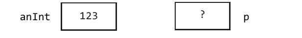

这里的`?`代表这个指针尚未被赋值。也就是说，`?`代表的是一个垃圾值。为了表示该指针现在不指向任何东西，我们在这里需要用到一个C++关键字，`nullptr`。

```C++
p = nullptr;
```

当指针`p`被赋予`nullptr`这个值时，`p`的状态可以用下面这个带对角线的图形符号来表示：


指针对象可以通过`&`操作符来获取其要赋值的*地址*。`&`操作符返回的是其后面那个对象的地址。

**通用格式 12.2**： *获取某个对象的地址*

```text
&object-name;
```

举个例子，`&anInt`这个表达式得到的就是`anInt`的地址。我们可以通过下面的语句将`anInt`的地址存储到指针对象`p`中（在这里，我们可以将`&anInt`这个表达式读作”anInt的地址“）：

```C++
p = &anInt; // &anInt returns memory location (address) of anInt
```

这个赋值操作最好的图形化表示就是从之前的`？`处拉一个箭头指向`anInt`的地址所表示的内存。


这个从`p`指向`anInt`的箭头代表`p`目前指向了`anInt`这个对象。但是，`p`中实际存储的是一个地址，也就是`anInt`在内存中的位置。

指针对象是可以间接改变其指向对象的状态的。例如，我们可以不通过`anInt`这个对象本身的名称来改变它的状态，这里需要用到叫做 *间接寻址（indirect addressing）* 的解引用操作。这种间接操作需要用`*`操作符来完成，它允许我们在程序中通过指针对象来检查或修改该指针指向的内存。下面我们就来示范一下如何通过`p`修改`anInt`所在的内存：


**通用格式 12.3**： *间接寻址*

```text
*pointer-object;
```

也就是说，针对`*p`的赋值操作要修改的不是`p`本身，而是`p`所指向的对象的状态。

请注意，`*`操作符在指针方面有两种不同的含义。首先在声明语句中，它表示我们正在声明的是一个指针。例如：

```C++
int* pInteger;
double* pDouble;
```

其次，在当我们将星号与指针放在一起使用时，它代表的是对指针的解引用操作：

```C++
*pInteger = 456;
*pDoube = 123.45;
```

另外在数学方面，`*`还代表了乘法运算。如你所见，星号的确是个被重载的操作符。所以我们要根据它们在代码中的具体运用来确定星号所代表的意义。

总而言之，在指针对象之前加一个星号代表的是该指针指向的那个地址，并可以对那个地址中的值进行存储和修改。例如，如果`anInt`被存储在地址为6308的内存中，那么`p`中存储的值就是6308。


为了说明`p`、`*p`和`&anInt`这三者之间的区别。我们打算用下面这段程序示范一下间接寻址的用法。这段程序的作用就是交换两个指针的值，在执行完该程序后`p1`和`p2`都应该指向彼此原本指向的`int`对象[^1]。

[^1]: 译者注：原文如此，但从上下文来看，似乎应该是`double`对象。

请注意，由于指针指向的是`double`类型的值，所以它们也必须被声明成`double`类型的指针。这样做是为了告诉编译器，它要转向的是一个存储在`double`指针中的地址，要以足够的字节数来对去这个`double`对象（通常是8个字节）。

```C++
// Interchange two pointer values. The pointers are switched
// to point to the other's original int object.
#include <iostream>
using namespace std;

int main() {
    double* p1;
    double* p2;
    double* temp;
    double n1 = 99.9;
    double n2 = 88.8;

    // Let p1 point to n1 and p2 point to n2
    p1 = &n1;
    p2 = &n2;

    cout << "*p1 and *p2 before switch" << endl;
    // Get the integers indirectly with the \* operator
    cout << (*p1) << " " << (*p2) << endl;

    // Swap the pointers by letting p1 point to where p2 is pointing.
    // Also let p2 point to where p1 is pointing.
    temp = p1;
    p1 = p2;
    p2 = temp;

    // Now the values of the pointers are switched to point to each
    // other's int object. The ints themselves do not move.
    cout << "*p1 and *p2 after switch" << endl;
    cout << (*p1) << " " << (*p2) << endl << endl;

    cout << "Actual memory locations in hexadecimal:" << endl;
    cout << p1 << " " << p2 << endl;

    return 0;
}
```

#### 程序输出

```text
*p1 and *p2 before switch
99.9     88.8
*p1 and *p2 after switch
88.8     99.9

Actual memory locations in hexadecimal:
0x7fff5d00cbf0 0x7fff5d00cbf8
```

在该程序中，99.9和88.8这两个字在内存中并没有被移动过。我们只是将指向这些`double`对象的指针进行了互换。下面我们用图形化的方式来跟踪一下这个程序的执行过程。首先是所有五个对象的初始化工作（*请注意：* 下面所有盒子都代表着一块存储某个对象状态的内存）：

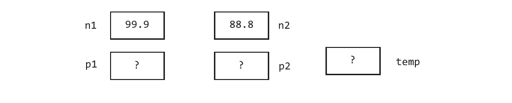

在接下来的两条语句（即`p1 = &n1; and p2 = &n2;`），我们将两个`double`对象的地址存储到了相应的指针中。然后是`temp = p1;`这条语句，它让指针对象`temp`也指向了`p1`所指向的那块内存。

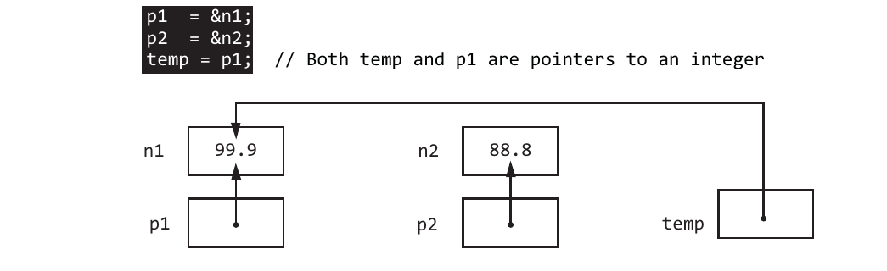 [^2]

[^2]: 译者注：该图中的注释似乎与实际情况不符，这是一个double对象，而不是一个integer对象。

也就是说，`p1`中的地址（我们用箭头来表示）也被存储到了`temp`中，这时候表达式`temp == p1`应为`true`。这样做所产生的变化就是让`p1`和`temp`的箭头都指向了相同的位置，就是那个名为`n1`的对象。

再接下来，我们执行的是`p1 = p2;`这个赋值动作，它让`p1`与`p2`指向了相同的地方。所以现在`p1`和`p2`存储的是相同的地址，这两个指针的值是相等的。

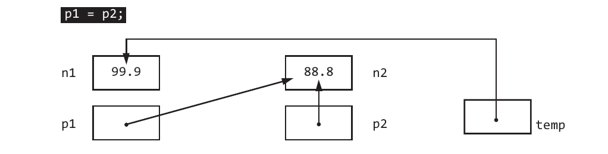

然后是最后一条语句`p2 = temp;`，它让`p2`指向了`p1`原本指向的那个`double`对象。

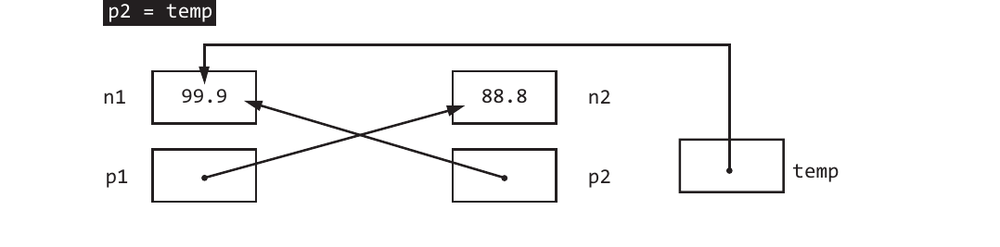

现在，`p2`指向了`n1`，`p1`指向了`n2`。换句话说，如果现在执行`cout << (*p1)`这个操作输出的是88.8，而不是原来的99.9了。

我们首先要明白的是，指针的使用并不容易。这需要我们将理解的对象概念从存储值的对象切换成存储其他对象地址的对象。因为在使用指针时，我们要做的算法设计和程序调试是不一样的。在调试过程中，用箭头来表示指针的值是一个不错的低成本辅助工具，我们可以通过移动箭头而不是填写地址的方式来跟踪算法。

另外在编写调试代码时，被指向的值通常要比该对象所在的地址更有价值。所以我们在调试时应该多使用带`*`操作符的`cout << (*aPointer);`语句，而不是`cout << aPointer;`。这样我们才能看到更有价值的对象值，而不是这些对象的地址。

### 12.1.2 指向对象

之前，我们所讨论的指向`int`和`double`对象，实际上都是在引用这些位置上存储的单值。它们并没有关联的成员函数。现在我们要来关注一下用指针向其指向的对象发送消息的过程中会发生什么情况。首先，由于解引用操作符的优先级低于函数调用操作的，所以像下面这样是不行的：

```C++
BankAccount anAcct("Functions > Dereference", 123.45);
BankAccount* bp;
bp = &anAcct;
*bp.deposit(123.45); // ERROR
```

解决该问题的方法之一就是将解引用操作放在一个括号，以覆盖掉其原本的优先级。这样`*bp`就能在调用之`deposit`函数*之前*返回一个`BankAccount`对象了：

```C++
(*bp).deposit(123.45); // OKAY
```

或者我们也可以使用C++提供的箭头操作符`->`来简化指针指向相关类示例的方式：

```C++>
bp->deposit(123.45); // SHORTCUT
```

下面我们在一段程序中实际使用一下这两种技术：

```C++
#include <iostream>
using namespace std;
#include "BankAccount.h"

int main() {
    BankAccount anAcct("both (*bp) and bp-> work ", 100.00);
    BankAccount* bp;
    bp = &anAcct;

    // Wrap the dereference in parentheses because the dereference
    // operator * has lower precedence than function calls

    (*bp).deposit(123.45);
    cout << (*bp).getName() << (*bp).getBalance() << endl;

    // Use -> for pointers to objects other than int or double
    bp->withdraw(111.11);
    cout << bp->getName() << bp->getBalance() << endl;

    return 0;
}
```

#### 程序输出

```text
both (*bp) and bp-> work 223.45
both (*bp) and bp-> work 112.34
```

### 自检题

* 12-1. 指针对象中存储的是什么？

* 12-2. 请根据下面的语句回答下列问题：
    ```C++
    double* doublePtr;
    double aDouble = 1.23;
    doublePtr = &aDouble;
    ```
  * a.  指针对象的名称是什么？
  * b.  `doublePtr`的值是什么？
  * c.  `*doublePtr`的值是什么？
  * d.  请编写代码，*间接地*将`aDouble`的值从1.23改成2.23。

* 12-3. 请问在下面这段代码执行之后，`*ptr`的值是什么？
    ```C++
    int anInt = 123;
    int* ptr = &anInt;
    *ptr += *ptr;
    ```

* 12-4. 请问在下面这段代码执行之后，`s3`的值是什么？
    ```C++
    string s1 = string("one");
    string* p1 = &s1;
    string s3 = p1->c_str();
    s3 += p1->c_str();
    cout << s3;
    ```

* 12-5. 请编写一个表达式，计算出下面两个`BankAccount`对象的余额之和。
    ```C++
    BankAccount ba1("one", 100.00);
    BankAccount ba2("two", 200.00);
    BankAccount* a = &ba1;
    BankAccount* b = &ba2;

* 12-6. 请写出下面程序会产生的输出：
    ```C++
    #include <iostream>
    using namespace std;
    int main() {
        int* p;
        int j = 12;
        p = &j;
        cout << ((*p) + (*p)) << " " << ((*p) * (*p)) << endl;
        return 0;
    }
    ```

* 12-7. 请编写一条语句，将一个`char`对象`ch`的地址存储到一个名为`charPtr`的指针对象中。

* 12-8. 请以最小的代码量声明并初始化下图中所有的对象：

    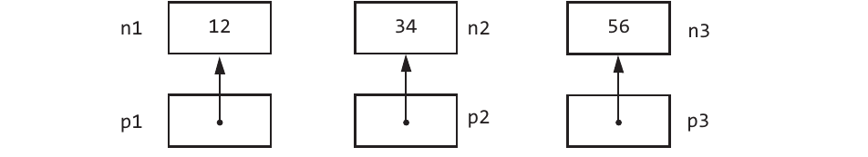

* 12-9. 请根据你在回答上一个问题时编写的代码写一条语句，使用`*`解引用操作符间接地输出所有整数的和值。

* 12-10. 请写出下面程序会产生的输出：
    ```C++
    int p = 111;
    int* q = &p;
    p += 222;
    cout << "p? " << p << endl;
    cout << "q? " << *q << endl;
    ```

* 12-11. 请写出下面程序会产生的输出：
    ```C++
    int n1 = 4;
    int n2 = 8;
    int* ptr1;
    int* ptr2;
    ptr1 = &n1;
    ptr2 = &n2;
    cout << (*ptr1) << " " << (*ptr2) << endl;
    ```

* 12-12. 请写出下面程序会产生的输出：
    ```C++
    double* p = new double;
    double* q = new double;
    *p = 1.23;
    *q = 4.56;
    p = q;
    cout << (*p) << " " << (*q);
    ```

* 12-13. 在之前12-12题的代码中，我们能否通过修改最后一行代码检索出1.23这个值？

***

## 12.2 原生的C数组

对C++来说，`vector`类只是个相对较新的扩展。在早期，内置的原生C数组是更常用的一种存储对象的容器。而由于这种数组实际上存储的是第一个元素的地址，所以它是我们用来说明指针用途的经典示例。事实上，我们在所能看到的代码实现中经常会看到对C数组的使用，更重要的是，我们也可以透过原生的C数组来了解动态内存管理的好处，它为`vector::resize`和字符串赋值这些操作提供了底层引擎。也就是说，我们可以利用指针和动态分配来更好地管理内存。

原生C数组是一种存储相同类型元素的固定大小的容器。数组是一种由同类实体组成的结构，它存储的是一组相似的对象。这组对象的类型可以是`char`、`int`、`double`等内置类型中的任何一种。当然，只要设有默认构造函数，程序员自定义的类型（譬如`BankAccount`类）也是可以用来声明成数组的。

下面我们来看一下声明原生C数组的通用格式：

**通用格式 12.4**： *声明数组*

```text
type array-name[capacity];
```

在这里，`type`指定的`array-name`中存储的对象类型。`capacity`指定的是`array-name`中所能存储的最大元素数。这个容量值必须是一个整数常量（譬如100）或者被定义了名称的整数常量。和`vector`不一样的是，数组是不能在运行时指定或调整大小的。例如，下面这个数组最多能存储一个元素：

```C++
double x[100];
```

数组中的各个元素都可以用和`vector`对象一样的下标来引用：

**通用格式 12.5**： *引用数组中的各个元素*

```text
array-name[int-expression];
```

数组的下标取值范围也和`vector`相同，即0到`capacity-1`之间。

### 12.2.1 原生数组与`vector`之间的差异

数组与`vector`之间存在着许多相似之处，尤其是在引用各自元素的方式上。事实上，我们在*第10章：vector*中介绍的所有`vector`处理算法都可以应用在原生C数组上。它们之间最明显的差异是原生C数组是不支持下标越界检查的，这也算是C数组的缺点之一，尤其对于那些刚刚开始学习数组和`vector`的人来说，有下标越界检查功能的存在会让程序更安全一些。

当代码中发生数组”越界“情况时，就会出现一些非常怪异的错误。代码中的其他对象的状态可能会被意外破坏。而`vector`的下标越界检查可以在程序试图越界使用内存时通知程序员，显然这是一种更可取的情况。

下面我们来看看`vector`类与原生C数组之间到底有哪些差异：

| 差异        | `vector`示例    | C数组示例        |
|------------|----------------|-----------------|
| `vector`会在构造过程中初始化其所有元素，数组不会。| `vector <int> x(100, 0); // All elements are 0` | `int x[100]; // Elements are garbage` |
| `vector`在运行时可以轻松地调整自身的大小，数组则需要做更多事才能实现。| `int n; cin >> n; x.resize(n);` | `// See growing an array // in a later chapter`|
| `vector`可以阻止下标越界新闻。| `// You are told // something is wrong cin >> x.at(100);` | `// Destroys other variables cin >> x[100];` |
| `vector`需要`#include`相关的文件，而原生数组是内置的，不需要如此。 | `#include <vector>`  | `// No #include required` |

### 12.2.2 数组与指针的联系

事实上，所有原生C数组存储的都是其第一个元素的指针（或者地址）。然后只要对数组对象使用下标就可以计算出相应元素的地址。举个例子，如果`x`是个整数数组，那么每个数组元素的长度应该是四个字节，`x`的地址是6000的话，我们就可以用下面公式计算出`x[3]`的地址应该是`6000 + (3 * 4)`。

**计算数组中各元素地址的公式**

```text
address of first array element + (subscript * size of one element)
```

因此，`x[3]`的存储地址应该是6012。

| 引用       | 地址     | 值    |
|-----------|---------|-------|
| x[0]      |  6000   | ?     |
| x[1]      |  6004   | ?     |
| x[2]      |  6008   | ?     |
| x[3]      |  6012   | ?     |
| x[4]      |  6016   | ?     |

### 12.2.3 传递原生数组实参

当数组被传递给一个函数时，被传送过去的实际上是第一个数组元素的地址。数组会自动采用传引用的方式。声明数组形参的方式是类名加上形参名，后面再跟一个`[]`。下面，我们用一个程序来做个说明。在该程序中，`main()`函数会将一个数组传递给`init`函数。请注意，当`init`函数修改其形参`x`时，与之相关联的实参`anArray`也随之被修改了。也就是说，`x`和`anArray`的前三个元素都会被分别赋值为90、95、99。即使我们没有用`&`操作符来将`anArray`传递给形参，情况也是一样的。毕竟`anArray`本身是按值传递的。

```C++
// Pass the address of the array to a function.
// The & is not required. An array stores an address.
#include <iostream>
using namespace std;

void init(int x[], int & n) {
    // x and n are reference parameters; however, x does not need &
    x[0] = 90;
    x[1] = 95;
    x[2] = 99;
    n = 3;
}

int main() {
    int n = 5;
    int anArray[5];

    init(anArray, n); // init will change x and anArray for (int index = 0; index < n; index++) {
        cout << anArray[index] << " ";
    }
    cout << endl;

    return 0;
}
```

#### 程序输出

```text
90 95 99
```

由于数组名中存储的是该数组第一个元素的地址，所以传递数组名给某个函数时实际上传递地址。因此，数组自动采用了传引用的方式，传递了该数组第一个元素的地址。对`x`使用下标的结果和对`anArray`使用下标的结果是一致的。我们可以用下面这张图来描绘一下`anArray`按引用传递的过程，这里我们甚至没有使用`&`操作符：

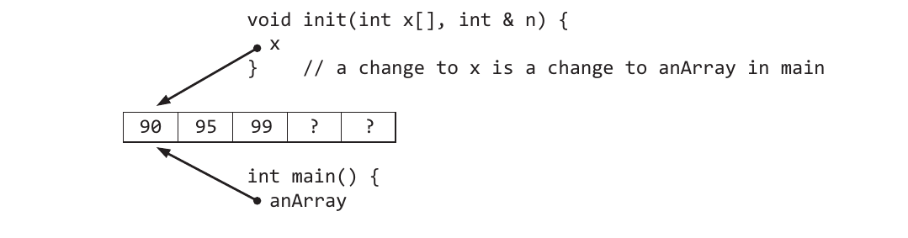

## 12.3 用new操作符分配内存

`new`操作符经常会被用来为指针对象赋值。当我们在类名前面加上一个`new`操作符时，该表达式就会分配一块足够大的连续内存空间，以便存储该类的实例。然后，这个表达式会将其获得的内存地址（或者说指向该内存的指针）返回。

**通用格式 12.6**：*（单一对象的）动态内存分配*

```text
new class-name
```

在这里，我们在运行时所分配到的内存来自一个叫*自由存储区（free store*）的地方，后者是计算机内存中一块专为自由分配而设定的区域（自由存储区有时候也被称为*堆（heap）*）。例如，下面表达式会分配一块足以存储一个`int`值的内存，并返回指向该内存的指针。

```C++
new int; // Allocate memory, return a pointer value (an address)
```

当然，该指针表达式通常会搭配指针对象的初始化动作，而不是像上面这样忽略其返回的指针值（即可以存储一个整数值的内存地址）。

```C++
int* intPtr = new int; // Allocate memory, store address in intPtr
```

另外需要说明的是，上面这种写法其实是下面这种等效代码简写形式：

```C++
int* intPtr;
intPtr = new int; // Allocate memory, store address in intPtr
```

现在，我们的情况是`intPtr`持有了一个`int`对象的地址（即该地址上可以存储一个`int`值）。该情况也可以用下面这张图来说明。在该图中，由于`int`的值尚未被定义，使用我们用？来表示，而`intPtr`的值则用箭头来表示[^3]，指向这个未定义值的`int`对象：

[^3]: 译者注：原文如此，但该图中似乎没有画上箭头。


接下来，我们可以用这条语句初始化这块新分配的内存：

```C++
*intPtr = 123;
```

该操作产生的指针和`int`对象的状态如下图所示：


下面，我们用一段具体的程序来演示一下如何动态分配一个`int`对象：

```C++
// Illustrate one pointer object and one int object
#include <iostream>
using namespace std;

int main() {
    // Declare an intPtr as a pointer to an int
    int* intPtr;

    // Allocate memory for an int and store address in intPtr
    intPtr = new int;

    // Store 123 into memory referenced by intPtr
    *intPtr = 123;

    cout << "\n The address stored in the pointer object: " << intPtr;
    cout << "\nThe value of the int pointed to by intPtr: " << *intPtr;

    return 0;
}
```

#### 程序输出（地址以十六进制的形式显示，也就是说a代表10，f代表15）

```text
The address stored in the pointer object: 0x7fbd3bc04a20
The value of the int pointed to by intPtr: 123
```

请注意，这里指针对象的值为25360（即十六进制数0x7fbd3bc04a20），它被`intPtr`所引用了，而实际的`int`值123得通过`*intPtr`这个解引用操作来获取。

### 12.3.1 在运行时为数组分配内存

有时候，在运行时分数组可能会更方便一些，因在那时候我们能更好地了解自己所需的最大容量。在C++中，我们可以通过在之前的`new`操作符表达式上增加一个[*capacity*]来实现为多个对象分配内存。这里的*capacity*代表的是要分配的对象个数。

**通用格式 12.7**： *（capacity个对象的）动态内存分配*

```C++
new type[capacity];
```

*示例：* 为十个整数分配内存：

```C++
new int[10]; // Allocate memory for 10 integers and return              // a pointer to this newly allocated memory
```

由于`new`操作符返回的是数组首字节的地址，所以我们可以用它来快速初始化指针对象：

**通用格式 12.8**：*初始化指针对象*

```C++
type* identier = new class-name[number of elements];
```

*示例：*

```C++
int* nums = new int[10];
```

现在，指针对象`nums`指向的是一块内存的首地址，这块内存的大小为`4 * 10`，其中的值处于未定义状态（即垃圾值），其中每4个字节将存储一个整数：

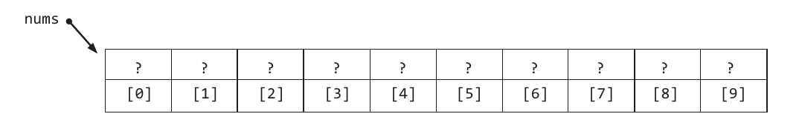

我们可能一时会觉得这种内存动态分配很好用。当我们为某个数组设置一个初始容量之后，在运行时发现自己需要更大容量，就可以执行以下算法来调整它：[^4]

* 创建一个比当前实例变量更大的临时数组。
* 将原数组的内容（从`num[0]`到`nums[n-1]`)复制到临时数组中。
* 让指向原数组的引用指向这个临时数组。

[^4]: 译者注：作者之所以会说这是“一时觉得”，是因为这个算法没有考虑到内存泄漏的问题。关于内存泄漏，作者在稍后介绍delete操作符时会具体说明。

```C++
// This code dynamically (at runtime) "grows" an array
#include <iostream>
using namespace std;

int main() {
    int n = 10;
    int* nums = new int[n]; // Some C++ compilers can not handle int[n]
    int anInt = 1;
    // Initialize n array elements with a for loop
    for (int i = 0; i < n; i++) {
        nums[i] = anInt;
        anInt += 3;
    }

    // Show the lled array
    for (int i = 0; i < n; i++) {
        cout << nums[i] << " ";
    }

    // Need more room? Grow the array at runtime
    int* temp = new int[n+5]; // Some C++ compilers can not handle int[n+5]
    // 2) copy the elements to the temporary array
    for (int i = 0; i < n; i++) {
        temp[i] = nums[i];
    }

    // Make the original array pointer refer to the "bigger" array
    nums = temp;

    // Add 3 more elements to the bigger array
    nums[n++] = 997;
    nums[n++] = 998;
    nums[n++] = 999;

    // Print the larger array with the added elements
    cout << endl << "Larger array" << endl;
    for (int i = 0; i < n; i++) {
        cout << nums[i] << " ";
    }

    return 0;
}
```

#### 程序输出

```text
 1 4 7 10 13 16 19 22 25 28
 Larger array
 1 4 7 10 13 16 19 22 25 28 997 998 999
```

下面我们通过图片来看一下这个数组，首先是被填满容量的原数组：


然后是容量两倍于原数组的新数组：

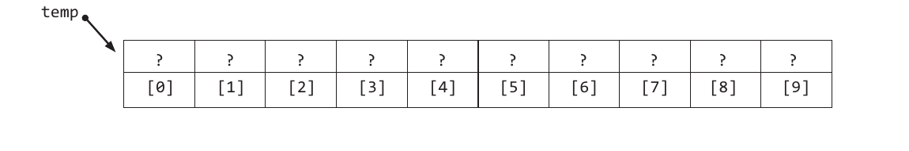

最后，我们让`nums`指向这个新数组，用下面这条赋值语句让它与`temp`成为同一个引用：

```C++
nums = temp;
```

在将上面三个整数添加到这个容量更大的数组之后，我们就会看到该数组的情况如下：[^5]

[^5]:译者注：原文如此，但该图中好像并没有出现加进来的三个整数。

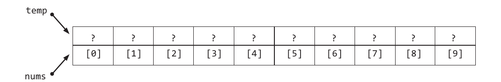

### 自检题

* 12-14. 请写出下面代码会产生的输出：
    ```C++
    int* x = new int[10];
    x[0] = 4;
    x[1] = 8;
    cout << x[0] + x[1] << endl;
    ```

* 12-15 请编写一条初始化语句，要求用`new`操作符分配一个能存储1000个`double`对象的数组。

* 12-16. 请编写代码，将上一个问题中的1000个`double`全都初始化成-1。

* 12-17. 请写出下面代码会产生的输出：
    ```C++
    const int MAX = 6;
    int* x = new int[MAX];

    for(int i = 0; i < MAX; i++) {
        x[i] = 2 * i;
    }

    for(int i = 0; i < MAX; i++) {
        cout << x[i] << " ";
    }
    ```

* 12-18. 原生数组支持在声明的同时用数组的初始化器进行初始化，譬如像这样：
    ```C++
    int x[] = {3, -4, -3, 6, 1};
    int n = 5;
    ```
  请编写一段代码，找出上面这个数组`x`的元素取值区间，这里取值区间的定义是数组中最大值与最小值之间的差值。我们要求你的代码必须要适应数组初始化器以各种不同容量值和元素值初始化出来的数组。

* 12-19. 请声明一个`string`数组，并用数组初始化将其元素依次初始化成："a"、"b"、"c"、"d"。

***

## 12.4 delete操作符

到目前为止，我们用`new`操作符示范的都是少量的内存分配。但我们还是得考虑一下如果内存分配的量大到一定量会出现什么情况。如果一直使用`new`，但不将内存归还到自由存储区，就会导致*内存泄漏（memory leak）*。这会对程序可用的内存量形成限制。

在某些时间点上，程序可能就不再需要之前动态分配所得的内存了。一旦出现这种情况，我们就要将之前分配所得的，现在不再需要的内存归还给自由存储区。这样才能让其他对象得到这些动态分配的内存。在C++中，这种归还或*释放（deallocation）*内存的动作是通过其内置的`delete`操作符来完成的。下面，我们来看一下`delete`操作符的两种通用格式：

**通用格式 12.9**：*释放内存（一种回收资源的形式）*

```text
delete pointer-object;
delete[] pointer-to-array;
```

如你所见，上面的第一种格式是将单个对象动态分配所得的内存归还给自由存储区。第二种格式是将我们用`new`和`[]`分配的一组对象的内存归还给自由存储区。在下面的程序中，我们分别用`delete`操作符释放了指针`p`所指的存储单个`double`对象的内存，以及`charArray`所指的存储十个`char`对象的内存，和`x`所指的存储100个整数的内存。[^6]

[^6]: 译者注：原文如此，但下面代码中并没有定义charArray，指针x指向的是一块可存储10000个整数的内存。

```C++
// Allocate and deallocate memory at runtime
#include <iostream>
using namespace std;

int main() {
    int* p = new int;
    *p = 123;

    int* x = new int[10000]; // claim 40,000 bytes from the free store
    x[0] = 76;
    x[1] = 89;
    // ...
    x[9999] = *p;

    // When no longer needed, free the memory to avoid memory leaks 
    delete p;
    delete[] x;
    // All the bytes of memory pointed to by p and x can be allocated later

    return 0;
}
```

在这两条`delete`语句执行完之后，该程序分配所得的内存就都归还给了自由存储区。然后，这些指针就不能用了，再用它们就会导致不可预测的行为。

我们在使用数组的程序中应该要用`delete`归还不再需要的内存，这样就不会得到什么警告信息或错误了。相反，如果我们让内存泄漏了，这些不在被需要的内存就再也无法回收了。

```C++
double* temp = new double[n+5];
for (int i = 0; i < 10; i++) {
    temp[i] = nums[i];
}

delete[] nums; // Avoid a memory leak by freeing up memory
```

## 12.5 用C的struct构建单向链接结构体

单向链接的数据结构是用顺序方式来存储一组元素的一种替代方案。C++标准库中的`list`类很有可能就是用这种单向链接结构来实现的，这其中包含了我们在本节中要介绍的概念。

与之前将元素存储在一块连续内存中不同的是，单向链接的结构体是用一组带链接的节点来存储元素的，每个节点中都存储着一个元素和指向（对应顺序容器中）下一个节点的链接。当然，我们也需要有一个执行其第一个节点的指针，这里就将该指针命名为`first`。

为了实现这个结构，我们需要将指针作为数据成员添加到相应的类或结构体的定义中。结构体的定义和类基本上是一样的，除了在默认情况下，类中定义的成员是私有的，而结构体是公有的。但只要明确声明`public`或`private`，这两者之间除了名称就没有什么不同了。当然，由于历史原因，我们在此处使用的结构体只设有默认构造函数和数据成员，而它们默认就是公有的，所以这里就不必添加`public`关键字了。


下面我们来示范一下如何构建两个公有数据成员的`struct`，这是构建一个`LinkedList`结构的开始：

```C++
#ifndef LINKEDLIST_H_
#define LINKEDLIST_H_

/**
  * This le contains two types:
  *
  * 1) struct node to hold an element and a link to
  *    another node
  * 2) class LinkedList to hold an indexed sequential 
  *    collection using the singly linked data structure
  *
  * A LinkedList can only store string elements. Templates 
  * are not used here to allow focus on pointers and 
  * memory management.
  */

struct node {
    // Two public data members
    std::string data;
    node* next;

    // Two public constructors
    node() {
        next = nullptr;
    }

    node(std::string element) {
        data = element;
        next = nullptr;
    }
};
// class LinkedList will go here . . .

#endif /* LINKEDLIST_H_ */
```

在下面的代码中，我们要构建一个新的`node`对象，并让指针`first`指向该对象。然后我们通过`->`操作符来输出它的值，这是对`node`的公有数据成员执行解引用必须要用到的操作符。

```C++
#include <iostream>
#include <string>
#include "LinkedList.h"
using namespace std;

int main() {
    // Let nodePointer reference a dynamically allocated node object
    node* first = new node("Kim");
    // assert: nodePointer->next == nullptr

    // Display the state of the public data member my_data 
    cout << " The value: " << first->data << endl;
    cout << "#characters: " << first->data.length() << endl;
}
```

#### 程序输出

```text
The value: Kim
#characters: 3
```

下面用一张图来说明一下上述实现在内存中的样子：


链接结构的特征就是我们可以由一个元素来引用另一个元素。其数据成员中存储这一个指向同类型另一个对象的指针，这样这些对象就能被链接在一起了，我们就可以由第一个节点找到第二个节点。在下面的代码中，我们就来示范如何构建将三个节点链接在一起。请注意，这里是使用`p->next`来引用第二个节点的。

```C++
// Build the first node
node* p = new node("One");

// Construct a second node pointed to by the first node's next
p->next = new node("Two");

// Build a third node pointed to by p->next->next
p->next->next = new node("Three");
```

同样地，我们用一张图来说明一下这三个可链接节点在内存中的样子：


如你所见，我们用一个名为`ptr`的指针就可以遍历这三个节点了。也就是说，我们通过该指针就可以引用到所有的三个节点。一开始，`ptr`指向了第一个节点，只要`ptr`不等于nullptr。该节点中的数据就会（在循环中）被显示。

```C++
// Traverse the nodes until a next eld is nullptr
node* ptr = p; // Don't change p, which is a pointer to the first node
while(ptr != nullptr) {
    cout << ptr->data << endl;
    ptr = ptr->next;
}
```

如你所见，在每轮循环迭代中，我们都会通过`ptr = ptr >next`这条语句将`ptr`更新成指向下一个节点的指针，或者在循环结束时被设定为`nullptr`。.

### 12.5.1 用单向链接数据结构实现list类

This section describes LinkedList member functions that use these node objects. The constructor establishes an empty list using a dummy header node. Th is makes the coding easier during add and remove.

```C++
class LinkedList {

    private:
        node* header;
        node* last;
        int n;
    public:
    //--constructor
        LinkedList() {
            // Create a dummy header node to make things easier
            header = new node; // call node's default constructor
            last = first;
            n = 0;
        }
```

Here is a representation of what an empty list with a dummy first node looks like in memory:


### 12.5.2 add(std::string)

Adding an element to a linked list has different meanings for ordered and unordered lists. An ordered list stores objects in an ascending order based on the meaning of <. The linked list developed here is not ordered so the elements will not be in alphabetic order. Since this linked list here is unordered, all new elements can be added at the very end of the list. This is easy when a dummy headed node is employed to avoid the special case of adding to an empty list or removing an element. Elements are added by creating a new object pointed to by last->next. The member data last must then be updated to point to the last node. The current count must also be incremented.

```C++
void add(const std::string newElement) {
    // Allocate and initialize a new node
    last->next = new node(newElement);

    // Update the last pointer
    last = last->next;

    // Maintain current size
    n++;
}
```

This one adds message results in the pictures of memory shown below:

```C++
LinkedList stringList;   // n == 0
stringList.add("First"); // n == 1
```


```C++
stringList.add("Second"); // n == 2
stringList.add("Third"); // n == 3
```

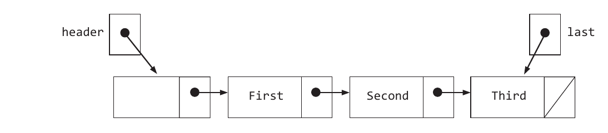

### 12.5.3 get(int index)

The get operation uses a for loop to advance an external pointer ptr to the correct node. Notice that if index is 0, the for loop does not advance ptr, leaving it to point to the first real node— the one pointed to by header->next, which would be the value "first".

```C++
std::string get(int index) {
    node* ptr = first->next;
    for (int i = 0; i < index; i++) {
        ptr = ptr->next;
    }
    return ptr->data;
}
```

### 12.5.4 remove(string removalCandidate)

These two possibilities must be considered when removing an element from a linked list:

1. the == operation does not match an element in the list
2. the == operation does match an element in the list

The search for a particular element in a linked list is similar to a sequential search through a vector or array. The difference is that now, instead of a subscript, a pointer will be used to access the data members.

The search for "Second" begins by pointing a variable named ptr to the first element in the list. With the node header, we can peek one node ahead in the search while maintaining a pointer to the node that precedes the node to be removed.

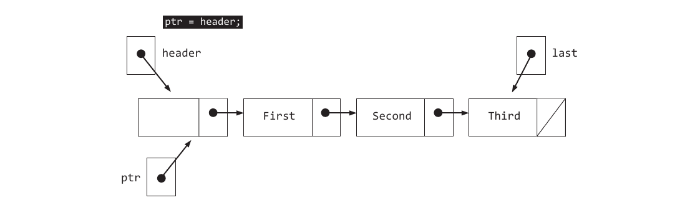

A sequential search continues until ptr->next->data equals the removalCandidate or there are no more elements to search. Since ptr->data == removalElement ("First" == "Second") is false, the loop advances ptr to the next node in the list.


Now the node pointed to by ptr points to the node before the node to be removed: ptr->next->data == "Second" is true now. With the help of the dummy header node, this algorithm is able to peek at the data one node ahead. This comes in handy as we need to send a pointer around the node to be deleted with ptr->next = ptr->next->next.

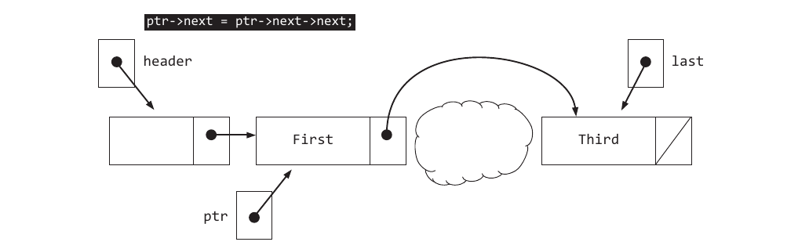

Now the node pointed to ptr->next can safely be returned to the free store with delete.

```C++
bool remove(const std::string removalElement) {
    // Create an external pointer to point to the node before the first node
    node* ptr = header;

    // Search the remaining list elements until
    // found or the end of the list is found
    while (ptr->next != nullptr && ptr->next->data != removalElement) {
        ptr = ptr->next;
    }

    // Don't delete a nonexistent node
    if (ptr->next == nullptr) {
        // removalElement was not found
        return false;
    } else {
        // Check if the last node is being removed so last gets corrected
        if(ptr->next == last) {
            last = ptr;
        }

        // Send the link around the node to be removed
        ptr->next = ptr->next->next;
        if (ptr != header)
            delete ptr->next;// Deallocate memory
        n--;                 // Maintain current size
        return true;         // Report successful removal
    }
}
```

If the last node is to be removed, last must be adjusted to the preceding node. If ptr points to the last node, the element was not found so remove returns false.

### SELF-CHECK

* 12-20 Draw a picture of a linked list with two nodes before and after removing the fi rst node.

* 12-21 Draw a picture of a linked list with one node before and after removing the fi rst node.

* 12-22 What happens if removalCandidate is not found in the list?

* 12-23 True or False
  * a.  The size of a dynamically linked list must be determined before the program begins to execute.
  * b.  Elements in a linked list are referenced through subscripts.
  * c.  Elements may be inserted into or deleted from a linked list at the beginning, end, or even the middle of a linked list.
  * d.  When an element is to be inserted into or deleted from a linked list, the list should be checked to see if it is empty.
  * e.  When an element has been removed from a dynamically linked list, the memory it used should be returned to the free store.

* 12-24 Write method bool removeLast() to remove the last element in a LinkedList. Return false if the list is empty. The program should generate the output shown in comments.
    ```C++
    #include <iostream>
    #include <string>
    #include "LinkedList.h"
    using namespace std;

    int main() {
        LinkedList list;
        cout << list.removeLast() << endl; // 0
        list.add("A");
        cout << list.removeLast() << endl; // 1
        list.add("B");
        list.add("C");
        list.add("D");
        cout << list.removeLast() << endl; // 1
        list.add("E");
        cout << list.get(0) << " ";
        cout << list.get(1) << " ";
        cout << list.get(2) << endl; // B C E
        cout << list.size() << endl; // 3
        return 0;
    }
    ```

***

## CHAPTER SUMMARY

* Pointers store addresses of other objects. A pointer object points to some object. For example, ptr is a pointer and *ptr is a reference to the double object x that starts as 99.9.
    ```C++
    double * ptr;
    double x = 99.9;
    ptr = &x;
    *ptr = 1.234;
    ```
  In the last statement, the pointer changes the value stored in x to 1.234. The * (asterisk) dereferences the pointer. This means the pointer goes to the address stored in the pointer, which in this case is the address of x and changes the value stored at that address. Therefore, the pointer changes the value stored in x indirectly.

* The address of a variable is the first address at the location where the state is stored. If it takes 4 bytes to store an int, the address of the int is the address of the first byte of the int value, which is the address stored in the pointer. The pointer knows when to stop reading addresses because the pointer was declared as an int pointer. Therefore, it reads 4 bytes (this may vary depending on your computer system).

* The address operator & gives us the address of a variable.

* The primitive C array—similar to the C++ vector class—is available on all compilers and will often be seen in existing C and C++ code.

* The new operator allocates memory from the free store. The delete operator deallocates memory. If more than one object is allocated as in char* name = new char[10]; it must be deallocated with [] like this: delete [] name;

* You can allocate memory at runtime with new and return it to the free store with delete.

## PROGRAMMING TIPS

1. Draw linked structures when debugging programs with pointers. The value of a pointer object represents a location in the memory of the computer. Th ese values are difficult to use in a program trace. A diagram with arrows and boxes makes execution simulation and pointer debugging much clearer.

2. Pointers allow dynamic allocation of arrays. One problem when using arrays involves how big to make them at compile time. It may be big enough one time, but not another. Sometimes memory gets wasted when declared too big.

3. Use vectors instead of arrays. Th e standard vector type can be dynamically grown, or shrunk even, at runtime with resize messages. Let this well-tested class do the work for you.

4. Avoid memory leaks. Use the delete operator to return the memory back to the free store for single variables. Use the delete[] operator to free an array of values.

## EXERCISES

1. Write the values of the attributes supplied by this initialization:
    ```C++
    double x = 987.65;
    ``` 

    * a. class
    * b. name
    * c. state
    * d. address

2. Declare a pointer to an int and initialize the pointer somehow.

3. Use these statements to answer the questions that follow:
    ```C++
    int* intPtr;
    int anInt = 123;
    intPtr = &anInt;
    ```

    * a.  What is the name of the pointer object?
    * b.  What is the value of *intPtr?
    * c.  Without using anInt, write a statement that adds 100 to the memory storing 123.

4. Write the minimum declarations and statements that declare and initialize all the objects as they are shown in the diagram below.

    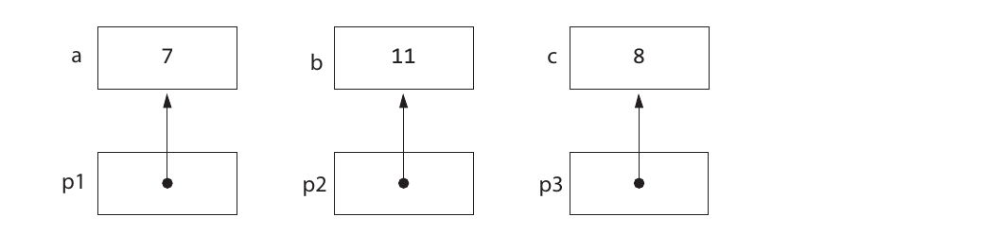

5. Using your code from the previous question, write the statements that will have a pointer object named largestPtr pointing to the largest integer no matter where it is stored among a, b, and c.

6. Using the declarations shown, which of the following are valid assignments that do not generate an error?
    ```C++
    int j = 456;
    int* p;
    ```

    * a. p = j
    * b. p = &j
    * c. p = 0
    * d. j = p
    * e. j = 123
    * f. *p = j
    * g. p = &p
    * h. p = 123
    * i. *p = "abc"
    * j. *j = 123
    * k. j = &p
    * l. *p = *p

7. Write the output generated by this code:
    ```C++
    int * intPtr;
    int anInt = 987;
    intPtr = &anInt;
    *intPtr = *intPtr + 111;
    cout << *intPtr << " " << anInt;
    ```

8. Trace the following program segment by drawing pictures of the modified objects:
    ```C++
    n1 = 123;
    p1 = &n1;
    *p1 = *p1 + 111;
    ```

9. Trace the following program segment by drawing pictures of the modified objects:
    ```C++
    n2 = 999;
    p3 = &n2;
    p2 = p3;
    ```

10. Trace the following program segment by drawing pictures of the modified objects:
    ```C++
    int * intPtr;
    intPtr = p3;
    ```

## PROGRAMMING PROJECTS

### 12A. ENHANCE LinkedList

Add two methods to the LinkedList class:

1. void toString() to return a string containing all elements with 10 elements separated by a new line “\n”.

2. void insertInOrder(std::string element) to insert string elements into the singly linked structure while maintaining alphabetical ordering.

### 12B. CLASS LinkedStack WITH A SINGLY LINKED STRUCTURE

Implement class LinkedStack which allows elements to be added and removed in a last-in, first-out (LIFO) manner. This class must use a singly-linked structure to store the elements.

Stacks have an operation called push to place elements at the “top” of the stack and another operation called pop to remove and return the element at the top of the stack. The only element on the stack that may be referenced is the one on the top. This means that if two elements are pushed onto the stack, the topmost element must be popped (removed) from the stack before the fi rst-pushed element can be referenced. Here is a stack program for storing strings:

```C++
#include <iostream>
#include <string> // Needed by Visual Studio
#include "LinkedStack.h"
using namespace std;

int main() {
    LinkedStack stack; // stack of 20 strings

    // Use intStack
    stack.push("a");
    stack.push("b");
    stack.push("c");
    stack.push("d");

    cout << "d? " << stack.peek() << endl;
    cout << "d? " << stack.pop() << endl;
    cout << "c? " << stack.peek() << endl;

    cout << "isEmpty 0? " << stack.isEmpty() << endl;
    cout << "c b a? ";
    while(! stack.isEmpty()) {
        cout << stack.pop() << " ";
    }
    cout << endl;
    cout << "isEmpty 1? " << stack.isEmpty() << endl;

    return 0;
}
```

Using the class LinkedStack that you generate, this program must compile and generate the following output:

#### Output

```text
 d? d
 d? d
 c? c
 isEmpty 0? 0
 c b a? c b a
 isEmpty 1? 1
```

LinkedStack must use a singly linked structure. It is recommended you keep a pointer to the top of the stack and push new elements onto the front. If top == nullptr, you can have top refer to a new node with the element. When the stack is not empty, you can add to the first so top references the most recently added. In this case, if you have pushed "First" then stack.push("Second") you could use code shown here in pictures of memory.

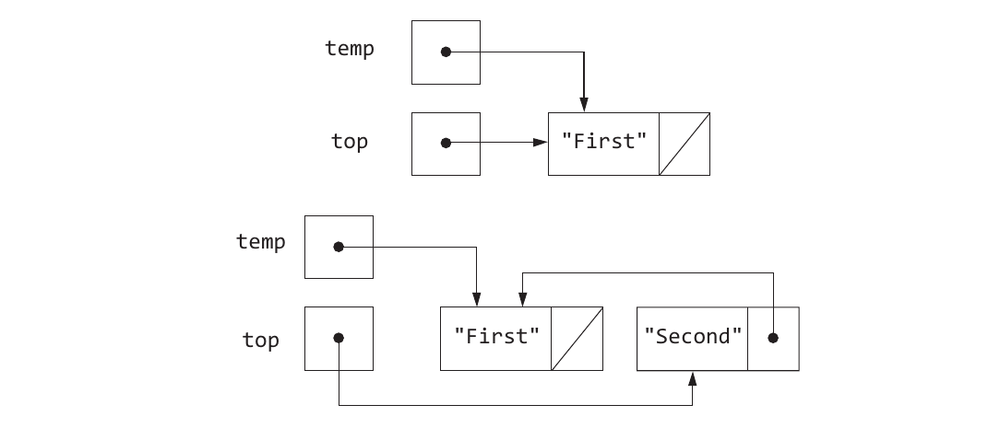

### 12C. LinkedPriorityList

This project asks you to implement a collection class LinkedPriorityList using a singly linked structure to store a sequence of string objects (no templates). This new type will store a collection of elements as a zero-based indexed list where the element at index 0 is considered to have higher priority than the element at index 1. Th e element at index size()-1 has the lowest priority. An instance of this collection class will be able to store just one type of element such as <string>.

#### Output

```text
Sleep
Get groceries
Study for the CS exam
```

Complete these methods in LinkedPriorityList so it uses a singly linked structure to store elements. Don’t forget to add struct node in the same file as this class.

```C++
// Construct an empty LinkedPriorityList
LinkedPriorityList();

// Return the number of elements currently in this LinkedPriorityList
int size();

// Return true if size() == 0 or false if size() > 0
bool isEmpty();

// Insert the element at the given index.
// precondition: index is on the range of 0 through size() void
insertElementAt(int index, std::string el);

// Return a reference to the element at the given index.
// precondition: index is on the range of 0 through size()-1
 std::string getElementAt(int index);

// Remove the element at the given index.
// precondition: index is on the range of 0 through size()-1
void removeElementAt(int index);

// Swap the element located at index with the element at index+1.
// Lower the priority of the element at index size()-1 has no effect.
// precondition: index is on the range of 0 through size() 
void lowerPriorityOf(int index);

// Swap the element located at index with the element at index-1.
// An attempt to raise the priority at index 0 has no effect.
// precondition: index is on the range of 0 through size() 
void raisePriorityOf(int index);

// Move the element at the given index to the end of this list.
// An attempt to move the last element to the last has no effect.
// precondition: index is on the range of 0 through size()-1
void moveToLast(int index);

// Move the element at the given index to the front of this list.
// An attempt to move the top element to the top has no effect.
// precondition: index is on the range of 0 through size()-1
void moveToTop(int index);
```

To help you understand how these methods work, consider the program below that shows the changing list as each of the messages is sent to list. Recommended: implement one member function at a time, and write tests to ensure that it works.

```C++
#include <iostream>
#include "LinkedPriorityList.h"
using namespace std;

int main() {
    LinkedPriorityList list;
    list.insertElementAt(0, "a");
    list.insertElementAt(1, "b");
    list.insertElementAt(2, "c");
    list.insertElementAt(3, "d");
    for (int i = 0; i < list.size(); i++) // a b c d
        cout << list.getElementAt(i) << " ";
    cout << endl;

    list.insertElementAt(1, "f");
    for (int i = 0; i < list.size(); i++) // a f b c d
        cout << list.getElementAt(i) << " ";
    cout << endl;

    list.removeElementAt(0);
    for (int i = 0; i < list.size(); i++) // f b c d
        cout << list.getElementAt(i) << " ";
    cout << endl;

    list.lowerPriorityOf(3); // no effect
    list.lowerPriorityOf(0); // move f right
    list.lowerPriorityOf(1); // move f right
    list.lowerPriorityOf(2); // move f right
    for (int i = 0; i < list.size(); i++) // b c d f
        cout << list.getElementAt(i) << " ";
    cout << endl;

    list.raisePriorityOf(0); // no effect
    list.raisePriorityOf(2); // move d left
    list.raisePriorityOf(1); // move d left
    for (int i = 0; i < list.size(); i++) // d b c f
        cout << list.getElementAt(i) << " ";
    cout << endl;

    list.moveToLast(list.size() - 1); // no effect
    list.moveToLast(0); // move d from top priority to last priority
    for (int i = 0; i < list.size(); i++) // b c f d
        cout << list.getElementAt(i) << " ";
    cout << endl;

    list.moveToTop(0); // no effect
    list.moveToTop(2); // move f to top priority again
    for (int i = 0; i < list.size(); i++) // f b c d
        cout << list.getElementAt(i) << " ";

    return 0;
}
```

### 12D. LinkedPriorityList<Type> THROWS EXCEPTIONS

Change your code so it throws an exception when the index is out of range. To do this, first add this #include to PriorityList<Type>:

```C++
#include <stdexcept>
```

Then add an if statement to every method that takes index as a parameter. An exception will be thrown if the programmer supplies an incorrect index like -1 or an index > size(), which is a good thing:

```C++
// Insert the element at the given index.
// precondition: index is on the range of 0 through size()
void insertElementAt(int index, Type element) {
    if (index < 0 || index > size()) {
        throw std::invalid_argument(
            "\ninsertElementAt: index must be 0..size()");
    } // . . .
```
