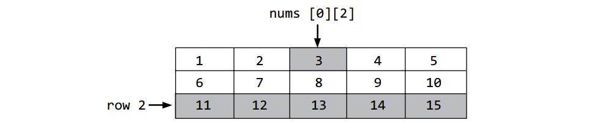
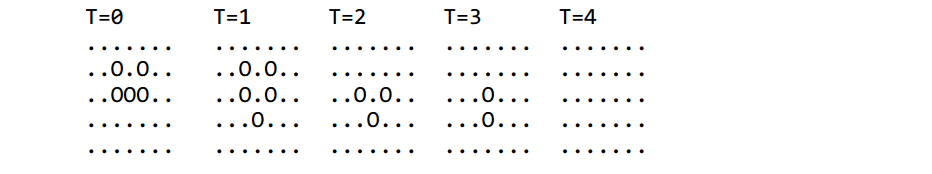
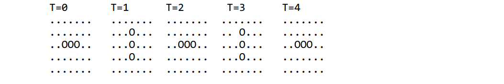
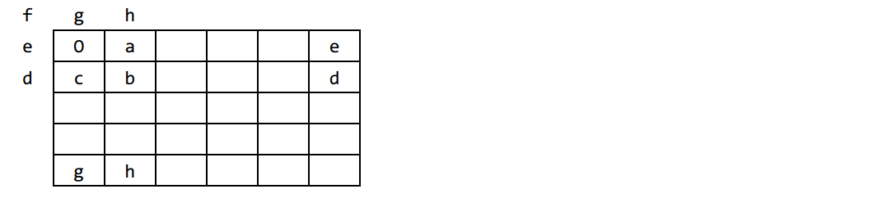

# 第13章 存储vector的vector（二维数组）

## 前章回顾

到目前为止，我们已经掌握了实现任意算法所需要的控制结构，也学会了如何在构建程序的过程中使用自由函数和编写独立的类。这些知识和经验将会有助于你理解本章的代码。当然，前两章所介绍的`vector`也同样会对你理解这些代码有所帮助。

## 本章提要

在本章，我们将介绍一种用两个下标来管理类似以表格行列形式存储的数据逻辑。这种存储和管理数据的方式对于像电子表格、游戏、地形图、成绩册以及其他以行和列为最佳数据呈现形式的应用程序来说是很有帮助的。另外，我们在本章还会带你再回顾一下C++中类的构造函数，用代码示范一下如何通过数据成员来研究某一主题执行的类设计。我们希望在学习完本章内容之后，你将能够：

* 对存储`vector`的`vector`中（行列形式）的数据执行相关的处理。
* 使用嵌套型`for`循环。

## 13.1 存储vector的vector

对于要以表格形式来呈现自己的数据来说，存储`vector`的`vector`对象无疑是一个不错的表示方式。

**通用格式 13.1**： *构造存储vector的vector*

```text
vector <vector<type> > identifier(rows,
    vector<type> (cols, initialValueoptional));
```

下面来具体示范一下该构造动作：

```C++
vector <vector<double> > table(4, vector<double> (8, 0.0)); // 32 zeros
vector <vector<string> > name(5, vector<string> (100, "TBA")); // 500 TBAs
```

对存储`vector`的`vector`中各个元素的引用需要用到两个下标，一个下标代表行，另一个代表列。这种数据结构还有另外一个名称，叫做*二维（2D）数组*。

**通用格式 13.2**：*访问个别元素*

```text
vectorName[row][column]
```

如你所见，这里每个下标都必须有一个单独的中括号。程序员有责任确保每个下标都在有效范围内。这双下标引用的第一个下标代表的是行，第二个下标代表的是列。

*嵌套型循环*常常会被用来处理与二维数组相关的数据。在下面的代码中，存储`vector`的`vector`中一开始存储的是15个垃圾值。我们用一个嵌套型循环将其中所有的元素分别初始化成了1到15的整数：

*请记得给旧版本的C++保留一点空间。*

```C++
vector <vector<int> > nums(3, vector<int> (5));

int count = 1;
for(int row = 0; row < nums.size(); row++) {
    // Initialize one row
    for(int col = 0; col < nums[row].size(); col++) {
        nums[row][col] = count;
        count++;
    }
}
```



### 自检题

* 13-1. 哪种类型更适合用来管理数据列表，是`vector`还是存储`vector`的`vector`？

* 13-2. 哪种类型更适合用来管理以行列形式呈现的数据，是`vector`还是存储`vector`的`vector`？

* 13-3. 请构造一个存储`vector`的`vector`对象，名称为`sales`。其中要分10行存储120个数字。

* 13-4. 请构造一个存储`vector`的`vector`对象，名称为`sales`。其中要分10列存储120个数字。

***

## 13.2 Matrix类

在数学中，*矩阵（matrix，复数形式是matrices）* 是一种矩形向量，它会以行和列形式呈现一系列数字、符号和表达式，并能以某种特定方式来处理。其中一种处理方式就是获取矩阵的*阶数（order）*状态。例如，下面这个矩阵的阶数说明它是一个2 x 2的矩阵，因为它有两行两列：

$$
  \begin{bmatrix}
  12 & 4 \\
  –1 & 9
  \end{bmatrix}
$$

矩阵中的各项值通常被称之为矩阵的*元素*或*项目*.

矩阵在大多数科学领域中都有应用，其中包括物理学的各个分支，譬如传统力学、光学、电磁学、量子力学和量子电动学等，以及各种物理现象的研究，譬如刚体运动等。另外在计算机图形学方面，矩阵也常被用来将三维影像投射到二维的屏幕上。在概率论与统计学方面，我们在描述概率集时经常会需要用到随机矩阵。例如，在被Google搜索用来对页面进行排序的PageRank算法中就有使用到它们。

我们可以用C++的类机制来为矩阵建模，方法是利用存储`vector`的`vector`来存储矩阵元素，并维护该矩阵的行数和列数。在下面的头文件中，我们就定义了一个特定的`matrix`类型（当然，除此之外还有各种可能的不同设计）：

```C++
// File name: Matrix.h
#ifndef MATRIX_H_
#define MATRIX_H_
#include <vector>

class Matrix {
    private:
        int rows, columns;
        // Make sure there is a space between > and >
        //                           ||
        std::vector<std::vector<int> > table;

    public:
        // Construct a new Matrix and read data from an input file
        Matrix(std::string leName);

        // Construct a new Matrix given a vector of vectors
        Matrix(const std::vector<std::vector<int> > & vecOfVecs);

        // Return a string representation of this object.
        std::string toString();

        // Multiply each element by val
        void scalarMultiply(int val);

        // Return the sum of this Matrix + other
        Matrix add(Matrix other);
};
#endif // MATRIX_H_
```

在只需要少量数据的程序中，通常使用交互式输入就足够了。`vector`对象的初始化往往要面向的是大量的数据。因此，这些数据通常需要外部文件来提供。下面我们来看一个外部输入文件的示例。在这个整数文件`matrix.data`的第一行，我们指定了该文件要输入矩阵的行数和列数：

```text
  3 4
  6 7 8 9
  4 5 6 7
  8 7 7 8
```

剩下的每一行都代表着一位学生的测验成绩。我们接下来就要用这个小型的输入文件来演示一下如何利用存储`vector`的`vector`来处理矩阵。

首先，我们要在构造函数中将该外部文件与`ifstream`对象`inFile`关联起来。然后用输入语句将该文件第一行指定的行数和列数（3和4）读取出来，并根据读取到的数据来调整其`vector`的行数和列数。由于存储`vector`的`vector`的内存是在运行时动态分配的，并且采用的C++类的构建方式，所以这是个必要的操作。只有这样，我们才能构建一个足够大的矩阵，用以存储三行数据，每行是一个包含四个整数的`vector`。最后，我们会在一组嵌套型循环（即一个循环中嵌套着另一个循环）中用输入文件中的数据初始化这些`vector`。上述所有操作都将被封装在`Matrix.cpp`文件的`Matrix`类的构造函数中：

```C++
/*
 * Matrix.cpp
 */
#include <string>
#include <fstream>
#include "Matrix.h"
using namespace std;

// Constructs a new object and reads data from
// the input le specified as the leName argument.
Matrix::Matrix(string leName) {
    rows = columns = 0; // Avoid a warning from one compiler
    // Make sure the le named lename is stored in the same directory
    ifstream inFile( leName);
    inFile >> rows >> columns;

    // Resize the vector of vectors to any capacity at runtime (dynamically).
    table.resize(rows, vector<int>(columns));

    // Initialize the vector of vectors from file input
    for (int row = 0; row < rows; row++) {
        for (int col = 0; col < columns; col++) {
            inFile >> table[row][col];
        }
    }
}
```

与`vector`对象一样，使用输出显示矩阵中所有完成了初始化的元素是一种可以预防错误的反bug技术。下面是`Matrix::toString`方法利用嵌套型循环的帮助回显输入数据的实现：

```C++
string Matrix::toString() {
    string result("");
    // Concatenate all elements into one string
    for (int i = 0; i < rows; i++) {
        for (int j = 0; j < columns; j++) {
            result = result + std::to_string((int) table[i][j]) + " ";
        }
        result = result + "\n"; // new line"
    }
    return result;
}
```

下面，我们写一段程序来具体执行初始化和输出显示的过程：先用从文件输入的数组逐个初始化矩阵中的元素，然后输出显示存储在矩阵中的数据：

```C++
#include "Matrix.h"
#include <iostream>
using namespace std;

int main() {
    Matrix m("matrix.data");
    cout << m.toString();
    return 0;
}
```

#### 程序输出

```text
6 7 8 9
4 5 6 7
8 7 7 8
```

如你所见，`Matrix`对象得到了正确的初始化并存储了12个整数。

### 13.2.1 标量乘法

*标量乘法（Scalar multiplication）* 是`vector`与标量之间的乘法运算，它们的乘积依然是一个`vector`。这个运算可以实现为下面这个会改变`Matrix`对象状态的方法：

```C++
void Matrix::scalarMultiply(int val) {
    for (int i = 0; i < rows; i++) {
        for (int j = 0; j < columns; j++) {
            table[i][j] *= val;
        }
    }
}
```

在该运算中，矩阵的每个元素都是乘法的实参，所以下面这段代码的输出如下：

```C++
m.scalarMultiply(3);
cout << m.toString() << endl;
```

#### 程序输出

```text
18 21 24 27
12 15 18 21
24 21 21 24
```

### 13.2.2 矩阵加法

*矩阵加法（Matrix addition）* 指的是两个被相加的矩阵中的各相应项相加：

$$
  \begin{bmatrix}
  12 & 4 \\
  –1 & 9
  \end{bmatrix}
   +
  \begin{bmatrix}
   7 & –2 \\
   5 & –4
  \end{bmatrix}
   +
  \begin{bmatrix}
   19 & 2 \\
   4  & 5
  \end{bmatrix}
$$

为了让下面的代码能返回一个新的矩阵，

```C++
Matrix a("a.data");
Matrix b("b.data"); // Uses another input le to initialize Matrix c = a.add(b);
```

我们需要编写第二个构造函数，该构造函数要以存储`vector`的`vector`对象为实参来构造矩阵。下面就是这第二个构造函数，它会接收一个存储`vector`的`vector`，采用的是`const`引用类型的形参：

```C++
// Construct a new Matrix object given a vector of vectors
Matrix::Matrix(const std::vector<std::vector<int> > & vecOfVecs) {
    rows = vecOfVecs.size();
    columns = vecOfVecs[0].size();
    table = vecOfVecs;
}
```

这样，`add`操作就可以通过调用该构造函数来返回一个新的`Matrix`对象了：

```C++
Matrix Matrix::add(Matrix other) {
    vector<vector<int> > temp(rows, vector<int>(columns));
    for (int i = 0; i < rows; i++) {
        for (int j = 0; j < columns; j++) {
            temp[i][j] += table[i][j] + other.table[i][j];
        }
    }
    Matrix result(temp); // Use the second constructor
    return result;
}
```

接下来，请用输入文件来表示上述三个矩阵，下面的代码将会产生如下输出：

```C++
cout << "Matrix a: " << endl << a.toString() << endl;
cout << "Matrix b: " << endl << b.toString() << endl;
cout << "Matrix c: " << endl << c.toString() << endl;
```

#### 程序输出

```text
Matrix a:
12 4
-1 9

Matrix b:
7 -2
5 -4

Matrix c:
19 2
 4 5
```

### 自检题

* 13-5. 在逐行处理数据的过程中，是哪一个下标的增速较慢？行数还是列数？

* 13-6. 在逐列处理数据的过程中，是哪一个下标的增速较慢？行数还是列数？

  请基于下面这个2 × 2的矩阵回答下列问题：

$$
  \begin{matrix}
   12 & 4 \\
   -1 & 9
  \end{matrix}
$$

* 13-7. 请完成下面的`get`方法，返回指定行和列的元素，譬如`Matrix.get(1, 0)`将返回-1。
    ```C++
    // Assume get is in class Matrix
    int Matrix::get(int row, int column) {
    ```

* 13-8. 请完成下面的矩阵成员`sum`方法，返回矩阵中所有元素之和，譬如上述2 x 2矩阵的元素之和是24。
    ```C++
    // Assume sum is in class Matrix
    int Matrix::sum() {
    ```
***

### 13.3 原生的二维数组

上述逐行和逐列处理数据的概念也同样适用于用两个下标声明的原生C数组。换而言之，原生的C数组也可以用两个用中括号括住的，分别代表行数和列数的下标来声明。例如，下面声明的`x`中存储了10行5列的数据，总计50个数字；

```C++
double x[10][5]; // Row subscripts 0...9, column subscripts 0...4
```

这其中另一个重要的区别是，原生的C数组是没有下标越界检查的。下面，我们可以用一张表来对比一下之前的`Matrix`类和用两个下标声明的原生C数组：declared with two subscripts:

|          | 存储`vector`的`vector` | 原生C数组 |
|----------|-------------------|--------------------|
| 通用格式 | vector <vector<type> > identifier (rows, vector<type>(columns)); | type identifier[rows][columns]; |
| 实例示范 |        vector <vector<int> > unitsSold(4,vector<int>(6)); |  int unitsSold[4][6]; |
| 越界检查 | 支持 | 不支持 |
| 调整大小   | 支持 | 不支持 |
| `#include`指令 | `#include <vector>` | 不需要 |

如你所见，在名为`unitsSold`的存储`vector`的`vector`对象中，管理着4行6列的整数（一共24个整数），而在同名的原生C数组中也管理着相同下标范围内、的相同数量的整数（上述声明中右边下标代表行数）。两者之间的不同之处包括了原生C数组不支持下标的越界检查。无论我们使用的是原生C数组还是存储`vector`的`vector`对象，我们引用个别数组元素的方式是一样的。这两种数据结构的下标都始终是从0开始计数的。也就是说，下面这段代码可以同时适用于存储`vector`的`vector`和双下标的原生C数组：

```C++
int unitsSold[4][6];
// vector<vector<int> > unitsSold(4, vector<int>(6));

for (int r = 0; r < 4; r++) {
    for (int c = 0; c < 6; c++)
        unitsSold[r][c] = r + c;
}

for (int r = 0; r < 4; r++) {
    for (int c = 0; c < 6; c++) {
        cout << unitsSold[r][c] << " ";
    }
    cout << endl;
}
```

#### 使用存储`vector`的`vector`和双下标的原生C数组都会产生的输出

```text
0 1 2 3 4 5
1 2 3 4 5 6
2 3 4 5 6 7
3 4 5 6 7 8
```

### 自检题

请基于下面的声明回答下列问题：

```C++
 int a[3][4];
```

* 13-9. `a[0][0]`的值是什么？

* 13-10. 它会执行下标检查吗？

* 13-11. `a`中确切管理着多少个`int`元素？

* 13-12. `a`的行下标（即第一个下标）的范围是什么？

* 13-13. `a`的列下标（即第二个下标）的范围是什么？

* 13-14. 请编写一段代码，将`a`中所有元素初始化成999。

* 13-15. 请编写一段代码，逐行输出`a`中的所有元素，每个元素之间间隔八个空格。

***

## 13.4 拥有两个以上下标的数组

Singly and doubly subscripted vectors occur more frequently than vectors with more than two subscripts. However, vectors with three or even more subscripts are sometimes useful. Triply subscripted arrays are possible because C++ does not limit the number of subscripts. For example, the declaration

```C++
double q[3][11][6]
```

could represent the quiz grades for three courses, since 198 (3 × 11 × 6) grades can be stored under the same name (q). Th is triply subscripted object

```C++
q[1][9][3]
```

is a reference to quiz index 3 of student index 9 in course index 1. In the following program, an array with three subscripts is initialized (with meaningless data). The first subscript—representing a course—changes the most slowly. So the vector object q is initialized and then displayed in a course-by-course manner:

```C++
// Declare, initialize, and display a triply subscripted vector
// object. The primitive C subscripted object is used here, but we
// could also use a vector of Matrix objects to do the same thing.
#include <iostream>
using namespace std;

int main() {
    const int courses = 3;
    const int students = 11;
    const int quizzes = 6;
    int q[courses][students][quizzes];

    for (int c = 0; c < courses; c++) {
        for (int row = 0; row < students; row++) {
            for (int col = 0; col < quizzes; col++) {
                // Give each quiz a value using a meaningless formula
                q[c][col][row] = (col + 1) * (row + 2) + c + 25;
            }
        }
    }

    for (int course = 0; course < courses; course++) {
        cout << endl;
        cout << "Course #" << course << endl;
        for (int row = 0; row < students; row++) {
            cout.width(3);
            cout << row << ": ";
            for (int col = 0; col < quizzes; col++) {
                cout.width(4);
                cout << q[course][col][row];
            }
            cout << endl;
        }
    }
    return 0;
}
```

#### Output with updated student line

```text
Course #0
  0: 27 33 41 49 57 65
  1: 28 34 43 52 61 70
  2: 29 35 45 55 65 75
  3: 30 36 47 58 69 80
  4: 31 37 49 61 73 85
  5: 32 39 46 53 60 67
  6: 33 41 49 57 65 73
  7: 34 43 52 61 70 79
  8: 35 45 55 65 75 85
  9: 36 47 58 69 80 91
 10: 37 49 61 73 85 97

Course #1
  0: 28 34 42 50 58 66
  1: 29 35 44 53 62 71
  2: 30 36 46 56 66 76
  3: 31 37 48 59 70 81
  4: 32 38 50 62 74 86
  5: 33 40 47 54 61 68
  6: 34 42 50 58 66 74
  7: 35 44 53 62 71 80
  8: 36 46 56 66 76 86
  9: 37 48 59 70 81 92
 10: 38 50 62 74 86 98

Course #2
  0: 29 35 43 51 59 67
  1: 30 36 45 54 63 72
  2: 31 37 47 57 67 77
  3: 32 38 49 60 71 82
  4: 33 39 51 63 75 87
  5: 34 41 48 55 62 69
  6: 35 43 51 59 67 75
  7: 36 45 54 63 72 81
  8: 37 47 57 67 77 87
  9: 38 49 60 71 82 93
 10: 39 51 63 75 87 99
```

## 本章小结

* A doubly subscripted vector of vectors and a primitive C++ 2D array both manage data that is logically organized in a tabular format—in rows and columns.

* The first subscript specifi es the rows of data in a table; the second represents the columns.

* The elements stored in these data structures can be processed row by row or column by col-umn.

* Nested for loops are commonly used to process these data structures.

* Primitive 2D arrays do not check the subscript, which can lead to difficult errors. vector can check with at messages, as in nums.at(5).at(20); to reference the 21st element in the 6th row.

## 练习题

1. For each doubly subscripted object declaration below, determine:
   * a.  The total number of elements
   * b.  Th e value of all elements
    ```C++
    vector<vector<string> > teacher(5, vector<string>(7, "to hire"));
    vector<vector<double> > quiz(10, vector<double>(32, 0.0));
    vector<vector<int> > nums(10, vector<int>(10, -999)); double budget[6][100];
    ```

2. Detect the error(s) in the following attempts to declare a doubly subscripted vector:
   * a.  int x(5,6);
   * b.  double x[5,6];
   * c.  vector<vector<int> > x(5, 6);

3. Declare a doubly subscripted object identifi ed with three rows and four columns of fl oatingpoint numbers.

4. Write C++ code to accomplish the following tasks:
   * a.  Declare a doubly subscripted object called aTable that stores 10 rows and 14 columns of fl oating-point numbers.
   * b.  Set every element in aTable to 0.0.
   * c.  Write a for loop that sets all elements in row 4 to -1.0.

5. Show the output from the following program when the dialogue is:
    ```text
        a.  # rows? ***2***     d. # rows? ***1***
            # cols? ***3***        # cols? ***1***
        b.  # rows? ***3***     e. # rows? ***1***
            # cols? ***2***        # cols? ***2***
        c.  # rows? ***4***     f. # rows? ***2***
            # cols? ***4***        # cols? ***1***
    ```

    ```C++
    #include <iostream>
    #include <vector>
    using namespace std;

    int main() {
        int maxRow, maxCol;
        cout << "# rows? ";
        cin >> maxRow;
        cout << "# cols? ";
        cin >> maxCol;
        vector<vector<int> > aTable(maxRow, vector<int>(maxCol, -999));

        // Initialize Matrix elements
        for (int row = 0; row < maxRow; row++) {
            for (int col = 0; col < maxCol; col++) {
                aTable[row][col] = row * col;
            }
        }

        // Display table elements
        for (int row = 0; row < maxRow; row++) {
            for (int col = 0; col < maxCol; col++) {
                cout.width(5);
                cout << aTable[row][col];
            }
            cout << endl;
        }
        return 0;
    }
    ```
   Use this class to answer questions 6 through 9:
    ```C++
    class huh {
        public:
            huh(int initLastRow, int initLastColumn);
            void add(int increment);
            void show() const;
            int rowSum(int currentRow) const;
        private:
            int lastRow, lastCol;
            std::vector <std:vector<int> > m;
    };

    huh::huh(int initLastRow, int initLastColumn) {
        lastRow = initLastRow;
        lastCol = initLastColumn;
        // The vector of vectors must be initialized in the constructor.
        // Use a resize message with two arguments to avoid a loop for each row.
        m.resize(lastRow, vector<int>(lastCol));

        for(int row = 0; row < lastRow; row++) {
            for(int col = 0; col < lastCol; col++) {
                // Give each item a meaningless formula
                m[row][col] = (row + 1) + (col + 1);
            }
        }
    }

    void huh::show() const {
        int row, col;
        for(row = 0; row < lastRow; row++) {
            for(col = 0; col < lastCol; col++) {
                cout.width(4);
                cout << m[row][col];
            }
            cout << endl;
        }
    }
    ```

6. Write the output generated by the following program:
    ```C++
    int main() {
        huh h(1, 2);
        h.show();
        return 0;
    }
    ```

7. Write the output generated by the following program:
    ```C++
    int main() {
        huh h(3, 7);
        h.show();
        return 0;
    }
    ```

8. Complete the member function huh::rowSum that returns the sum of all the elements in a given row. Th e program below must generate the output of 22.
    ```C++
    int main() {
        huh h(4, 4);
        cout << h.rowSum(2);
        return 0;
    }
    ```

9. Complete the member function huh::showDiagonal that prints all elements on the diagonal. Assume rows and columns are the same. The program to the left must generate the output on the right. *Hint:* You may use cout.width to get the required indentation.
    ```C++
    int main() {
        huh h(4, 4);
        h.showDiagonal();
        return 0;
    }
    ```
   **Output**
    ```text
    2
      4
        6
          8
    ```

10. To class Matrix, add member function transpose that changes the Matrix to its transpose. The transpose of a Matrix has the rows replace the columns and the columns replace the rows. You will need to declare a temporary vector of vectors.

    Here is what the matrix should look like before:
    ```text
    1  4
    2  5
    3  6
    ```

    Here is what the matrix should look like after:
    ```text
    1 2 3
    4 5 6
    ```

## 编程小技巧

1. When constructing vectors of vectors, be careful not to write >> in your constructions with some compilers.
    ```C++
    vector<vector<int>> error(10, vector<int> (10, -1));
    // Error: Need space between > and >
    ```

2. When using vectors of vectors, consider using the range-checking member function vector::at, especially when first using two subscripts. The standard vector class does not automatically check the subscripts, but it can be made to do so with the vector::at member function.
    ```C++
    vector<vector<int> > aTable(3, vector<int> (3, -1));
    aTable.at(2).at(3) = 23; // Column 3 out of bounds
    aTable.at(3).at(2) = 32; // Row 3 out of bounds
    cout << aTable.at(0).at(0); //> Output: -1
    ```
   It is common to get a subscript variable that is out of bounds. The sooner you know about it, the better. With range checking on, you’ll know immediately.

3. Many of the programming tips for vectors with one subscript can be applied to doubly and triply subscripted objects:
   * The elements of any vector must be of the same class. For example, a Matrix cannot store both string and integer values.
   * Any object that uses a large amount of memory may be passed as a const reference parameter. As with singly subscripted vectors, memory is saved and only one value (the address of the Matrix) needs to be copied. However, when a Matrix is passed as a value parameter, every single element gets copied, making the program less efficient.
        ```C++
        void function(const Matrix<double> & m) // Pass by const reference
        ```
     is more efficient than
        ```C++
        void function(Matrix<double> m)
        ```

   * Range checking should be employed while you are learning to manipulate doubly subscript-ed objects.

## 编程项目

### 13A. MAGIC SQUARE

A magic square is an *n*-by-*n* vector of vectors where the integers 1 to *n*^2^ appear exactly once where *n* must be a positive integer like 1, 3, or 5. Additionally, the sum of the integers in every row, every column, and on both diagonals is the same. Implement class MagicSquare with two member functions: a constructor and display. The following code should generate the output shown:


You should be able to construct an *n*-by-*n* magic square for any odd value *n* from 1 to 15. When *j* is 1, place the value of *j* in the middle of the first row. Th en, for a counter value ranging from 1 to *n*^2^, move up one row and to the right one column, and store the counter value—unless one of the following events occurs:

1. When the next row becomes 0, make the next row equal to *n* – 1.
2. When the next column becomes *n*, make the next column equal to 0.
3. If a position is already fi lled or the upper-right corner element has just obtained a value, place the next counter value in the position that is one row below the position where the last counter value has been placed.

You will need to resize the vector of vectors instance variable which can be done like this:

```C++
// An instance variable
vector<vector<int> > magic;
// Resize the vector to be a size by size vector
magic = vector<vector<int> >(size, vector<int>(size));
```

### 13B. GAME OF LIFE

The Game of Life was invented by John Conway to simulate the birth and death of cells in a society. The following rules govern the birth and/or death of cells between two consecutive time periods. At time *T*:

* A cell is born if there was none at time *T* – 1 and exactly three of its neighbors were alive.
* An existing cell remains alive if at time *T* – 1 there were either two or three neighbors.
* A cell dies from isolation if at time *T* – 1 there were fewer than two neighbors.

* A cell dies from overcrowding if at time *T* – 1 there were more than three neighbors.

A neighborhood consists of the eight elements around any element (N represents one neighbor):

```text
NNN
N N
NNN
```

The neighborhood can extend to the other side of the society. For example, a location in the first row has a neighborhood that includes three locations in the last row. Th e following patterns would occur when T ranges from 1 to 5, with the initial society shown at T=1. O represents a live cell; a blank indicates that no cell exists at that particular location in the society.



Other societies may stabilize like this:



Use a test driver like this to see the fi rst fi ve versions of a society. Design your own fi le to be read by the GameOfLife constructor.

```C++
#include "GameOfLife.h" // For the GameOfLife class

int main() {
    GameOfLife society("5by7");
    for (int updates = 1; updates <= 5; updates++) {
        society.toString();
        society.update();
    }
    return 0;
}
```

Implement the following member functions defi ned in this header file:

```C++
/*
 *  File name: GameOfLife.h
 *
 * A model for John Conway's Game of Life to simulate the birth and death
 * of cells. This is an example of cellular automata.
 */

#ifndef GAMEOFLIFE_H_
#define GAMEOFLIFE_H_

#include <vector>
#include <string>

class GameOfLife {
    private:
        std::vector<std::vector<bool> > theSociety;
        int nRows;
        int nCols;

    public:
        /*
        * Write the constructor to initialize a vector of vectors so
        * all elements are false. Also set nRows and nCols
        *
        */
        GameOfLife(int rows, int cols);

        /*
         * Return the number of rows, which is indexed from 0..numberOfRows()-1.
         */
        int numberOfRows();

        /*
         * The number of columns, which is indexed from 0..numberOfColumns()-1.
         */
        int numberOfColumns();

        /*
         * Place a new cell in the society.
         * Precondition: row and col are in range.
         * row The row to grow the cell.
         * col The column to grow the cell.
         */
        void growCellAt(int row, int col);

        /*
         * Return true if there is a cell at the given row and column.
         * Return false if there is none at the speci ed location.
         *
         * row The row to check.
         * col The column to check.
         */
        bool cellAt(int row, int col);

        /*
         * Return one big string of cells to represent the current state of the
         * society of cells (see output below where '.' represents an empty space
         * and 'O' is a live cell. There is no need to test toString. Simply use
         * it to visually inspect. Here is one sample output from toString:
         *
         * GameOfLife society(4, 14);
         * society.growCellAt(1, 2);
         * society.growCellAt(2, 3);
         * society.growCellAt(3, 4);
         *  cout << society.toString();
         *
         * Output
         * ..............
         * ..O...........
         * ...O..........
         * ....O.........
         * */
        std::string toString();

        /*
         * Count the neighbors around the given location. Use wraparound. A cell
         * in row 0 has neighbors in the last row if a cell is in the same column
         * or the column to the left or right. In this example, cell 0,5 has two
         * neighbors in the last row, cell 2,8 has four neighbors, cell 2,0 has 
         * four neighbors, cell 1,0 has three neighbors. Cell 3,8 has 3 neighbors.
         * The potential location for a cell at 4,8 would have 3 neighbors.
         *
         * .....O..O
         * O........
         * O.......O
         * O.......O
         * ....O.O..
         *
         * The return values should always be in the range of 0 through 8.
         */
        int neighborCount(int row, int col);

        /*
         * Update the state to represent the next society.
         * Typically, some cells will die off while others are born.
         */
        void update();
};

#endif /* GAMEOFLIFE_H_ */
```

This GameOfLife has wraparound. It is recommended that you use nested for loops to visit all eight neighbors. Use an additional two int variables to be the actual row and column that are set, while checking to see if a loop index is negative or too large. Try to imagine the cells covering a torus:


The O below has eight neighbors labeled a through h. Wraparound is needed for neighbors labeled d through h. The labels are repeated to show where they need to be checked.



*Another hint:* During update, initialize all elements of a temporary vector of vectors to false. Look at the vector instance variable. Only grow cells in the temporary vector. When done, assign this to the instance variable like this:

```C++
theSociety = temporary;
```

Here are two examples of updates in two different cell societies. After 21 updates, the society on the right will return to its original form shifted five spaces to the right. If you do 63 updates, you will see the form that begins on the right shifted to be on the left due to wraparound.

(译者to编辑：此处排版太复杂，请引用原书中的代码)
