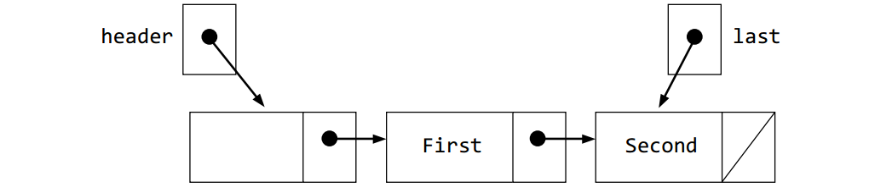
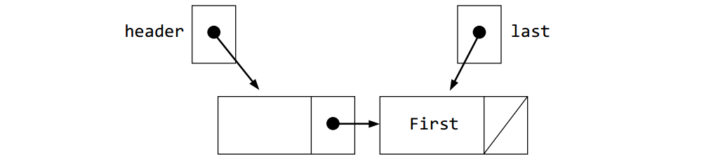
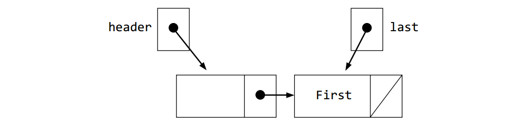
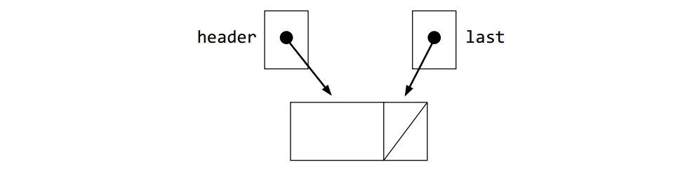

# 附录： 自检题答案

## 第1章： 用C++来解决问题

* 1-1. input: pounds or perhaps todaysConversionRate output: USDollars

* 1-2. cdCollection, selectedCD

* 1-3.

  | Problem | Object Names | Input or Output | Sample Problem |
  |--------|---------------|----------|------------| 
  | Compute the future value of an investment | presentValue periods rate futureValue | Input " " Output | 1000.00 360 0.0075 14730.58 |

* 1-4. Turn the oven off (you might have recognized some other activity has been omitted).

* 1-5. No (at least the author thinks it’s okay).

* 1-6. No (at least the author thinks it’s okay).

* 1-7. No. The courseGrade would be computed using undefined values for test1, test2, and nalExam.

* 1-8. No. The details of the process step are not present. Need a formula to compute a weighted average.

* 1-9. The program is wrong.

* 1-10. The prediction is wrong.

* 1-11. The program is wrong.

* 1-12. Numbers with a fractional part—floating-point numbers such as −1.2 or 1.023.

* 1-13. + - * (also = output with cout << and input with cin>>)

* 1-14. Integers—numbers without a decimal point. The actual range of integers is system dependent (unfortunately). Most C++ systems implement int to store integers in the range of –2,147,483,648 to 2,147,483,647.

* 1-15. + - * (also = output with cout << and input with cin>> )

* 1-16. A collection of characters.

* 1-17. float, double, int, bool, char, short, unsigned int, unsigned long

* * *

## 第2章： C++基础

* 2-1. 22 plus or minus two. Actually it is easy to miscount, so let the compiler worry about it.

* 2-2.
    ```text
    * a. VALID                       * l. periods'.' not allowed
    * b. 1 can’t start identifier    * m. double is a reserved word
    * c.  VALID                      * n. can’t start identifiers with 5
    * d.  # not allowed              * o. space not allowed
    * e.  space not allowed          * p. VALID
    * f.  # not allowed              * q. VALID
    * g.  ! not allowed              * r. å) not allowed
    * h.  VALID                      * s. VALID (but weird)
    * i.  ( ) are not allowed        * t. / not allowed
    * j.  VALID (double is not)      * u. VALID
    * k.  VALID
    ```
* 2-3.  + - other possible answers , : ; ! ( ) = { }

* 2-4.  << >> other possible answers != == <= >=

* 2-5.  cin and cout (also string vector width sqrt)

* 2-6.  thisIsOne and this Is_YET_Another_1$

* 2-7.
  * a.  string literals: "'" and "H"
  * b.  integer constants: 234 and -123
  * c.  floating-point constants: 1.0 and 1.0e+03
  * d.  boolean literals: false true
  * e.  char literals: '\n' 'h'

* 2-8.  a and d only

* 2-9.  
    ```C++
    double aNumber = -1.5;
    double anotherNumber = -1.5;
    ```
* 2-10. string address;

* 2-11. 
    ```C++
    #include <iostream>
    using namespace std;
    int main() {
        cout << "Kim" << endl;
        cout << "Miller" << endl;
        return 0;
    }
    ```

    or

    ```C++
    #include <iostream>
    int main() {
        std::cout << "Kim" << std::endl;
        std::cout << "Miller" << std::endl;
        return 0;
    }
    ```

* 2-12.
    ```text
    * a. error, can’t assign int to boolean   * d. error, can’t assign double to long
    * b. 123 (truncation occurs)              * c. 123.0;
    ```

* 2-13.
    ```text
    * a. 10.5       * d. -0.75
    * b. 1.75       * e. -0.5
    * c. 3.5        * f. 1.0
    ```

* 2-14.
    ```text
    97 % 25 % 10 / 5
       22   % 10 / 5
            2   / 5
                0
    ```

* 2-15.
    ```text
    * a. 0      * d. 1
    * b. 1      * e. 0
    * c. 0      * f. 0
    ```

* 2-16.
    ```text
    * a. 0             * d. 10
    * b. 0.5555556     * e. 12
    * c. 0.5555556     * f. 2
    ```

* 2-17.
    ```text
    Dialogue #1:         Dialogue #2:       Dialogue #2:
    * a. 3.2(16.0/5.0)   *b. 1.9(9.5/5.0)   *c. 2.8(14.0/5.0)
    ```

* 2-18. That depends on the garbage value of x. Compilers usually warn about x being undefined.

* 2-19. The predicted answer 25 does not match 0.04.

* 2-20. change cin >> n to cin >> sum and cin >> sum to cin >> n.

* 2-21. 
  * a. intent
  * b. compile time
  * c. compile time

* * *

## 第3章： 自由函数的运用

* 3-1. pow(4.0, 3.0) is 4*4*4 or 64

* 3-2. pow(3.0, 4.0) is 3.0*3.0*3.0*3.0 or 81

* 3-3. floor(1.6+0.5) is 2.0

* 3-4. ceil(1.6-0.5) is 2.0

* 3-5. 1.0

* 3-6. 4.0

* 3-7. Trace 9.99 rounded to 1 decimal place.

  |                                 | x     | n |
  |---------------------------------|-------|---|
  | Input n                         | 9.99  | 1 |
  | Let x become x * $10^n$         | 99.9  | 1 |
  | Add 0.5 to x                    | 100.4 | " |
  | Let x become oor(x)             | 100.0 | " |
  | Let x become x divided by $10^n$| 10.0  | " |

* 3-8. Three Sample Problems (other answers certainly possible)

  | x         | n   | changed x  |
  |:---------:|:---:|------------|
  | 0.567     | 1   | 0.6        |
  | 1234.56789 | 2  | 1234.57    |
  | -1.5       | 1  | -1.0       |

* 3-9.  3.2

* 3-10.
    ```C++
    x = x * pow(10, n)
    x = x - 0.5 // subtract 0.5
    x = ceil(x) // take the ceiling of x
    x = x / pow(10,n)
    ```

* 3-11.
    ```text
    * a. 16.0 or 16      * d. 1.0
    * b.  4.0 or 4       * e. 23.4
    * c.  -1.0 or -1     * f. 16.0
    ```

* 3-12.
    ```text
    * a. valid               * d. incorrect type of argument 
    * b. wrong function name * e. missing ( and )
    * c. too many arguments  * f. valid (the int is promoted to a double)
    ```

* 3-13.
  * a. missing parameter type (need int, double, string, or, . . . )
  * b.  missing two commas
  * c.  no return type
  * d.  okay only if myClass exists
  * e.  extra , before )
  * f.  attempt at parameter is a string literal

* 3-14.
   1. floor(1.9999)
   2. floor(0.99999)
   3. floor (-1.9)
   4. floor(-1) (other answers possible)

* 3-15.
  1. 1.0 (or 1 will do)
  2. 0.0
  3. -2.0
  4. -1.0

* 3-16. "1st"

* 3-17. 3.4

* 3-18.
    ```text
    * a. double      * d. double
    * b. pow         * e. double
    * c. 2           * f. there is no third argument
    ```

* 3-19 pow(-81.0, 2) (other answers possible)

* 3-20 No, the preconditions are not met. The return value is undefined. Return could be NaN (not a number).

* 3-21 Yes, 100.0.

* 3-22 Yes, 32.0.

* 3-23 Yes, 2.0 (you might have needed a scientifi c calculator.$x^{0.5}$ is the square root of x).

* 3-24. No, missing 2nd argument. Return value cannot be determined.

* 3-25.
    ```C++
    double remainder(double dividend, double divisor).
    // pre: divisor is not zero
    // post: return the oating point remainder of dividend/divisor
    ```
* * *

## 第4章： 自由函数的实现

* 4-1.
    ```text
    * a. -1.0      * d. ERROR, one too many arguments 
    * b. 7.0       * e. One two few arguments
    * c. 17.0      * f. 66.28
    ```

*4-2. 0.375

* 4-3. No. The argument is supposed to be positive. Th e result depends on the system you are using. You could get Infinity, NaN for not a number, or a square root of a negative number error.

* 4-4.
    ```text
    * a.  Remove ; after )     * d. return missing, you cannot assign a number to a function name.
    * b.  j is unkown in f2   * e. must return a number, not the double class name.
    * c.  j is unkown in f3   * f. must return an int, f6 tries to return a string instead.
    ```

* 4-5.
    ```C++
    double times3(double x) {
        return 3 * x;
    }
    ```

* 4-6.
    ```text
    cout    f1, f2, and main   a     f1 only
    b       f1 only            d     f2 only
    cin     f1, f2, and main   f2    f2 and main
    MAX     f1, f2, and main   main  from nowhere inside this file
    c       f2 only            e      main only
    f1      f1, f2, and main
    ```

* 4-7 Parameters and variables declared within the function’s block.

* 4-8 Anywhere to the end of the fi le unless it is redeclared within a block, then the global is hidden from that particular function.

* 4-9.
    ```text
    a. // arg1    5      arg2     5
    b. // arg1    11     arg2     123
    ```

* * *

## 第5章： 发送消息

* 5-1.
  * a.  Missing second argument. 
  * b.  Missing fi rst argument.
  * c.  bankAccount is an undefi ned symbol. Change b to B.
  * d.  Missing a numeric argument between ( and ).
  * e.  Missing (, the argument, and ).
  * f.  Wrong class of argument. Pass a number, not a string.
  * g.  B1 is undefined.
  * h.  Deposit is not a member of BankAccount. Change D to d.
  * i.  Need an object and a dot before withdraw.
  * j.  b4 is not a BankAccount object, it was never declared to be anything.
  * k.  missing () after name.
  * l.  name takes zero arguments, not one.

* 5-2.
    ```text
    Chris: 202.22
    Kim: 545.55
    ```

* 5-3.
    ```text
    14
    S
    k
    7
    18446744073709551615 or string::npos. Answer may vary on different systems
    Net
    N Network o
    ```

* 5-4.
    ```text
    * a. UnSocial    * c. Socl
    * b. Societal    * d. NoTiaX
    ```

* 5-5.
    ```C++
    string aString = "abcd";
    int midChar = aString.length() / 2;
    charmid = aString.at(midChar);
    ```

* 5-6.
    ```text
    * a. error, length is not a function    * d. 3
    * b.  error , missing ()                * e. y Str
    * c.  error, length is unknown          * f. error
    ```

* 5-7.
    ```text
    123456789012345
    1 2.3 who
    ```

* 5-8.
    ```text
    9.88
    1
    1.2
    ```

* 5-9.
    ```text
    * a. Enter an integer: 123   *  b. Enter an integer: XYZ
         Good? 1                       Good? 0
    ```

* 5-10.
    ```text
    * a.  istream          * c. string
    * b.  Grid             * d. BankAccount
    * c.  ostream          * e. istream
    ```

* 5-11.
    ```text
    . . . . . . .
    . . <       .
    . . . .     .
    . . . .     .
    . . . . . . .
    row: 1
    row: 2
    ```

* 5-12.
  1. Moving off the edge of the Grid (another answer is possible).
  2. Moving through a block.
  3. Attempting to pick up something that isn’t there.

* 5-13. 1

* 5-14. 35

* 5-15.
    ```C++
    #include "Grid.h"
    #include <iostream>
    using namespace std;
    int main() {
        Grid g(5, 5, 2, 3, east);
        g.move(1);
        g.face(north);
        g.move(1);
        g.face(west);
        g.move(1);
        g.face(south);
        g.move();
        g.display();
        return 0;
    }
    ```

* 5-16.
   There is less code to write (another answer is possible).

   Abstraction allows us to think of what the function does, not the details of the implementation.

   The same code is often needed in more than one location. Writing that code as a function avoids duplicated code, which is a very bad thing.

* 5-17.
   Use your cell phone without worrying about how the network works.

   Can do a lot without worrying about how to walk and breathe.

* * *

## CHAPTER 6: IMPLEMENTING MEMBER FUNCTIONS

* 6-1. LibraryBook

* 6-2. borrowBook returnBook

* 6-3. isAvailable getBorrower getBookInfo

* 6-4. author title borrower available

* 6-5. string

* 6-6. bool

* 6-7. LibraryBook aBook("Computing Fundamentals with Java, "River Tanner");

* 6-8. abook.borrowBook("Madison");

* 6-9. abook.getBorrower();

* 6-10. Add the class name and :: before the function name (after the return type). Also match the rest of the function heading in the class definition. The parameter names may differ.

* 6-11. Yes

* 6-12. No

* 6-13.
    ```text
    'Tinker Tailor Soldier Spy' by John le Carre
    CAN BORROW
    1
    Charlie Archer
    0
    1
    CAN BORROW
    ```

* 6-14. The function is not supposed to change the state. This is enforced when passing the argument by const reference: const&.

* 6-15. The constructor(s).

* 6-16. Allow access to the state of any object so humans or other objects can either inspect or use that state. An accessor may return a data member, or some sort of processing may occur to return some information about the state of the object.

* 6-17 Modify the state of the object. At least one data member gets changed for each modifying message—otherwise it is an accessor.

* 6-18 Allow programmers to initialize objects with either the default state or their own initial values.

* 6-19 To store the state of any object. Each instance of the class has its own copy of the data members.

* 6-20 Lines 2 and 3 are attempts to send a modifying message to a const object (the parameter b).

* * *

## CHAPTER 7: SELECTION

* 7-1.
    ```text
    * a. true      * e. true
    * b. false     * f. true
    * c. false     * h. true (165 is non-zero)
    * d. true      * g. false (= is assignment, not equality,j = 0 is evaluates to false)
    ```

* 7-2.
    ```text
    * a. addRecord                    * e. dubious
    * b. deleteRecord                 * f. g: 45
    * c. None option is lower case         at cutoff
    * d.  dubious                          g: 70
          failing                          you get one
                                           g: 1
    ```

* 7-3.  Tune-up due in 0 miles

* 7-4.
    ```text
    * a. 38.0                * c. 43.0
    * b. 40.0                * d. 45.25
    ```

* 7-5.
    ```text
    * a. true             * c. x is low
         after if...else  * d. neg
    * b. zero or pos
    ```

* 7-6.
    ```C++
    if (option == 1)
        cout << "My name" << endl;
    else
        cout << "My school" << endl;
    ```

* 7-7.
    ```text
    * a. true           * e. true
    * b. false          * f. false
    * c. true           * g. true
    * d. false          * h. true
    ```

* 7-8.  (score >= 1) && (score <= 10)

* 7-9.  (test > 100) || (score < 0)

* 7-10. President's list (always true because = was used instead of ==).

* 7-11.
    ```text
    Row     Column     Output
    3       4          not
    4       3          not
    2       2          not
    0       2          On edge
    2       0          On edge
    ```

* 7-12.
    ```text
    * a. true      * c. false
    * b. false     * d. false
    ```

* 7-13. All four evaluate. The fourth expression (¦¦ g.column()==g.nColumns()-1) had to be evaluated because the first three are false (as is the fourth).

* 7-14. The last three couts were not evaluated. Th is is weird code meant to vividly demonstrate short circuit Boolean Evaluation.
    ```text
    * a. okay     * c. okay
    * b. failed   * d. failed
    ```

* 7-15. 70

* 7-16. This unfortunate student gets a D instead of the deserved C.

* 7-17. I wouldn’t be happy, and I doubt you would either.

* 7-18.
    ```text
    -40: extremely frigid    20: warm               -1: below freezing
    42: toast                15: freezing to mild   31: very hot
    ```

* 7-15. 20 through 29 inclusive.

* 7-16. 0 through 19 inclusive. 

* 7-21.
    ```C++
    int main() {
        assert("extremely frigid" == weather(-41));
        assert("extremely frigid" == weather(-40));
        assert("below freezing" == weather(-39));
        assert("below freezing" == weather(-1));
        assert("freezing to mild" == weather(0));
        assert("freezing to mild" == weather(19));
        assert("warm" == weather(20));
        assert("warm" == weather(29));
        assert("very hot" == weather(30));
        assert("very hot" == weather(39));
        assert("toast" == weather(40));
        assert("toast" == weather(41));
        return 0;
    }
    ```

* 7-22. AAA

* 7-23. BBB

* 7-24. Invalid

* 7-25. Invalid

* 7-26.
    ```C++
    switch(choice) {
        case 1:
        cout << "Favorite music is Jazz" << endl;
        break;
        case 2:
        cout << "Favorite food is Tacos" << endl;
        break;
        case 3:
        cout << "Favorite teacher is you" << endl;
        break;
        default;
        cout << "Error" << endl;
    }
    ```

* * *

## CHAPTER 8: REPETITION

* 8-1. No, the init-statement happens fi rst (and only once).

* 8-2. No, you can use increments of any amount, including negative increments (or decrements). 

* 8-3. No, consider the example for (int i = 1; i < n; i++) when n==0.

* 8-4. Consider if the update step does not increment j, or j is decremented as much as it is incremented inside the loop: for (j = 1; j < n; j){ } *or* for (j = 1; j < n; j++){j--;}

* 8-5.
    ```text 
    * a. 1 2 3 4       * d. 0 1 2 3 4
    * b. 1 2 3 4 5     * e. 5 4 3 2 1
    * c. -3 -1 1 3     * f. before after
    ```

* 8-6.
    ```C++
    for (int i = 1; i <= 100; i++) {
        cout << i << endl;
    }
    ```

* 8-7.
    ```C++
    for (int i = 10; i >= 1; i--) {
        cout << i << " ";
    }
    ```

* 8-8.  An attempt is made to block an intersection at a non-existent row; the program terminates.

* 8-9.  It’s no big deal. The right corners would be blocked twice.

* 8-10. The function would alter a copy of the Grid, not the Grid in main. The border would be set locally in setBorder, but it would not modify the arguments aGrid or anotherGrid in main.

* 8-11. Range = 3

* 8-12. Range = 29 (this is correct).

| highest | -2147483648   | -5   | 8    | 22   | 22  | 22 |
|---------|---------------|------|------|------|-----|----|
| lowest  |  2147483647   | -5   | -5   | -5   | -7  | -7 |

* 8-13.  Range = 4 (this is correct).

| highest | -2147483648  | 5         | 5   | 5   | 5 | 5 |
|---------|--------------|-----------|-----|-----|---|---|
| lowest  |  2147483647  | 2147483647| 4   | 3   | 2 | 1 |

* 8-14.  Range = Range: -2147483642 (this is obviously incorrect)

| highest | -2147483648  | 1            | 2           | 3 |
|---------|--------------|--------------|-------------|---|
| lowest  | 2147483647   | 2147483647   |2147483647   | 2147483647 |

* 8-15. b. When the input is entered in ascending order.

* 8-16. Get rid of the else.

* 8-17. The client code will never know in advance how many moves must be made. It cannot be determined in advance

* 8-18.
  * a. 56.33333 the fi rst test (70.0) is destroyed before its added to the accumulator. Additionally, the sentinel-1 is incorrectly added to the accumulator.
  * b. 80.0

* 8-19. a. Observe the location of the second cin>>testScore. Redo till you arrive at the preceding answers of 56.3333 for a. and 80.0 for b.

* 8-20. b. Th e input statement comes immediately before it is compared to –1.

* 8-21. zero

* 8-22. Input another cin >> testscore at the bottom of the loop.

* 8-23. A tricky question: remove the ; after ). This loop does nothing infinitely because ; represents the null statement. It is legal code, but it was not likely intended.

* 8-24.
    ```text
    * a. 1 2 3     * b. 2 4 6 8 10
    ```

* 8-25.
    ```text
    * a. unknown       * d. forever
    * b. forever       * e. 5
    * c. 0             * f. forever notice the ; after count >= 0);
    ```

* 8-26.
    ```C++
    int sum = 0;
    int x = 0;
    while ( (cin >> x) && (x != 999) ) {
        sum += x;
    }
    ```

* 8-27.
    ```text
    * a. 1        * b. -1
         2             -0.5
         3              0
                        0.5
                        1
    ```

* 8-28.
    ```C++
    int x;
    do {
        cout << "Enter a number in the range of 1 through 10: ";
        cin >> x;
    } while ( x < 1 || x > 10);
    ```

* 8-29.
    ```C++
    do {
        cout << "Enter A)dd W)ithdraw Q)uit: ";
        cin >> option; option = toupper(option);
    } while ( option != 'A' && option != 'W' && option != 'Q');
    ```

* 8-30.
  * a. determinate for loop
  * b. determinate for loop
  * c. indeterminate while loop
  * d. indeterminate do-while loop

* 8-31.
  * a. value == -1
  * b. while (value != -1)

* 8-32 For each loop, which objects are not initialized but should be?
  * a. count and n
  * b. n and inc

* * *

## CHAPTER 9: FILE STREAMS

* 9-1.
    ```C++
    // file name: THISPROG.CPP
    #include <fstream> // for class ifstream
    #include <iostream> // for cout \#include <string>
    using namespace std;

    int main() {
        string aString;
        ifstream inFile("THISPROG.CPP");
        for(int j = 1; j <= 4; j++) {
            inFile >> aString;
            cout << aString << " ";
        }
        cout << endl; return 0;
    }
    ```

* 9-2. Can't average 0 numbers.

* 9-3.
  * a. Failed to find the file numbers.dat
  * b. iteration # 1: 0.001 <br/>
       End of le reached. 1 numbers found.
  * c. End of le reached. 0 numbers found.

* 9-4. 
    ```text
    * a. 6         * c. 6
    * b. 15        * d. 1 the period '.' sets inFile to a bad state and the loop terminates.
    ```

* 9-5. The loop would terminate since there would be no last name for Kline. The status would be Kline, the last name Sue. The employee Kline would never be constructed.

* 9-6. The loop would terminate when S was encountered for exempts. The employee Kline would never be constructed.

* 9-7.
  * a. 1313 Mocking Bird Lane
  * b. 1214 West Walnut Tree Drive

* * *

## 第10章： vector

* 10-1. 100

* 10-2. 0

* 10-3. 99

* 10-4. 0

* 10-5. x[0] = 78;

* 10-6.
    ```C++
    int n = 100;
    for(int j = 0; j < n; j++) {
        x[j] = n-j;
    }
    ```

* 10-7.
    ```C++
    for(j = 0; j < n; j++) {
        cout << x[j] << endl;
    }
    ```

* 10-8. It depends. The computer may “crash.” You may destroy the state of another object. Or, with subscript range checking, you may get a runtime error before the program terminates.

* 10-9. vector::resize and vector::capacity

* 10-10.
    ```text
    0 1 2 3 4
    0 1 2 3 4 0 0 0 0 0
    ```

* 10-11. -1

* 10-12. 1

* 10-13. 5

* 10-14. 4

* 10-15. n

* 10-16. 0 (because of short circuit Boolean evaluation).

* 10-17. irst econ hir ourt

* 10-18.
    ```C++
    account[12] = BankAccount("A12thCustomer", 1212.12);
    account[13] = BankAccount("Cust13", 1313.13);
    ```

* 10-19. The 21st account on the 21st line of the file would not become part of the account database. The vector size would not be big enough and the loop would terminate because numberOfAccounts < account.capacity() would be false.

* 10-20.
    ```C++
    #include <iostream>
    #include <fstream>
    using namespace std;
    int main() {
        vector <int> vectorOfInts(1000);
        // File name will do if it is in the working directory
        ifstream inFile("int.dat");
        int n = 0;
        int el;
        while( (inFile >> el) && (n < vectorOfInts.capacity()) ) {
            vectorOfInts[n] = el;
            n++;
        }
        return 0;
    }
    ```

* 10-21. n

* 10-22.
    ```C++
    cout << "Number of meaningful ints in vectorOfInts is "
    << n << endl;
    cout << "Here they are" << endl;
    for(int j = 0; j < n; j++) {
        cout << j << ". " << vectorOfInts[j] << endl;
    }
    ```

* 10-23. Grid and vector objects are much bigger than int and double. That is, it takes more memory to store a grid than an int (appoximately 800 bytes versus 4 bytes). A vector of 1,000 doubles is 1,000 times larger than one double.

* 10-24.
  * a. 100,000 **×** 57 or 5.7 million bytes.
  * b. 4
  * c. 4

* 10-25. ascending

* 10-26. The first element in the vector is swapped with itself. That means three extra assignments, but it is not worth worrying about this special case.

* 10-27.
    ```C++
    double largest = x[0];
    for(int j = 1; j < n; j++) {
        if( x[j] > largest )
            largest = x[j];
    }
    ```

* 10-28. The vector is sorted and the binary search knows whether it is either ascending or descending order.

* 10-29. 1: 1024 2: 512 3: 256 4: 128 5: 64 6: 32 7: 16 8: 8 9: 4 10: 2 11: <br/> Therefore, the largest number of comparisons is 11.

* 10-25. When first exceeds last, that is the beginning and end of the vector no longer make any sense. For example when first == 1028 and last == 1026.

* 10-26. Swap the location of the two statements.
    ```C++
    last = mid - 1;
    ```

   and
    ```C++
    first = mid + 1;
    ```

   or change the expression
    ```C++
    if (searchString < str[mid])
    ```

   to
    ```C++
    if (str[mid] < searchString)
    ```

   but NOT both changes.

* * *

## 第11章： 泛型容器

* 11-1. Any number can be used as long as the computer has more memory to grow the vector.

* 11-2. cout << intSet.size() << endl;

* 11-3. intSet.insert(89);

* 11-4. intSet.remove(89);

* 11-5. three

* 11-6.
  * a. 5
  * b. 40
  * c. 0

* 11-7.
    ```C++
    #include <iostream>
    using namespace std;
    #include "Set.h" // For a generic Set class
    #include "BankAccount.h"
    int main() {
        Set<BankAccount> set; // Store a set of 4 BankAccounts
        set.insert(BankAccount("Chris", 300.00));
        set.insert(BankAccount("Devon", 100.00));
        set.insert(BankAccount("Kim", 444.44));
        set.insert(BankAccount("Dakota", 99.99));

        double largest = 0.0;
        set.first(); // Initialize an iteration over all elements
        while (set.hasMore()) {
            double currentBalance = set.current().getBalance();if (currentBalance > largest)
                largest = currentBalance;
            set.next();
        }
        cout << "Max balance is " << largest << endl;
        return 0;
    }
    ```

* * *

## 第12章： 指针与内存管理

* 12-1. The addresses of other objects

* 12-2.
  * a. doublePtr
  * b. Can’t know. One run with cout << & doublePtr;
    was 0x7fff5b44cc78.
  * c. 1.23
  * d. *doublePtr += 1.0;

* 12-3. 246

* 12-4. 1

* 12-5.
    ```C++
    a->getBalance() + b->getBalance();
    ```

   -or-
    ```C++
    (*a).getBalance() + (*b).getBalance();
    ```

* 12-6. 24 144

* 12-7.
    ```C++
    char ch = 'C';
    char* charPtr = &ch;
    ```

* 12-8.
    ```C++
    int n1 = 12;
    int n2 = 34;
    int n3 = 56;
    int *p1 = &n1;
    int *p2 = &n2;
    int *p3 = &n3;
    ```

* 12-9. cout << *p1 + *p2 + *p3 <<endl

* 12-10.
    ```text
    p? 333
    q? 333
    ```

* 12-11. 4 8

* 12-12. 4.56 4.56

* 12-13. There is no way to get the value memory that was found at *p.

* 12-14. 12

* 12-15. int array[1000];

* 12-16.
    ```C++
    for(int i = 0; i < 1000; i++) {
        array[i] = -1;
    }
    ```

* 12-17.  0 2 4 6 8 10

* 12-18.
    ```C++
    int min = x[0];
    int max = x[0];
    for (int i = 1; i < n; i++) {
        if(x[i] > max)
            max = x[i];
        if(x[i] < min)
            min = x\[i\];
    }
    ```

* 12-19. string strs[] = {"one", "two", "three", "four"}; 

* 12-20.

   Before:
   
   After:
   

* 12-21.

   Before:
   
   After:
   

* 12-22. Remove returns false. No changes are made to the state of the list.

* 12-23. 
  * a. False, it can grow at runtime.
  * b. False, not in this list anyway. Use get(int). The [] could be overridden.
  * c. True
  * d. False, this is not necessary with the unused header node.
  * e. True, to avoid a memory leak. In small program it doesn’t matter, but in large pro-grams a lot of time is spent chasing down and removing memory leaks unfortunately.

* 12-24.
    ```C++
    bool removeLast() {
        if (n == 0)
            return false;

        // Get ptr to point to the last node
        node* ptr = header;
        while (ptr->next != last) {
            ptr = ptr->next;
        }
        // Adjust last to the node before it, clean up memory, decrease size
        last = ptr;
        delete ptr->next;
        n--;

        return true;
    }
    ```

* * *

## 第13章： 存储vector的vector

* 13-1. vector

* 13-2. matrix (or a vector of vectors)

* 13-3. matrix<double> sales(10, 12);

* 13-4. matrix<double> sales2(12, 10);

* 13-5. row

* 13-6. column

* 13-7.
    ```C++
    int Matrix::get(int row, int column) {
        return table[row][column];
    }
    ```

* 13-8.
    ```C++
    int Matrix::sum() {
        int result = 0;
        for (int i = 0; i < rows; i++) {
            for (int j = 0; j < columns; j++) {
                result += table[i][j];
            }
        }
        return result;
    }
    ```

* 13-9. Undefined, could be anything (just had a[0][0] return 1550093504).

* 13-10. No, this is a primitive array.

* 13-11. 12

* 13-12. 0 through 2

* 13-13. 0 through 3

* 13-14.
    ```C++
    for (int row = 0; row < 3; row++) {
        for(int col = 0; col < 4; col++) {
            a[row][col] = 999;
        }
    }
    ```

* 13-15.
    ```C++
    for (int row = 0; row < 3; row++) {
        for (int col = 0; col < 4; col++) {
            cout.width(8);
            cout << a[row][col];
        }
        cout << endl;
    }
    ```
